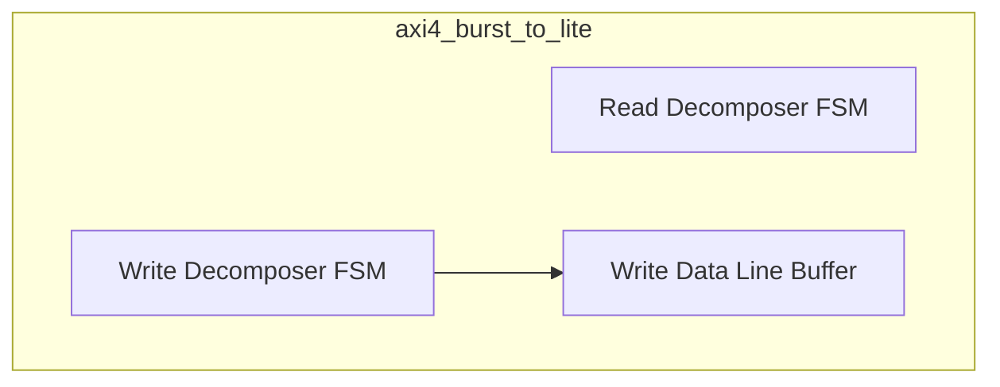
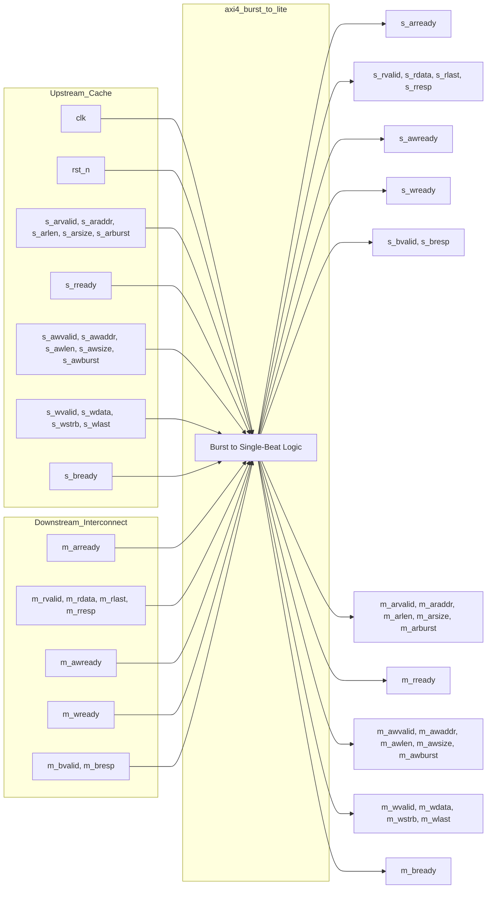

# axi4_burst_to_lite

## Description

The `axi4_burst_to_lite` module acts as a transaction-decomposing shim within the SMVDU-TITAN-X SoC interconnect. It bridges full AXI4 burst-capable masters (such as L1 cache controllers that emit 8-beat INCR bursts) to single-beat downstream slaves. This is necessary because certain controllers in the SoC, like the DDR controller, only process single-beat transactions and will return a `SLVERR` for bursts with length > 0. On the read path, it serializes a burst read request into multiple `AR`/`R` round-trips, forwarding read data beats and asserting `RLAST` only on the final beat. On the write path, it accepts the `AW` address upfront, collects all `W` data beats into an internal line buffer, and then issues a sequence of single-beat `AW`/`W` pairs downstream. It aggregates the downstream `B` responses, returning a single response to the master with the worst-case error status encountered.

## Interface

### Inputs

| Signal | Width | Description |
|--------|-------|-------------|
| clk | 1 | System clock |
| rst_n | 1 | Active-low asynchronous reset |
| s_arvalid | 1 | Upstream (cache) read address valid |
| s_araddr | ADDR_W | Upstream read address (parameter ADDR_W) |
| s_arlen | 8 | Upstream read burst length |
| s_arsize | 3 | Upstream read burst size |
| s_arburst | 2 | Upstream read burst type |
| s_rready | 1 | Upstream read data ready |
| s_awvalid | 1 | Upstream write address valid |
| s_awaddr | ADDR_W | Upstream write address |
| s_awlen | 8 | Upstream write burst length |
| s_awsize | 3 | Upstream write burst size |
| s_awburst | 2 | Upstream write burst type |
| s_wvalid | 1 | Upstream write data valid |
| s_wdata | DATA_W | Upstream write data (parameter DATA_W) |
| s_wstrb | DATA_W/8 | Upstream write byte strobes |
| s_wlast | 1 | Upstream write last beat flag |
| s_bready | 1 | Upstream write response ready |
| m_arready | 1 | Downstream (interconnect) read address ready |
| m_rvalid | 1 | Downstream read data valid |
| m_rdata | DATA_W | Downstream read data |
| m_rlast | 1 | Downstream read last beat flag |
| m_rresp | 2 | Downstream read response |
| m_awready | 1 | Downstream write address ready |
| m_wready | 1 | Downstream write data ready |
| m_bvalid | 1 | Downstream write response valid |
| m_bresp | 2 | Downstream write response |

### Outputs

| Signal | Width | Description |
|--------|-------|-------------|
| s_arready | 1 | Upstream read address ready |
| s_rvalid | 1 | Upstream read data valid |
| s_rdata | DATA_W | Upstream read data |
| s_rlast | 1 | Upstream read last beat flag |
| s_rresp | 2 | Upstream read response |
| s_awready | 1 | Upstream write address ready |
| s_wready | 1 | Upstream write data ready |
| s_bvalid | 1 | Upstream write response valid |
| s_bresp | 2 | Upstream write response |
| m_arvalid | 1 | Downstream read address valid |
| m_araddr | ADDR_W | Downstream read address |
| m_arlen | 8 | Downstream read burst length (tied to 0) |
| m_arsize | 3 | Downstream read burst size (tied to 3 / 8B) |
| m_arburst | 2 | Downstream read burst type (tied to INCR) |
| m_rready | 1 | Downstream read data ready |
| m_awvalid | 1 | Downstream write address valid |
| m_awaddr | ADDR_W | Downstream write address |
| m_awlen | 8 | Downstream write burst length (tied to 0) |
| m_awsize | 3 | Downstream write burst size (tied to 3) |
| m_awburst | 2 | Downstream write burst type (tied to INCR) |
| m_wvalid | 1 | Downstream write data valid |
| m_wdata | DATA_W | Downstream write data |
| m_wstrb | DATA_W/8 | Downstream write byte strobes |
| m_wlast | 1 | Downstream write last beat flag (tied to 1) |
| m_bready | 1 | Downstream write response ready |

## Functionality

The module contains two independent FSMs for decomposing read and write bursts. The read FSM (`R_IDLE`, `R_ADDR`, `R_DATA`, `R_FWD`) intercepts a burst AR transaction and sequentially loops through `R_ADDR` and `R_DATA` states to issue single-beat reads and forward the responses back upstream. The write FSM (`W_IDLE`, `W_COLL`, `W_ISSUE`, `W_RESP`, `W_DONE`) first buffers an entire incoming burst write (up to `MAX_BEATS`) into local registers during `W_COLL`. Once the last beat is collected, it enters a loop (`W_ISSUE`, `W_RESP`) to issue the beats sequentially as single-beat AW/W transactions. The FSM tracks the downstream `BRESP` values and degrades the aggregate response to `SLVERR` if any beat failed. This strictly serial processing scheme requires no beat reordering and permits only one outstanding burst transaction at a time.

## Hierarchical Block Diagram

## Signal-Level Diagram

