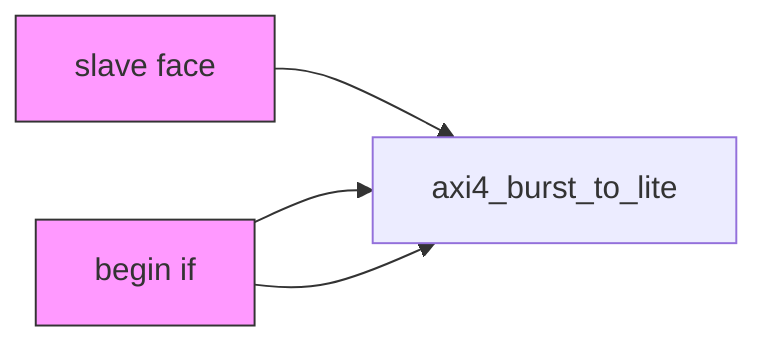

# axi4_burst_to_lite

## Description

The **axi4_burst_to_lite** module SPDX-License-Identifier: Apache-2.0
 SMVDU-TITAN-X SoC — AXI4 burst-master → single-beat-master shim

 The L1 caches refill/evict with 8-beat INCR bursts, but this SoC's
 memory-side controllers are single-beat (ddr_ctrl_top answers SLVERR
 for len>0). This shim decomposes every burst into N single-beat
 transactions and reassembles the responses, so a burst-native master
 can sit transparently behind the core's existing external ports.

 Read side : N AR/R round-trips, R beats forwarded with RLAST only on
             the final beat; per-beat RRESP passed through.
 Write side: AW accepted up front, W beats collected into a line buffer,
             then N single-beat AW+W pairs; ONE B is returned upstream
             after the last downstream B. BRESP = worst response seen.

 No reordering, one outstanding burst either direction — matches the
 cache FSMs' strictly serial use.
`timescale 1ns/1ps

## Interface

### Inputs

| Name | Width | Description |
|------|-------|-------------|
| wire | 1 | – |
| wire | 1 | – |
| wire | 1 | – |
| wire | 1 | – |
| wire | 1 | – |
| wire | 1 | – |
| wire | 1 | – |
| wire | 1 | – |
| wire | 1 | – |
| wire | 1 | – |
| wire | 1 | – |
| wire | 1 | – |
| wire | 1 | – |
| wire | 1 | – |
| wire | 1 | – |
| wire | 1 | – |
| wire | 1 | – |
| wire | 1 | – |
| wire | 1 | – |
| wire | 1 | – |
| wire | 1 | – |
| wire | 1 | – |
| wire | 1 | – |
| wire | 1 | – |
| wire | 1 | – |
| wire | 1 | – |
| wire | 1 | – |

### Outputs

| Name | Width | Description |
|------|-------|-------------|
| wire | 1 | – |
| reg | 1 | – |
| reg | 1 | – |
| reg | 1 | – |
| reg | 1 | – |
| wire | 1 | – |
| reg | 1 | – |
| reg | 1 | – |
| reg | 1 | – |
| reg | 1 | – |
| reg | 1 | – |
| wire | 1 | – |
| wire | 1 | – |
| wire | 1 | – |
| reg | 1 | – |
| reg | 1 | – |
| reg | 1 | – |
| wire | 1 | – |
| wire | 1 | – |
| wire | 1 | – |
| reg | 1 | – |
| reg | 1 | – |
| reg | 1 | – |
| reg | 1 | – |
| reg | 1 | – |

## Functionality

*axi4_burst_to_lite provides the hardware implementation for its designated function within the SoC.*

## Hierarchical Block Diagram (Mermaid)

## Full Signal‑Level Diagram (Mermaid)

```mermaid
graph LR
    classDef sig fill:#eef,stroke:#555,stroke-width:1px;
    classDef port fill:#cfe,stroke:#333,stroke-width:1px;
    wire["wire\n(input, 1)"]:::port
    wire["wire\n(input, 1)"]:::port
    wire["wire\n(input, 1)"]:::port
    wire["wire\n(output, 1)"]:::port
    wire["wire\n(input, 1)"]:::port
    wire["wire\n(input, 1)"]:::port
    wire["wire\n(input, 1)"]:::port
    wire["wire\n(input, 1)"]:::port
    reg["reg\n(output, 1)"]:::port
    wire["wire\n(input, 1)"]:::port
    reg["reg\n(output, 1)"]:::port
    reg["reg\n(output, 1)"]:::port
    reg["reg\n(output, 1)"]:::port
    wire["wire\n(input, 1)"]:::port
    wire["wire\n(output, 1)"]:::port
    wire["wire\n(input, 1)"]:::port
    wire["wire\n(input, 1)"]:::port
    wire["wire\n(input, 1)"]:::port
    wire["wire\n(input, 1)"]:::port
    wire["wire\n(input, 1)"]:::port
    reg["reg\n(output, 1)"]:::port
    wire["wire\n(input, 1)"]:::port
    wire["wire\n(input, 1)"]:::port
    wire["wire\n(input, 1)"]:::port
    reg["reg\n(output, 1)"]:::port
    wire["wire\n(input, 1)"]:::port
    reg["reg\n(output, 1)"]:::port
    reg["reg\n(output, 1)"]:::port
    wire["wire\n(input, 1)"]:::port
    reg["reg\n(output, 1)"]:::port
    wire["wire\n(output, 1)"]:::port
    wire["wire\n(output, 1)"]:::port
    wire["wire\n(output, 1)"]:::port
    wire["wire\n(input, 1)"]:::port
    reg["reg\n(output, 1)"]:::port
    wire["wire\n(input, 1)"]:::port
    wire["wire\n(input, 1)"]:::port
    wire["wire\n(input, 1)"]:::port
    reg["reg\n(output, 1)"]:::port
    wire["wire\n(input, 1)"]:::port
    reg["reg\n(output, 1)"]:::port
    wire["wire\n(output, 1)"]:::port
    wire["wire\n(output, 1)"]:::port
    wire["wire\n(output, 1)"]:::port
    reg["reg\n(output, 1)"]:::port
    wire["wire\n(input, 1)"]:::port
    reg["reg\n(output, 1)"]:::port
    reg["reg\n(output, 1)"]:::port
    reg["reg\n(output, 1)"]:::port
    wire["wire\n(input, 1)"]:::port
    reg["reg\n(output, 1)"]:::port
    wire["wire\n(input, 1)"]:::port
    rstate["rstate\n(reg, 2)"]:::sig
    r_len["r_len\n(reg, 8)"]:::sig
    r_cnt["r_cnt\n(reg, 8)"]:::sig
    wstate["wstate\n(reg, 3)"]:::sig
    w_len["w_len\n(reg, 8)"]:::sig
    w_cnt["w_cnt\n(reg, 8)"]:::sig
    w_coll["w_coll\n(reg, 8)"]:::sig
    w_resp_acc["w_resp_acc\n(reg, 2)"]:::sig
```

