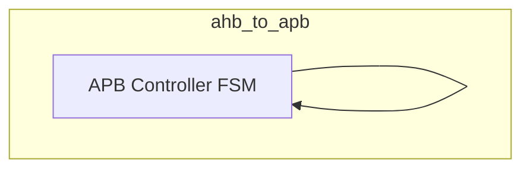
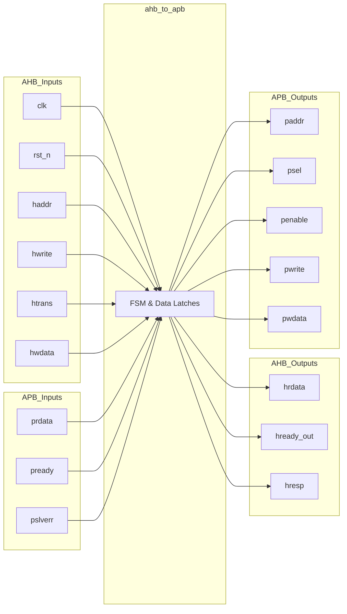

# ahb_to_apb

## Description

The AHB3 to APB4 Bridge serves as the secondary interface in the SMVDU-TITAN-X SoC for communicating with low-bandwidth, memory-mapped peripherals. It bridges 32-bit AHB3-Lite transactions to the simpler 32-bit APB4 protocol. By interpreting the AHB address and control phase (specifically looking for `NONSEQ` or `SEQ` transfers via `htrans[1]`), it drives an APB SETUP phase followed by an ENABLE phase, stalling the AHB bus (`hready_out` = 0) until the APB peripheral completes the transfer (`pready` = 1). This ensures precise translation without losing transfers, simplifying integration for typical register-based IP blocks.

## Interface

### Inputs

| Signal | Width | Description |
|--------|-------|-------------|
| clk | 1 | System clock |
| rst_n | 1 | Active-low asynchronous reset |
| haddr | 32 | AHB transaction address |
| hwrite | 1 | AHB write transfer flag |
| htrans | 2 | AHB transfer type (IDLE, BUSY, NONSEQ, SEQ) |
| hwdata | 32 | AHB write data |
| prdata | 32 | APB read data |
| pready | 1 | APB ready signal from the peripheral |
| pslverr | 1 | APB slave error signal |

### Outputs

| Signal | Width | Description |
|--------|-------|-------------|
| hrdata | 32 | AHB read data (captured from APB read data) |
| hready_out | 1 | AHB ready output (stalls AHB bus during APB access) |
| hresp | 1 | AHB response signal (tied to OKAY / 0) |
| paddr | 32 | APB address |
| psel | 1 | APB select signal (setup phase) |
| penable | 1 | APB enable signal (access phase) |
| pwrite | 1 | APB write flag |
| pwdata | 32 | APB write data |

## Functionality

The bridge implements a simple finite state machine to span the AHB and APB timing requirements. In `PS_IDLE`, it monitors `htrans` to detect active transfers (`htrans[1]`). When a transfer is detected, it immediately latches the address, write flag, and write data into the APB interface, asserts `psel`, and pulls `hready_out` low to stall the AHB master. In the next cycle (`PS_ENABLE`), it asserts `penable` to begin the APB access phase. It waits in this state until the APB slave asserts `pready`. Upon completion, it captures the read data into `hrdata`, clears the APB control signals, asserts `hready_out`, and returns to `PS_IDLE` for the next transaction.

## Hierarchical Block Diagram

## Signal-Level Diagram

