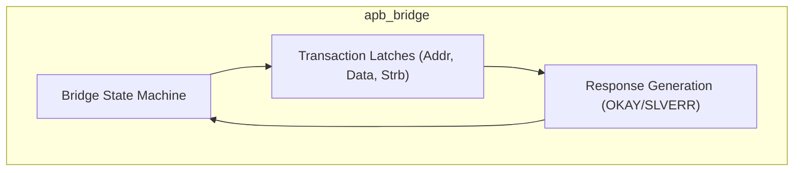
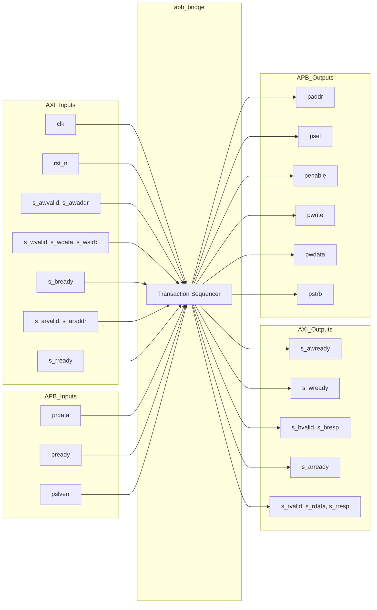

# apb_bridge

## Description

The AXI4-Lite to APB Bridge in the SMVDU-TITAN-X SoC converts standard AXI4-Lite transactions into AMBA 3/4 compliant APB transfers. It operates as a strict one-outstanding sequencer, latching a single read or write request at a time to prevent transaction merging or data corruption. For write transactions, it ensures both the address (`AW`) and data (`W`) beats are captured before initiating the APB `SETUP` phase. It provides independent priority logic, strictly prioritizing write requests over read requests to avoid deadlocks. Errors reported by the APB peripheral via `pslverr` are translated into AXI `SLVERR` (2'b10) responses. The bridge also supports the APB4 `pstrb` extension, passing byte strobes directly to the peripheral.

## Interface

### Inputs

| Signal | Width | Description |
|--------|-------|-------------|
| clk | 1 | System clock |
| rst_n | 1 | Active-low asynchronous reset |
| s_awvalid | 1 | AXI write address valid |
| s_awaddr | AW | AXI write address (parameter AW, default 32) |
| s_wvalid | 1 | AXI write data valid |
| s_wdata | DW | AXI write data (parameter DW, default 32) |
| s_wstrb | DW/8 | AXI write byte strobes |
| s_bready | 1 | AXI write response ready |
| s_arvalid | 1 | AXI read address valid |
| s_araddr | AW | AXI read address |
| s_rready | 1 | AXI read data ready |
| prdata | DW | APB read data from peripheral |
| pready | 1 | APB ready signal from peripheral |
| pslverr | 1 | APB slave error signal |

### Outputs

| Signal | Width | Description |
|--------|-------|-------------|
| s_awready | 1 | AXI write address ready |
| s_wready | 1 | AXI write data ready |
| s_bvalid | 1 | AXI write response valid |
| s_bresp | 2 | AXI write response (OKAY or SLVERR) |
| s_arready | 1 | AXI read address ready |
| s_rvalid | 1 | AXI read data valid |
| s_rdata | DW | AXI read data (captured from APB prdata) |
| s_rresp | 2 | AXI read response (OKAY or SLVERR) |
| paddr | AW | APB transaction address |
| psel | 1 | APB select signal (setup and access phases) |
| penable | 1 | APB enable signal (access phase) |
| pwrite | 1 | APB write flag |
| pwdata | DW | APB write data |
| pstrb | DW/8 | APB write byte strobes (APB4 extension) |

## Functionality

The bridge relies on an internal finite state machine comprising three states: `IDLE`, `SETUP`, and `ACCESS`. In the `IDLE` state, the bridge awaits an incoming AXI transaction. If `s_awvalid` is asserted, it accepts the write address, latches it, and sets an internal flag indicating a pending write. It then waits for `s_wvalid` to capture the write data. Once both the address and data are received (or immediately if a read address is accepted via `s_arvalid`), the FSM advances to `SETUP`. During `SETUP`, `psel` is asserted alongside the address and data. In the following cycle, `ACCESS` is entered, and `penable` is asserted. The bridge remains in `ACCESS` until the peripheral asserts `pready`. Upon completion, the FSM returns to `IDLE` while simultaneously latching the response (read data, `bresp`, or `rresp`), which is then driven back to the AXI master. Write responses (`s_bvalid`) and read data (`s_rvalid`) remain asserted until acknowledged by their respective ready signals.

## Hierarchical Block Diagram

## Signal-Level Diagram

