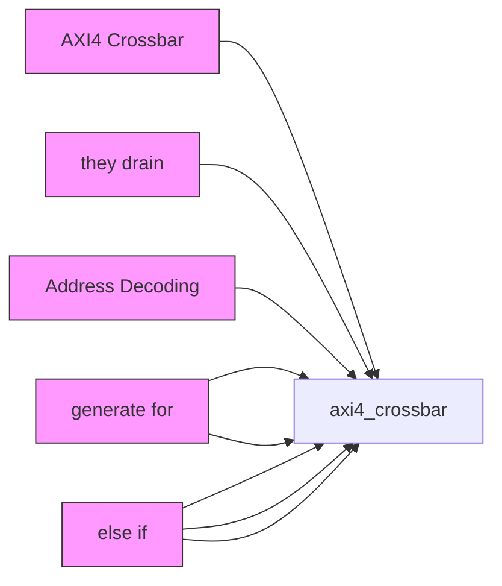

# axi4_crossbar

## Description

The **axi4_crossbar** module SPDX-License-Identifier: Apache-2.0
 SMVDU-TITAN-X SoC — AXI4 Crossbar (15 Masters × 9 Slaves)
 Iteration 4: queue-based routing replacing the self-clearing grant scheme.

 Iteration 3 defect (root cause of every write hanging at the W handshake):
 W/B/R routing was keyed on s_*_gnt registers that cleared to "no grant" the
 moment awvalid dropped — i.e. one cycle after every AW handshake. Transaction
 state now lives in FIFOs pushed on address-handshake and popped on completion
 handshake, so a transaction stays routable for its whole lifetime:

   per-master wr_wq[m] : target slave of each outstanding write; W beats are
                         routed to the head; popped on the WLAST handshake.
   per-master rd_tgt/cnt : outstanding-read target (single-target contract);
                         popped when its owned RLAST beat is accepted.
   per-slave  b_own[s] : which master owns the next B response; pushed on AW
                         handshake, popped on B acceptance.
   per-slave  r_own[s] : which master owns the next R beat; pushed on AR
                         handshake, popped on the RLAST beat.

 Ordering contract: a master may pipeline transactions, but only to the same
 target slave until they drain (every master in this SoC is in-order). This
 keeps each master's response source unique at any instant, so B/R demux by
 owner-FIFO head is exact. Bursts pass through beat-by-beat. Addresses that
 decode to no slave get an internal DECERR responder instead of silently
 landing on real slave 8 (the Iteration 3 collision).
`timescale 1ns/1ps

## Interface

### Inputs

| Name | Width | Description |
|------|-------|-------------|
| wire | 1 | – |
| wire | 1 | – |
| wire | 1 | – |
| wire | 1 | – |
| wire | 1 | – |
| wire | 1 | – |
| wire | 1 | – |
| wire | 1 | – |
| wire | 1 | – |
| wire | 1 | – |
| wire | 1 | – |
| wire | 1 | – |
| wire | 1 | – |
| wire | 1 | – |
| wire | 1 | – |
| wire | 1 | – |
| wire | 1 | – |
| wire | 1 | – |
| wire | 1 | – |
| wire | 1 | – |
| wire | 1 | – |
| wire | 1 | – |
| wire | 1 | – |
| wire | 1 | – |
| wire | 1 | – |

### Outputs

| Name | Width | Description |
|------|-------|-------------|
| wire | 1 | – |
| wire | 1 | – |
| wire | 1 | – |
| wire | 1 | – |
| wire | 1 | – |
| wire | 1 | – |
| wire | 1 | – |
| wire | 1 | – |
| wire | 1 | – |
| wire | 1 | – |
| wire | 1 | – |
| wire | 1 | – |
| wire | 1 | – |
| wire | 1 | – |
| wire | 1 | – |
| wire | 1 | – |
| wire | 1 | – |
| wire | 1 | – |
| wire | 1 | – |
| wire | 1 | – |
| wire | 1 | – |
| wire | 1 | – |
| wire | 1 | – |

## Functionality

*axi4_crossbar provides the hardware implementation for its designated function within the SoC.*

## Hierarchical Block Diagram (Mermaid)

## Full Signal‑Level Diagram (Mermaid)

```mermaid
graph LR
    classDef sig fill:#eef,stroke:#555,stroke-width:1px;
    classDef port fill:#cfe,stroke:#333,stroke-width:1px;
    wire["wire\n(input, 1)"]:::port
    wire["wire\n(input, 1)"]:::port
    wire["wire\n(input, 1)"]:::port
    wire["wire\n(output, 1)"]:::port
    wire["wire\n(input, 1)"]:::port
    wire["wire\n(input, 1)"]:::port
    wire["wire\n(input, 1)"]:::port
    wire["wire\n(output, 1)"]:::port
    wire["wire\n(input, 1)"]:::port
    wire["wire\n(input, 1)"]:::port
    wire["wire\n(input, 1)"]:::port
    wire["wire\n(output, 1)"]:::port
    wire["wire\n(input, 1)"]:::port
    wire["wire\n(output, 1)"]:::port
    wire["wire\n(output, 1)"]:::port
    wire["wire\n(input, 1)"]:::port
    wire["wire\n(output, 1)"]:::port
    wire["wire\n(input, 1)"]:::port
    wire["wire\n(input, 1)"]:::port
    wire["wire\n(output, 1)"]:::port
    wire["wire\n(input, 1)"]:::port
    wire["wire\n(output, 1)"]:::port
    wire["wire\n(output, 1)"]:::port
    wire["wire\n(output, 1)"]:::port
    wire["wire\n(output, 1)"]:::port
    wire["wire\n(output, 1)"]:::port
    wire["wire\n(input, 1)"]:::port
    wire["wire\n(output, 1)"]:::port
    wire["wire\n(output, 1)"]:::port
    wire["wire\n(output, 1)"]:::port
    wire["wire\n(input, 1)"]:::port
    wire["wire\n(output, 1)"]:::port
    wire["wire\n(output, 1)"]:::port
    wire["wire\n(output, 1)"]:::port
    wire["wire\n(input, 1)"]:::port
    wire["wire\n(output, 1)"]:::port
    wire["wire\n(input, 1)"]:::port
    wire["wire\n(input, 1)"]:::port
    wire["wire\n(output, 1)"]:::port
    wire["wire\n(input, 1)"]:::port
    wire["wire\n(output, 1)"]:::port
    wire["wire\n(output, 1)"]:::port
    wire["wire\n(input, 1)"]:::port
    wire["wire\n(output, 1)"]:::port
    wire["wire\n(input, 1)"]:::port
    wire["wire\n(input, 1)"]:::port
    wire["wire\n(input, 1)"]:::port
    wire["wire\n(input, 1)"]:::port
    wpush["wpush\n(reg, 1)"]:::sig
    wpop["wpop\n(reg, 1)"]:::sig
    rpush["rpush\n(reg, 1)"]:::sig
    rpop["rpop\n(reg, 1)"]:::sig
    bpush["bpush\n(reg, 1)"]:::sig
    bpop["bpop\n(reg, 1)"]:::sig
    rpush2["rpush2\n(reg, 1)"]:::sig
    rpop2["rpop2\n(reg, 1)"]:::sig
    bpush3["bpush3\n(reg, 1)"]:::sig
    bpop3["bpop3\n(reg, 1)"]:::sig
    rpush3["rpush3\n(reg, 1)"]:::sig
    rpop3["rpop3\n(reg, 1)"]:::sig
```

