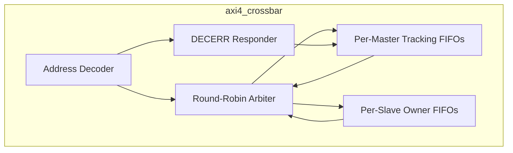
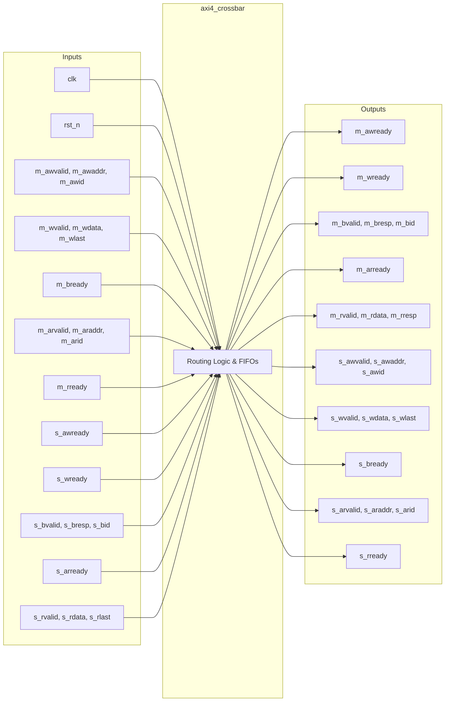

# axi4_crossbar

## Description

The AXI4 Crossbar is a crucial interconnect component in the SMVDU-TITAN-X SoC, dynamically routing transactions between 15 AXI4 masters and 9 AXI4 slaves. It implements a robust queue-based routing scheme to track outstanding transactions, replacing a previous self-clearing grant approach to resolve write channel hangs. By tracking transaction state in per-master and per-slave FIFOs, the crossbar guarantees precise write data steering and response demultiplexing. It enforces a single-target ordering contract per master to maintain in-order responses. Additionally, the crossbar includes an internal error responder that gracefully handles accesses to unmapped addresses by issuing DECERR responses without blocking other traffic.

## Interface

### Inputs

| Signal | Width | Description |
|--------|-------|-------------|
| clk | 1 | System clock |
| rst_n | 1 | Active-low asynchronous reset |
| m_awvalid | 15 | Master write address valid flags (one per master) |
| m_awaddr | 600 | Master write addresses (15 masters × 40 bits) |
| m_awid | 60 | Master write address IDs (15 masters × 4 bits) |
| m_wvalid | 15 | Master write data valid flags |
| m_wdata | 960 | Master write data channels (15 masters × 64 bits) |
| m_wstrb | 120 | Master write byte strobes (15 masters × 8 bits) |
| m_wlast | 15 | Master write last beat flags |
| m_bready | 15 | Master write response ready flags |
| m_arvalid | 15 | Master read address valid flags |
| m_araddr | 600 | Master read addresses (15 masters × 40 bits) |
| m_arid | 60 | Master read address IDs (15 masters × 4 bits) |
| m_rready | 15 | Master read data ready flags |
| s_awready | 9 | Slave write address ready flags (one per slave) |
| s_wready | 9 | Slave write data ready flags |
| s_bvalid | 9 | Slave write response valid flags |
| s_bresp | 18 | Slave write responses (9 slaves × 2 bits) |
| s_bid | 36 | Slave write response IDs (9 slaves × 4 bits) |
| s_arready | 9 | Slave read address ready flags |
| s_rvalid | 9 | Slave read data valid flags |
| s_rdata | 576 | Slave read data channels (9 slaves × 64 bits) |
| s_rresp | 18 | Slave read responses (9 slaves × 2 bits) |
| s_rlast | 9 | Slave read last beat flags |
| s_rid | 36 | Slave read data IDs (9 slaves × 4 bits) |

### Outputs

| Signal | Width | Description |
|--------|-------|-------------|
| m_awready | 15 | Crossbar write address ready flags to masters |
| m_wready | 15 | Crossbar write data ready flags to masters |
| m_bvalid | 15 | Crossbar write response valid flags to masters |
| m_bresp | 30 | Crossbar write responses to masters (15 masters × 2 bits) |
| m_bid | 60 | Crossbar write response IDs to masters (15 masters × 4 bits) |
| m_arready | 15 | Crossbar read address ready flags to masters |
| m_rvalid | 15 | Crossbar read data valid flags to masters |
| m_rdata | 960 | Crossbar read data channels to masters (15 masters × 64 bits) |
| m_rresp | 30 | Crossbar read responses to masters (15 masters × 2 bits) |
| m_rlast | 15 | Crossbar read last beat flags to masters |
| m_rid | 60 | Crossbar read data IDs to masters (15 masters × 4 bits) |
| s_awvalid | 9 | Crossbar write address valid flags to slaves |
| s_awaddr | 360 | Crossbar write addresses to slaves (9 slaves × 40 bits) |
| s_awid | 36 | Crossbar write address IDs to slaves (9 slaves × 4 bits) |
| s_wvalid | 9 | Crossbar write data valid flags to slaves |
| s_wdata | 576 | Crossbar write data channels to slaves (9 slaves × 64 bits) |
| s_wstrb | 72 | Crossbar write byte strobes to slaves (9 slaves × 8 bits) |
| s_wlast | 9 | Crossbar write last beat flags to slaves |
| s_bready | 9 | Crossbar write response ready flags to slaves |
| s_arvalid | 9 | Crossbar read address valid flags to slaves |
| s_araddr | 360 | Crossbar read addresses to slaves (9 slaves × 40 bits) |
| s_arid | 36 | Crossbar read address IDs to slaves (9 slaves × 4 bits) |
| s_rready | 9 | Crossbar read data ready flags to slaves |

## Functionality

The crossbar decodes a 40-bit address space into specific slave destinations, such as DDR4, AHB/APB bridge, BootROM, L2 cache, and memory-mapped peripherals. When an address handshake occurs (AW or AR), the target slave index is pushed into per-master FIFOs (`wr_q`, `rd_tgt`), and the originating master index is pushed into per-slave FIFOs (`b_own`, `r_own`). This strict queueing ensures that subsequent write data beats and read/write responses are routed precisely to the correct owner, seamlessly supporting bursts and overlapping handshakes. If a master issues a transaction to an unmapped address, the crossbar internally asserts `AWREADY` or `ARREADY`, absorbs any write data, and returns a synthetic DECERR response. Round-robin arbitration on address and data channels provides fair scheduling among the 15 masters competing for access to the 9 slaves.

## Hierarchical Block Diagram

## Signal-Level Diagram

