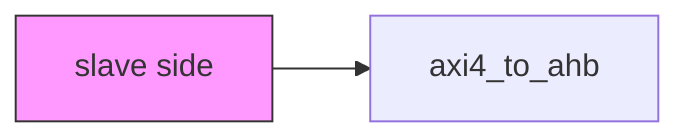
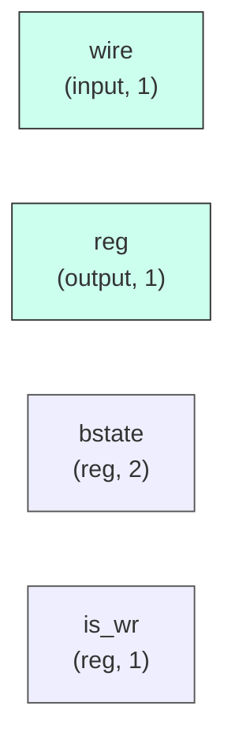

# axi4_to_ahb

## Description

The **axi4_to_ahb** module SPDX-License-Identifier: Apache-2.0
 SMVDU-TITAN-X SoC — AXI4 to AHB3-Lite Bridge
`timescale 1ns/1ps
 Width contract: the AXI slave side (DW) and the AHB master side (HDW) are
 INDEPENDENT parameters. The Titan-X fabric is 64-bit AXI but the AHB
 subsystem bus is 32 bits, so the bridge adapts: writes take the low HDW
 lanes of the AXI beat, reads are zero-extended into the AXI-width return.
 hsize stays 3'b010 (32-bit word) by construction — a single AXI beat maps
 to exactly one AHB word per transfer.

## Interface

### Inputs

| Name | Width | Description |
|------|-------|-------------|
| wire | 1 | – |
| wire | 1 | – |
| wire | 1 | – |
| wire | 1 | – |
| wire | 1 | – |
| wire | 1 | – |
| wire | 1 | – |
| wire | 1 | – |
| wire | 1 | – |
| wire | 1 | – |
| wire | 1 | – |
| wire | 1 | – |
| wire | 1 | – |
| wire | 1 | – |
| wire | 1 | – |
| wire | 1 | – |

### Outputs

| Name | Width | Description |
|------|-------|-------------|
| reg | 1 | – |
| reg | 1 | – |
| reg | 1 | – |
| wire | 1 | – |
| wire | 1 | – |
| reg | 1 | – |
| reg | 1 | – |
| reg | 1 | – |
| wire | 1 | – |
| wire | 1 | – |
| reg | 1 | – |
| reg | 1 | – |
| reg | 1 | – |
| reg | 1 | – |
| reg | 1 | – |
| reg | 1 | – |

## Functionality

*axi4_to_ahb provides the hardware implementation for its designated function within the SoC.*

## Hierarchical Block Diagram (Mermaid)

## Full Signal‑Level Diagram (Mermaid)

