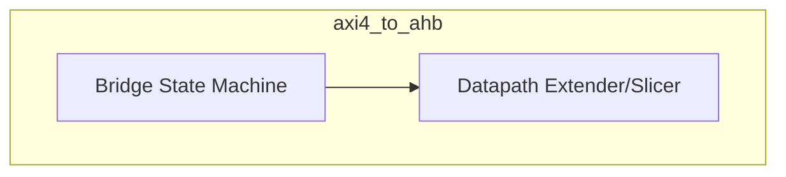
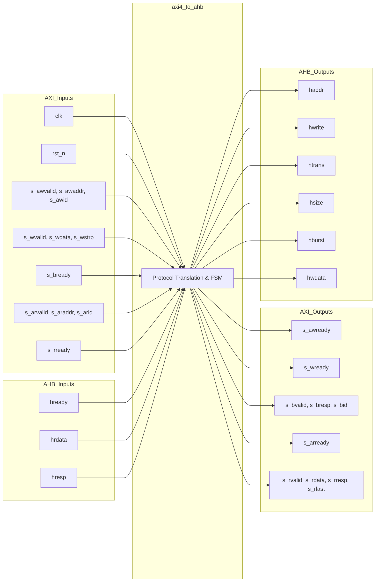

# axi4_to_ahb

## Description

The AXI4 to AHB3-Lite Bridge is an interconnect component that adapts AXI4-Lite transactions into AHB3-Lite transfers. It primarily targets the peripheral subsystem bus in the SMVDU-TITAN-X SoC, translating 64-bit or 32-bit AXI accesses to 32-bit AHB accesses. The design relies on a width contract where the AXI data width (`DW`) and AHB data width (`HDW`) are parameterized independently; write data is mapped from the lowest `HDW` lanes of the AXI bus, and read data is zero-extended to the full AXI width. All transactions are emitted as single 32-bit word transfers (`hsize` = 3'b010, `hburst` = 3'b000) on the AHB side, efficiently bridging simple AXI register-mapped peripheral accesses to the legacy AHB domain.

## Interface

### Inputs

| Signal | Width | Description |
|--------|-------|-------------|
| clk | 1 | System clock |
| rst_n | 1 | Active-low asynchronous reset |
| s_awvalid | 1 | AXI write address valid |
| s_awaddr | AW | AXI write address (parameter AW, typically 40 bits) |
| s_awid | IDW | AXI write address ID |
| s_wvalid | 1 | AXI write data valid |
| s_wdata | DW | AXI write data (parameter DW) |
| s_wstrb | DW/8 | AXI write byte strobes |
| s_bready | 1 | AXI write response ready |
| s_arvalid | 1 | AXI read address valid |
| s_araddr | AW | AXI read address (parameter AW) |
| s_arid | IDW | AXI read address ID |
| s_rready | 1 | AXI read data ready |
| hrdata | HDW | AHB read data (parameter HDW) |
| hready | 1 | AHB ready signal indicating transfer completion |
| hresp | 1 | AHB response signal |

### Outputs

| Signal | Width | Description |
|--------|-------|-------------|
| s_awready | 1 | AXI write address ready |
| s_wready | 1 | AXI write data ready |
| s_bvalid | 1 | AXI write response valid |
| s_bresp | 2 | AXI write response (tied to OKAY) |
| s_bid | IDW | AXI write response ID |
| s_arready | 1 | AXI read address ready |
| s_rvalid | 1 | AXI read data valid |
| s_rdata | DW | AXI read data (zero-extended from AHB read data) |
| s_rresp | 2 | AXI read response (tied to OKAY) |
| s_rlast | 1 | AXI read last beat (tied to 1'b1) |
| haddr | 32 | AHB transaction address |
| hwrite | 1 | AHB write transfer flag |
| htrans | 2 | AHB transfer type (IDLE or NONSEQ) |
| hsize | 3 | AHB transfer size (always 3'b010 for 32-bit word) |
| hburst | 3 | AHB burst type (always 3'b000 for single transfer) |
| hwdata | HDW | AHB write data |

## Functionality

The bridge utilizes a simple state machine (`BS_IDLE`, `BS_ADDR`, `BS_DATA`, `BS_RESP`) to sequence AXI requests to the AHB bus. In the idle state, it accepts a read or write address handshake and immediately initiates an AHB `NONSEQ` transfer with a fixed 32-bit word size. During writes, it waits for the AXI write data to arrive, drives the lower portion to the AHB `hwdata`, and then awaits the AHB `hready` to assert before generating an AXI write response (`s_bvalid`). For reads, the AHB data phase completes when `hready` goes high, at which point the bridge zero-extends the AHB `hrdata` to the AXI datapath width and returns it as `s_rdata`.

## Hierarchical Block Diagram

## Signal-Level Diagram

