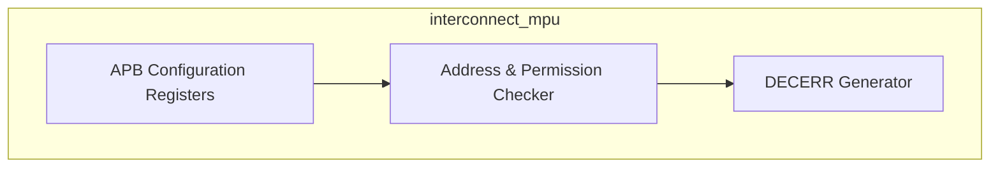
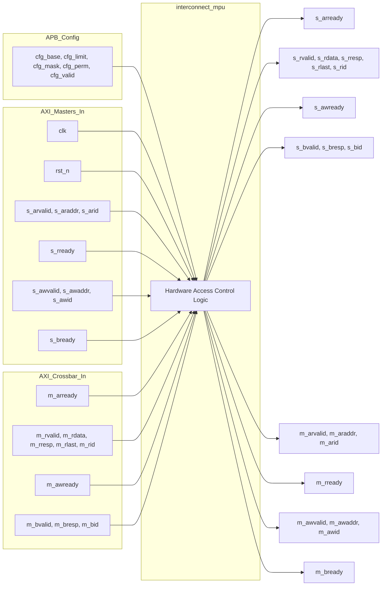

# interconnect_mpu

## Description

The Interconnect Memory Protection Unit (MPU) enforces hardware-level access control within the SMVDU-TITAN-X SoC. It is instantiated between the master ports and the central crossbar, providing 16 programmable protection regions configured via an APB interface. Each region defines a base address, a limit address, a master inclusion bitmask, and access permissions (read/write/read-write). When a master initiates an AXI transaction, the MPU checks the address against the configured regions. If the transaction falls into a valid region but the master is not permitted to perform that access, the MPU intercepts the request. It blocks the transaction from reaching the crossbar, synthetically acknowledges it, and generates an internal AXI `DECERR` response to gracefully drop the illegal operation without hanging the bus.

## Interface

### Inputs

| Signal | Width | Description |
|--------|-------|-------------|
| clk | 1 | System clock |
| rst_n | 1 | Active-low asynchronous reset |
| cfg_base_addr | 40 × 16 | Region base addresses |
| cfg_limit_addr| 40 × 16 | Region limit addresses |
| cfg_master_mask| 16 × 16 | Region allowed masters bitmasks |
| cfg_perm | 2 × 16 | Region permissions (01=R, 10=W, 11=RW) |
| cfg_valid | 1 × 16 | Region valid flags |
| s_arvalid | NM (15) | Interconnect read address valid from masters |
| s_araddr | NM × 40 | Interconnect read addresses from masters |
| s_arid | NM × 4 | Interconnect read address IDs from masters |
| m_arready | NM (15) | Interconnect read address ready from crossbar |
| m_rvalid | NM (15) | Interconnect read data valid from crossbar |
| m_rdata | NM × 64 | Interconnect read data from crossbar |
| m_rresp | NM × 2 | Interconnect read responses from crossbar |
| m_rlast | NM (15) | Interconnect read last beat flags from crossbar |
| m_rid | NM × 4 | Interconnect read data IDs from crossbar |
| s_rready | NM (15) | Interconnect read data ready from masters |
| s_awvalid | NM (15) | Interconnect write address valid from masters |
| s_awaddr | NM × 40 | Interconnect write addresses from masters |
| s_awid | NM × 4 | Interconnect write address IDs from masters |
| m_awready | NM (15) | Interconnect write address ready from crossbar |
| m_bvalid | NM (15) | Interconnect write response valid from crossbar |
| m_bresp | NM × 2 | Interconnect write responses from crossbar |
| m_bid | NM × 4 | Interconnect write response IDs from crossbar |
| s_bready | NM (15) | Interconnect write response ready from masters |

### Outputs

| Signal | Width | Description |
|--------|-------|-------------|
| s_arready | NM (15) | Interconnect read address ready to masters |
| m_arvalid | NM (15) | Interconnect read address valid to crossbar |
| m_araddr | NM × 40 | Interconnect read addresses to crossbar |
| m_arid | NM × 4 | Interconnect read address IDs to crossbar |
| s_rvalid | NM (15) | Interconnect read data valid to masters |
| s_rdata | NM × 64 | Interconnect read data to masters |
| s_rresp | NM × 2 | Interconnect read responses to masters |
| s_rlast | NM (15) | Interconnect read last beat flags to masters |
| s_rid | NM × 4 | Interconnect read data IDs to masters |
| m_rready | NM (15) | Interconnect read data ready to crossbar |
| s_awready | NM (15) | Interconnect write address ready to masters |
| m_awvalid | NM (15) | Interconnect write address valid to crossbar |
| m_awaddr | NM × 40 | Interconnect write addresses to crossbar |
| m_awid | NM × 4 | Interconnect write address IDs to crossbar |
| s_bvalid | NM (15) | Interconnect write response valid to masters |
| s_bresp | NM × 2 | Interconnect write responses to masters |
| s_bid | NM × 4 | Interconnect write response IDs to masters |
| m_bready | NM (15) | Interconnect write response ready to crossbar |

## Functionality

The MPU operates through a combinational block that checks incoming transaction addresses (`s_araddr`, `s_awaddr`) against all 16 programmable regions. If a transaction hits a valid region and the originating master's ID (represented as a bit position) does not match the allowed mask, or lacks the necessary R/W permissions, the transaction is marked as blocked. A blocked transaction is artificially acknowledged by the MPU asserting `s_arready` or `s_awready`, preventing a bus stall. The MPU then raises a local pending flag (`pending_ar_decerr`, `pending_aw_decerr`) which intercepts the return channel and feeds a synthetic `DECERR` response (2'b11) back to the master. Allowed transactions pass through the module with zero latency.

## Hierarchical Block Diagram

## Signal-Level Diagram

