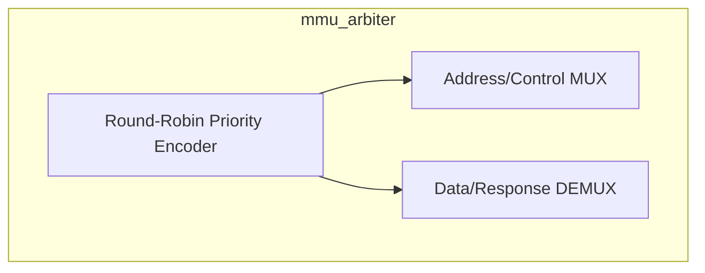
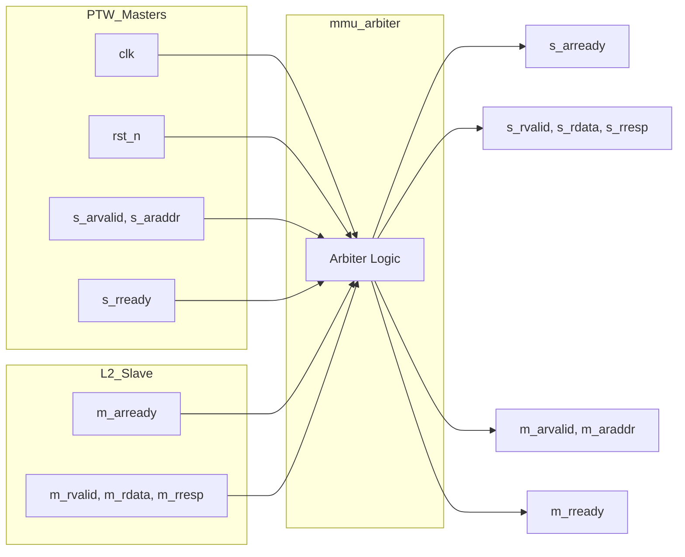

# mmu_arbiter

## Description

The MMU Page Table Walker (PTW) Arbiter manages read-only AXI4 traffic from 5 distinct PTWs, funneling them into a single slave port connected to the L2 cache (or central crossbar) in the SMVDU-TITAN-X SoC. It implements a strict round-robin scheduling algorithm to ensure fair access among the walkers. When a PTW requests access, the arbiter grants it priority, routes its read address (`AR`) downstream, and locks the channel. It subsequently routes the returning read data (`R`) directly back to the active PTW. Other requesting PTWs are held in wait states until the current transaction completes, after which priority advances to the next requester.

## Interface

### Inputs

| Signal | Width | Description |
|--------|-------|-------------|
| clk | 1 | System clock |
| rst_n | 1 | Active-low asynchronous reset |
| s_arvalid | N (5) | Read address valid flags from 5 PTWs |
| s_araddr | N × 40 | Read addresses from 5 PTWs |
| s_rready | N (5) | Read data ready flags from 5 PTWs |
| m_arready | 1 | Read address ready from L2 cache |
| m_rvalid | 1 | Read data valid from L2 cache |
| m_rdata | 64 | Read data from L2 cache |
| m_rresp | 2 | Read response from L2 cache |

### Outputs

| Signal | Width | Description |
|--------|-------|-------------|
| s_arready | N (5) | Read address ready flags to 5 PTWs |
| s_rvalid | N (5) | Read data valid flags to 5 PTWs |
| s_rdata | N × 64 | Read data to 5 PTWs |
| s_rresp | N × 2 | Read responses to 5 PTWs |
| m_arvalid | 1 | Read address valid to L2 cache |
| m_araddr | 40 | Read address to L2 cache |
| m_rready | 1 | Read data ready to L2 cache |

## Functionality

The arbiter revolves around a state tracking mechanism using a `grant_idx` counter and a `req_active` flag. When the bus is idle (`!req_active`), the arbiter scans the `s_arvalid` lines sequentially starting from the current `grant_idx`. Upon finding an active request, it asserts `req_active`, assigns the matching `grant_idx`, and forwards the `AR` channel signals to the L2 port. The arbiter stays locked to this index, demultiplexing the returning `m_rvalid`, `m_rdata`, and `m_rresp` signals exclusively to the selected master. When the read transaction completes (signaled by a handshake on the `R` channel), `req_active` is cleared and `grant_idx` is incremented to evaluate the next PTW, ensuring starvation-free round-robin arbitration.

## Hierarchical Block Diagram

## Signal-Level Diagram

