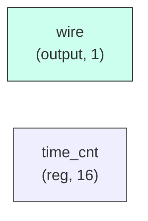

# qos_controller

## Description

The **qos_controller** module SPDX-License-Identifier: Apache-2.0
 SMVDU-TITAN-X SoC — QoS Controller
 Iteration 3: Dynamically adjusts AXI QoS signals based on bandwidth usage.
 Targets high-bandwidth masters (Video DMA, PCIe, Ethernet).
`timescale 1ns/1ps

## Interface

### Inputs

| Name | Width | Description |
|------|-------|-------------|
| wire | 1 | – |
| wire | 1 | – |
| wire | 1 | – |
| wire | 1 | – |
| wire | 1 | – |
| wire | 1 | – |
| wire | 1 | – |
| wire | 1 | – |
| wire | 1 | – |
| wire | 1 | – |

### Outputs

| Name | Width | Description |
|------|-------|-------------|
| wire | 1 | – |
| wire | 1 | – |

## Functionality

*qos_controller provides the hardware implementation for its designated function within the SoC.*

## Hierarchical Block Diagram (Mermaid)

## Full Signal‑Level Diagram (Mermaid)

