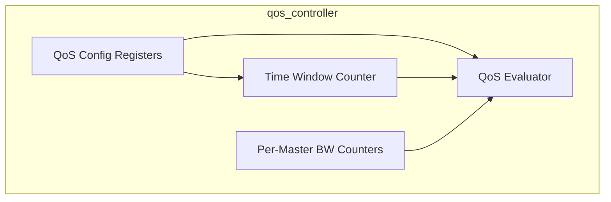
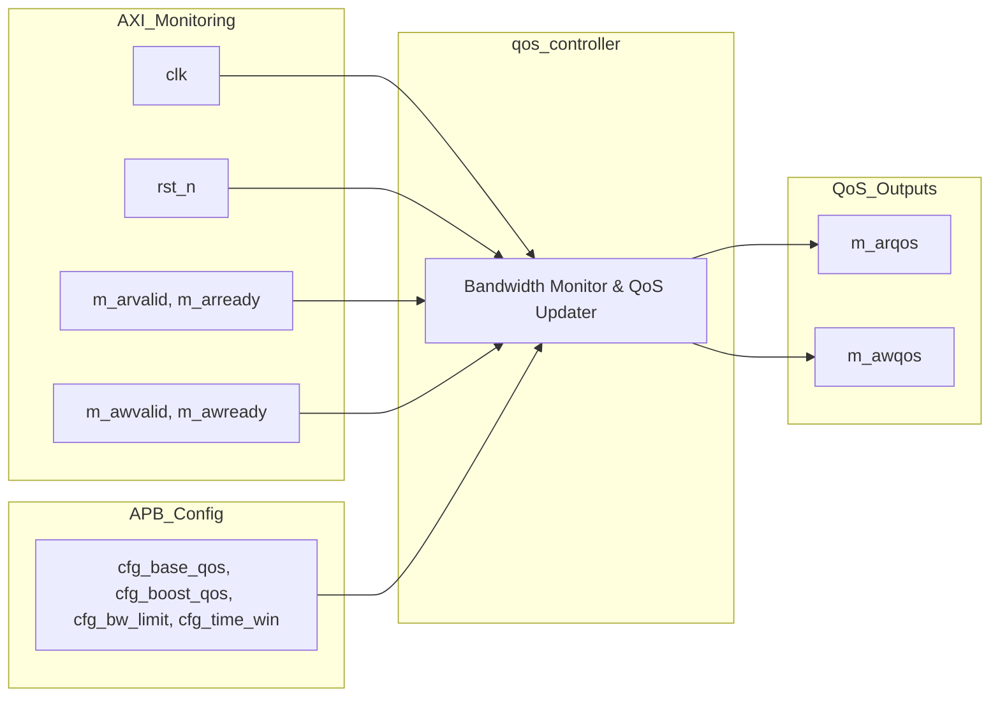

# qos_controller

## Description

The QoS Controller dynamically manages the AXI Quality of Service (QoS) signaling for all 15 master ports in the SMVDU-TITAN-X SoC. Its goal is to prevent high-bandwidth peripherals, such as Video DMAs and PCIe controllers, from starving critical real-time components. The controller is programmed via an APB interface with a global time window and per-master bandwidth thresholds. It continuously monitors accepted AXI address handshakes (`AR` and `AW`) within the programmed time window. At the end of each window, masters that exceeded their transaction limit are throttled to a lower base QoS level, while masters within their limit receive a boosted QoS level for the next window.

## Interface

### Inputs

| Signal | Width | Description |
|--------|-------|-------------|
| clk | 1 | System clock |
| rst_n | 1 | Active-low asynchronous reset |
| cfg_base_qos | 4 × 15 | Base QoS value per master (when throttled) |
| cfg_boost_qos | 4 × 15 | Boost QoS value per master (when within limits) |
| cfg_bw_limit | 16 × 15 | Bandwidth threshold in transactions per window per master |
| cfg_time_win | 16 | Global time window for bandwidth measurement (clock cycles) |
| m_arvalid | NM (15) | Read address valid flags monitored across all masters |
| m_arready | NM (15) | Read address ready flags monitored across all masters |
| m_awvalid | NM (15) | Write address valid flags monitored across all masters |
| m_awready | NM (15) | Write address ready flags monitored across all masters |

### Outputs

| Signal | Width | Description |
|--------|-------|-------------|
| m_arqos | 4 × 15 | Dynamically computed read QoS signals for all masters |
| m_awqos | 4 × 15 | Dynamically computed write QoS signals for all masters |

## Functionality

The controller uses a global 16-bit counter (`time_cnt`) to track the measurement window defined by `cfg_time_win`. Concurrently, 15 individual counters (`bw_cnt`) tally the total number of accepted read and write address handshakes for each master. When the time window expires, the controller evaluates each master's bandwidth usage against its `cfg_bw_limit`. If a master has exceeded its limit, its `cur_arqos` and `cur_awqos` registers are assigned the `cfg_base_qos` value (throttling its priority in the interconnect). If the master is within its limit, it is assigned the `cfg_boost_qos` value. All bandwidth counters and the time window counter are then reset for the next measurement interval. The computed QoS values are continuously driven out to replace the default AXI QoS signals on the interconnect.

## Hierarchical Block Diagram

## Signal-Level Diagram

