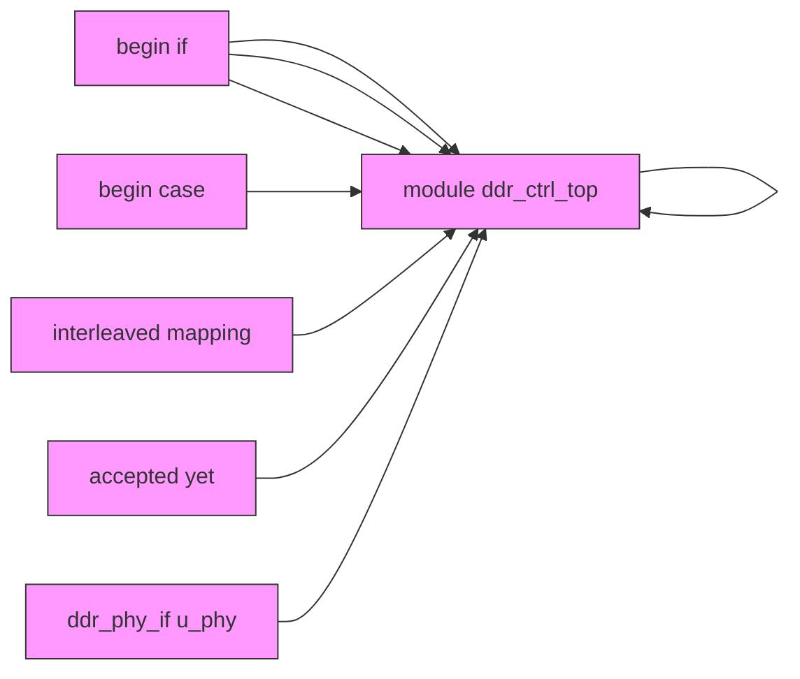

# ddr_ctrl_top

## Description

The **ddr_ctrl_top** module SPDX-License-Identifier: Apache-2.0
 SMVDU-TITAN-X SoC — DDR4 Memory Controller Top
 Iteration 3: Upgraded with Bank Interleaving, Auto-Refresh Manager, and DFI 4.0
 AXI4 slave → command sequencer → scheduler → PHY
`timescale 1ns/1ps

## Interface

### Inputs

| Name | Width | Description |
|------|-------|-------------|
| wire | 1 | – |
| wire | 1 | – |
| wire | 1 | – |
| wire | 1 | – |
| wire | 1 | – |
| wire | 1 | – |
| wire | 1 | – |
| wire | 1 | – |
| wire | 1 | – |
| wire | 1 | – |
| wire | 1 | – |
| wire | 1 | – |
| wire | 1 | – |
| wire | 1 | – |
| wire | 1 | – |
| wire | 1 | – |
| wire | 1 | – |

### Outputs

| Name | Width | Description |
|------|-------|-------------|
| wire | 1 | – |
| wire | 1 | – |
| wire | 1 | – |
| wire | 1 | – |
| wire | 1 | – |
| wire | 1 | – |
| wire | 1 | – |
| wire | 1 | – |
| wire | 1 | – |
| wire | 1 | – |
| wire | 1 | – |
| wire | 1 | – |
| wire | 1 | – |
| wire | 1 | – |
| wire | 1 | – |
| wire | 1 | – |
| wire | 1 | – |
| wire | 1 | – |
| wire | 1 | – |
| wire | 1 | – |
| wire | 1 | – |
| wire | 1 | – |

## Functionality

*ddr_ctrl_top provides the hardware implementation for its designated function within the SoC.*

## Hierarchical Block Diagram (Mermaid)

## Full Signal‑Level Diagram (Mermaid)

```mermaid
graph LR
    classDef sig fill:#eef,stroke:#555,stroke-width:1px;
    classDef port fill:#cfe,stroke:#333,stroke-width:1px;
    wire["wire\n(input, 1)"]:::port
    wire["wire\n(input, 1)"]:::port
    wire["wire\n(input, 1)"]:::port
    wire["wire\n(output, 1)"]:::port
    wire["wire\n(input, 1)"]:::port
    wire["wire\n(input, 1)"]:::port
    wire["wire\n(input, 1)"]:::port
    wire["wire\n(input, 1)"]:::port
    wire["wire\n(input, 1)"]:::port
    wire["wire\n(output, 1)"]:::port
    wire["wire\n(input, 1)"]:::port
    wire["wire\n(input, 1)"]:::port
    wire["wire\n(input, 1)"]:::port
    wire["wire\n(output, 1)"]:::port
    wire["wire\n(input, 1)"]:::port
    wire["wire\n(output, 1)"]:::port
    wire["wire\n(output, 1)"]:::port
    wire["wire\n(input, 1)"]:::port
    wire["wire\n(output, 1)"]:::port
    wire["wire\n(input, 1)"]:::port
    wire["wire\n(input, 1)"]:::port
    wire["wire\n(input, 1)"]:::port
    wire["wire\n(output, 1)"]:::port
    wire["wire\n(input, 1)"]:::port
    wire["wire\n(output, 1)"]:::port
    wire["wire\n(output, 1)"]:::port
    wire["wire\n(output, 1)"]:::port
    wire["wire\n(output, 1)"]:::port
    wire["wire\n(output, 1)"]:::port
    wire["wire\n(output, 1)"]:::port
    wire["wire\n(output, 1)"]:::port
    wire["wire\n(output, 1)"]:::port
    wire["wire\n(output, 1)"]:::port
    wire["wire\n(output, 1)"]:::port
    wire["wire\n(output, 1)"]:::port
    wire["wire\n(output, 1)"]:::port
    wire["wire\n(output, 1)"]:::port
    wire["wire\n(output, 1)"]:::port
    wire["wire\n(output, 1)"]:::port
    wire["wire\n(inout, 1)"]:::port
    wire["wire\n(inout, 1)"]:::port
    wire["wire\n(inout, 1)"]:::port
    init_cnt["init_cnt\n(reg, 16)"]:::sig
    init_done["init_done\n(reg, 1)"]:::sig
    ref_cnt["ref_cnt\n(reg, 16)"]:::sig
    ref_req["ref_req\n(reg, 1)"]:::sig
    ref_ack["ref_ack\n(wire, 1)"]:::sig
    cmd_addr["cmd_addr\n(reg, 40)"]:::sig
    cmd_wdata["cmd_wdata\n(reg, 64)"]:::sig
    cmd_wstrb["cmd_wstrb\n(reg, 8)"]:::sig
    cmd_id["cmd_id\n(reg, 4)"]:::sig
    cmd_is_wr["cmd_is_wr\n(reg, 1)"]:::sig
    ctrl_state["ctrl_state\n(reg, 2)"]:::sig
    s_arready_r["s_arready_r\n(reg, 1)"]:::sig
    s_awready_r["s_awready_r\n(reg, 1)"]:::sig
    s_wready_r["s_wready_r\n(reg, 1)"]:::sig
    s_bvalid_r["s_bvalid_r\n(reg, 1)"]:::sig
    s_rvalid_r["s_rvalid_r\n(reg, 1)"]:::sig
    s_rlast_r["s_rlast_r\n(reg, 1)"]:::sig
    s_rdata_r["s_rdata_r\n(reg, 64)"]:::sig
    s_rid_r["s_rid_r\n(reg, 4)"]:::sig
    s_bid_r["s_bid_r\n(reg, 4)"]:::sig
    s_rresp_r["s_rresp_r\n(reg, 2)"]:::sig
    s_bresp_r["s_bresp_r\n(reg, 2)"]:::sig
    sched_ready["sched_ready\n(wire, 1)"]:::sig
    sched_cmd_done["sched_cmd_done\n(wire, 1)"]:::sig
    sched_rddata["sched_rddata\n(wire, 64)"]:::sig
    sched_rdvalid["sched_rdvalid\n(wire, 1)"]:::sig
    cmd_pend["cmd_pend\n(reg, 1)"]:::sig
    sched_cmd_type["sched_cmd_type\n(reg, 2)"]:::sig
    sched_bank["sched_bank\n(reg, 3)"]:::sig
    sched_bg["sched_bg\n(reg, 2)"]:::sig
    sched_row["sched_row\n(reg, 16)"]:::sig
    sched_col["sched_col\n(reg, 10)"]:::sig
    sched_wrdata["sched_wrdata\n(reg, 64)"]:::sig
    wd_cnt["wd_cnt\n(reg, 16)"]:::sig
    dfi_cs_n_w["dfi_cs_n_w\n(wire, 1)"]:::sig
    dfi_ras_n_w["dfi_ras_n_w\n(wire, 1)"]:::sig
    dfi_cas_n_w["dfi_cas_n_w\n(wire, 1)"]:::sig
    dfi_we_n_w["dfi_we_n_w\n(wire, 1)"]:::sig
    dfi_act_n_w["dfi_act_n_w\n(wire, 1)"]:::sig
    dfi_bank_w["dfi_bank_w\n(wire, 3)"]:::sig
    dfi_bg_w["dfi_bg_w\n(wire, 2)"]:::sig
    dfi_addr_w["dfi_addr_w\n(wire, 16)"]:::sig
    dfi_wrdata_valid_w["dfi_wrdata_valid_w\n(wire, 1)"]:::sig
    dfi_wrdata_w["dfi_wrdata_w\n(wire, 64)"]:::sig
    dfi_rddata_w["dfi_rddata_w\n(wire, 64)"]:::sig
    dfi_rddata_valid_w["dfi_rddata_valid_w\n(wire, 1)"]:::sig
```

