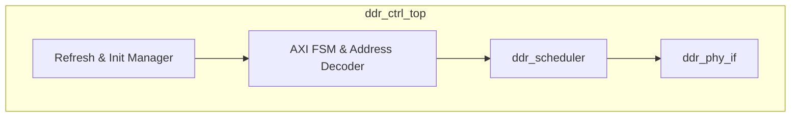
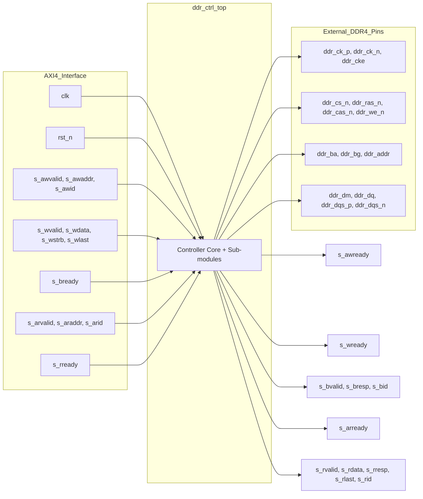

# ddr_ctrl_top

## Description

The DDR4 Memory Controller Top (`ddr_ctrl_top`) is the primary bridge between the internal AXI4 interconnect and the external DDR4 memory in the SMVDU-TITAN-X SoC. It encapsulates an initialization sequence, an auto-refresh manager, and address decoding logic to support bank interleaving. By parsing incoming AXI4 read and write requests, the controller extracts the bank group, bank, row, and column indices, and forwards them as structured commands to the underlying scheduler. It incorporates a robust watchdog mechanism to prevent the AXI bus from wedging; if the scheduler fails to return data or complete a command within a specified timeout, the controller safely degrades the transaction by returning a synthetic `SLVERR` response back to the master.

## Interface

### Inputs

| Signal | Width | Description |
|--------|-------|-------------|
| clk | 1 | System clock |
| rst_n | 1 | Active-low asynchronous reset |
| s_awvalid | 1 | AXI write address valid |
| s_awaddr | 40 | AXI write address |
| s_awid | 4 | AXI write address ID |
| s_awlen | 8 | AXI write burst length |
| s_awsize | 3 | AXI write burst size |
| s_wvalid | 1 | AXI write data valid |
| s_wdata | 64 | AXI write data |
| s_wstrb | 8 | AXI write byte strobes |
| s_wlast | 1 | AXI write last beat flag |
| s_bready | 1 | AXI write response ready |
| s_arvalid | 1 | AXI read address valid |
| s_araddr | 40 | AXI read address |
| s_arid | 4 | AXI read address ID |
| s_arlen | 8 | AXI read burst length |
| s_rready | 1 | AXI read data ready |

### Outputs

| Signal | Width | Description |
|--------|-------|-------------|
| s_awready | 1 | AXI write address ready |
| s_wready | 1 | AXI write data ready |
| s_bvalid | 1 | AXI write response valid |
| s_bresp | 2 | AXI write response |
| s_bid | 4 | AXI write response ID |
| s_arready | 1 | AXI read address ready |
| s_rvalid | 1 | AXI read data valid |
| s_rdata | 64 | AXI read data |
| s_rresp | 2 | AXI read response |
| s_rlast | 1 | AXI read last beat flag |
| s_rid | 4 | AXI read data ID |
| ddr_ck_p | 1 | DDR clock (positive phase) |
| ddr_ck_n | 1 | DDR clock (negative phase) |
| ddr_cke | 1 | DDR clock enable |
| ddr_cs_n | 1 | DDR chip select (active low) |
| ddr_ras_n | 1 | DDR row address strobe (active low) |
| ddr_cas_n | 1 | DDR column address strobe (active low) |
| ddr_we_n | 1 | DDR write enable (active low) |
| ddr_ba | 3 | DDR bank address |
| ddr_bg | 2 | DDR bank group |
| ddr_addr | 16 | DDR address bus (row and column) |
| ddr_dm | 8 | DDR data mask |
| ddr_dq | 64 | DDR bidirectional data bus (inout) |
| ddr_dqs_p | 8 | DDR bidirectional data strobe positive (inout) |
| ddr_dqs_n | 8 | DDR bidirectional data strobe negative (inout) |

## Functionality

Upon reset, the controller undergoes a simulated 40,000-cycle initialization sequence before accepting any AXI transactions. During normal operation, an autonomous refresh manager periodically forces the scheduler to issue `REF` commands to satisfy DDR memory retention constraints. For AXI transactions, the controller uses a finite state machine (`CS_IDLE`, `CS_READ`, `CS_WRITE`, `CS_WRESP`) to decode the address into bank group (bits [16:15]), bank (bits [14:12]), row, and column components, achieving effective bank interleaving. These components are issued to the `ddr_scheduler` sub-module as DFI-like commands. The controller maintains a pending state for each transaction, and if a transaction is not serviced by the scheduler within 4096 cycles (measured by `wd_cnt`), it aborts the wait and synthesizes an AXI `SLVERR` response to prevent system deadlock.

## Hierarchical Block Diagram

## Signal-Level Diagram

