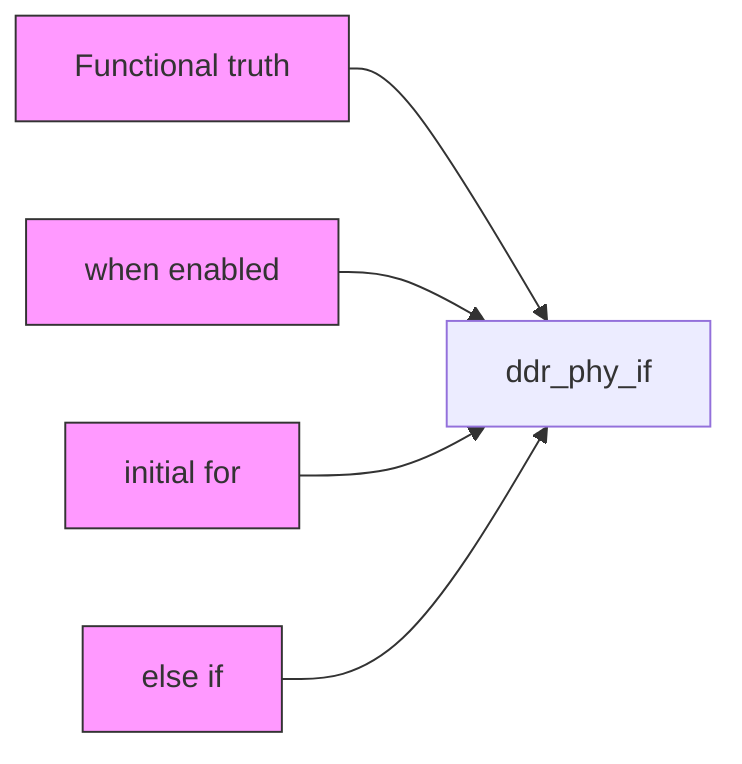
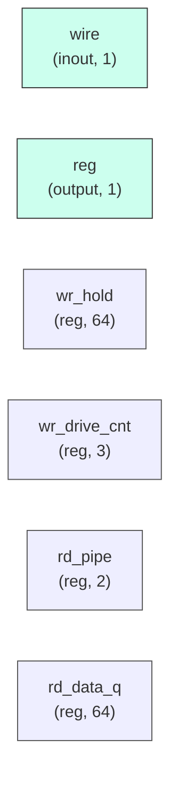

# ddr_phy_if

## Description

The **ddr_phy_if** module SPDX-License-Identifier: Apache-2.0
 SMVDU-TITAN-X SoC — DDR4 PHY Interface
 Iteration 4: deterministic in-model storage + real DDR-style pin activity.

 Functional truth (read/write DATA) lives in an internal array indexed by
 the full DDR4 address map {BG, BA, row, col}, so results never depend on
 tristate-pin sampling or clock-phase luck (the failure mode that made every
 read return zero in Iteration 3). The DDR CK/DQS/DQ pins still toggle
 realistically for waveforms; bfm/ddr4_sdram_bfm.v may listen on them but is
 no longer required for correct data.

 Modeled capacity (sim): 2-bit BG × 8 banks × 512 rows × 256 cols × 64-bit
 = 32 MB window starting at row 0. Addresses beyond the modeled row/col
 range fold — a documented sim-model limit, not an RTL claim.
`timescale 1ns/1ps

## Interface

### Inputs

| Name | Width | Description |
|------|-------|-------------|
| wire | 1 | – |
| wire | 1 | – |
| wire | 1 | – |
| wire | 1 | – |
| wire | 1 | – |
| wire | 1 | – |
| wire | 1 | – |
| wire | 1 | – |
| wire | 1 | – |
| wire | 1 | – |
| wire | 1 | – |
| wire | 1 | – |
| wire | 1 | – |

### Outputs

| Name | Width | Description |
|------|-------|-------------|
| reg | 1 | – |
| reg | 1 | – |
| reg | 1 | – |
| reg | 1 | – |
| wire | 1 | – |
| wire | 1 | – |
| wire | 1 | – |
| wire | 1 | – |
| wire | 1 | – |
| wire | 1 | – |
| wire | 1 | – |
| wire | 1 | – |
| wire | 1 | – |

## Functionality

*ddr_phy_if provides the hardware implementation for its designated function within the SoC.*

## Hierarchical Block Diagram (Mermaid)

## Full Signal‑Level Diagram (Mermaid)

