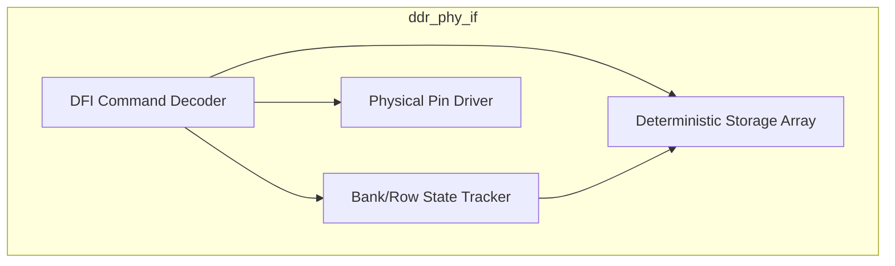
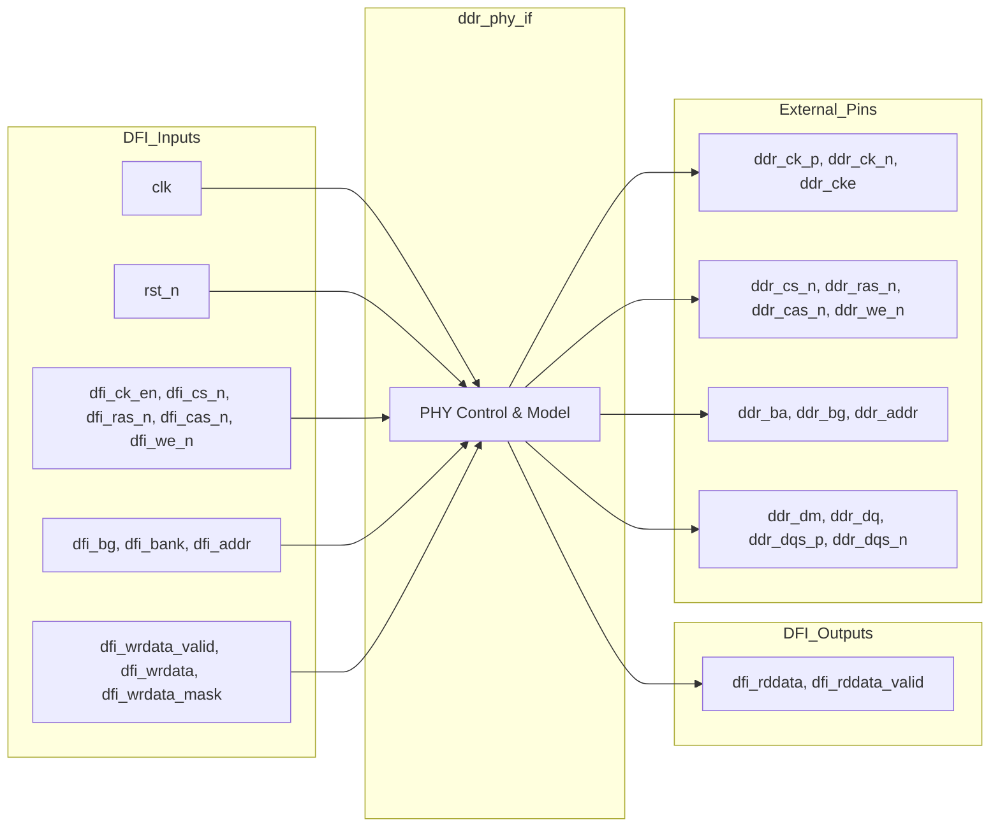

# ddr_phy_if

## Description

The DDR4 PHY Interface translates internal DFI 4.0 standard commands into physical DDR4 pin toggles while maintaining a highly deterministic internal memory model. To eliminate simulation errors caused by phase sampling fragility at the physical pin level, this module intercepts read and write operations and stores the canonical data in a predictable internal array (indexed strictly by `{bank_group, bank, row, col}`). It enforces a rigid 2-cycle CAS latency pipeline for read data retrieval, ensuring data correctness in simulation environments. Concurrently, it drives standard DDR pins (`DQ`, `DQS`, `CK`, `RAS`, `CAS`, etc.) precisely to enable realistic waveform tracing and verification with external Bus Functional Models (BFMs).

## Interface

### Inputs

| Signal | Width | Description |
|--------|-------|-------------|
| clk | 1 | System clock (typically 2x DDR rate) |
| rst_n | 1 | Active-low asynchronous reset |
| dfi_ck_en | 1 | DFI clock enable |
| dfi_cs_n | 1 | DFI chip select |
| dfi_ras_n | 1 | DFI row address strobe |
| dfi_cas_n | 1 | DFI column address strobe |
| dfi_we_n | 1 | DFI write enable |
| dfi_bg | 2 | DFI bank group |
| dfi_bank | 3 | DFI bank address |
| dfi_addr | 16 | DFI address bus |
| dfi_wrdata_valid | 1 | DFI write data valid flag |
| dfi_wrdata | 64 | DFI write data |
| dfi_wrdata_mask | 8 | DFI write data byte mask |

### Outputs

| Signal | Width | Description |
|--------|-------|-------------|
| dfi_rddata | 64 | DFI read data returned to scheduler |
| dfi_rddata_valid | 1 | DFI read data valid flag |
| ddr_ck_p | 1 | DDR physical clock positive |
| ddr_ck_n | 1 | DDR physical clock negative |
| ddr_cke | 1 | DDR clock enable |
| ddr_cs_n | 1 | DDR physical chip select |
| ddr_ras_n | 1 | DDR physical row address strobe |
| ddr_cas_n | 1 | DDR physical column address strobe |
| ddr_we_n | 1 | DDR physical write enable |
| ddr_ba | 3 | DDR physical bank address |
| ddr_bg | 2 | DDR physical bank group |
| ddr_addr | 16 | DDR physical address |
| ddr_dm | 8 | DDR physical data mask |
| ddr_dq | 64 | DDR bidirectional data pins |
| ddr_dqs_p | 8 | DDR bidirectional data strobe positive |
| ddr_dqs_n | 8 | DDR bidirectional data strobe negative |

## Functionality

The PHY interface parses the incoming DFI bus to detect memory commands like `ACT` (Activate), `PRE` (Precharge), `RD` (Read), and `WR` (Write). It maintains an internal tracking array (`open_row` and `row_open`) mirroring the state of the 32 physical bank slots. When an `ACT` command arrives, it records the open row. For `WR` commands, it bypasses complex bus turnaround timings and instantly commits `dfi_wrdata` to a large 64-bit internal memory array (`mem`), whilst accurately echoing the data on the external `ddr_dq` pins for 4 cycles for trace fidelity. For `RD` commands, it queues the request into a shift register (`rd_pipe`); two cycles later (acting as CAS latency), it fetches the data from the internal array and asserts `dfi_rddata_valid`. Reads targeting closed rows explicitly return zero.

## Hierarchical Block Diagram

## Signal-Level Diagram

