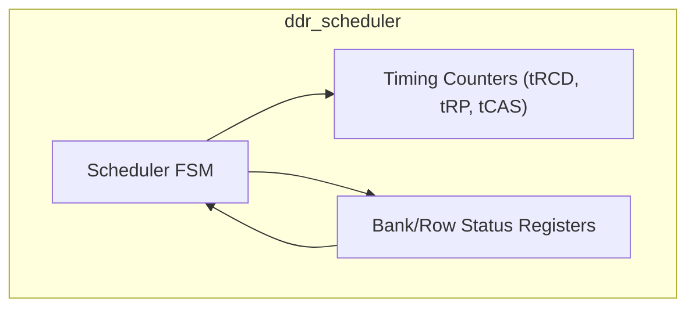
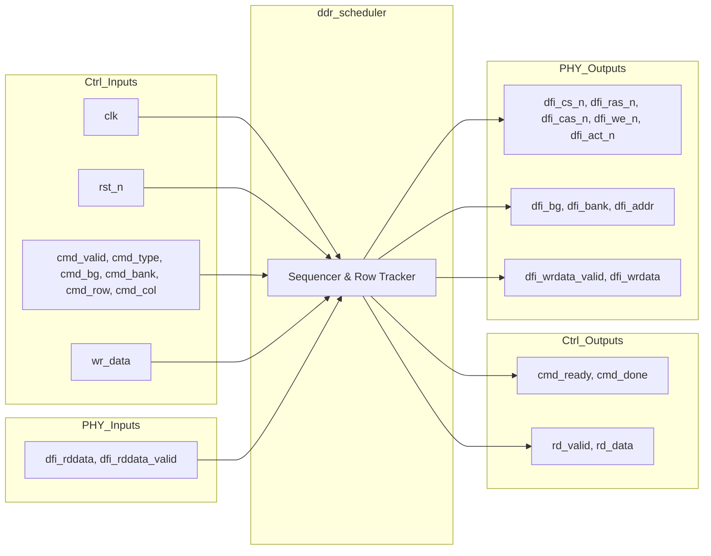

# ddr_scheduler

## Description

The DDR Scheduler orchestrates DFI commands (`ACT`, `CAS`, `PRE`) based on memory requests arriving from the memory controller. Implementing a strict open-row policy, it independently tracks the open row status across 32 individual memory bank slots (4 bank groups × 8 banks). When a transaction targets a currently open row, the scheduler expedites the access by issuing a `CAS` directly. Conversely, if a row conflict is detected, it sequences a `PRE` (Precharge) followed by an `ACT` (Activate) and finally a `CAS`, strictly observing parameterized timing delays (`tRCD`, `tRP`, `tCAS`). It is fully robust to periodic auto-refresh commands, injecting lightweight stalls during the `tRFC` interval.

## Interface

### Inputs

| Signal | Width | Description |
|--------|-------|-------------|
| clk | 1 | System clock |
| rst_n | 1 | Active-low asynchronous reset |
| cmd_valid | 1 | Input command valid |
| cmd_type | 2 | Command type (00=RD, 01=WR, 10=REF, 11=PRE) |
| cmd_bg | 2 | Target bank group |
| cmd_bank | 3 | Target bank |
| cmd_row | 16 | Target row |
| cmd_col | 10 | Target column |
| wr_data | 64 | Write data payload |
| dfi_rddata | 64 | DFI read data from PHY |
| dfi_rddata_valid | 1 | DFI read data valid flag from PHY |

### Outputs

| Signal | Width | Description |
|--------|-------|-------------|
| cmd_ready | 1 | Scheduler ready to accept command |
| cmd_done | 1 | Pulsed when a WR or REF command is fully retired |
| rd_data | 64 | Output read data back to controller |
| rd_valid | 1 | Output read data valid flag |
| dfi_cs_n | 1 | DFI chip select |
| dfi_ras_n | 1 | DFI row address strobe |
| dfi_cas_n | 1 | DFI column address strobe |
| dfi_we_n | 1 | DFI write enable |
| dfi_act_n | 1 | DFI activate signal |
| dfi_bank | 3 | DFI bank address |
| dfi_bg | 2 | DFI bank group |
| dfi_addr | 16 | DFI address |
| dfi_wrdata_valid | 1 | DFI write data valid flag |
| dfi_wrdata | 64 | DFI write data payload |

## Functionality

The core of the scheduler is a finite state machine (`SC_IDLE`, `SC_PRE`, `SC_TRPW`, `SC_ACT`, `SC_TRCDW`, `SC_CAS`, `SC_CASW`, `SC_RDWT`). Upon accepting a command in `SC_IDLE`, it evaluates the state of the target bank group and bank (`ba_cmd`). If the row is closed, it transitions to `SC_ACT`, asserting `dfi_act_n` and waiting `tRCD` cycles before moving to `SC_CAS`. If a conflicting row is open, it first moves to `SC_PRE` and waits `tRP` cycles before activating the new row. During `SC_CAS`, it asserts `dfi_cas_n`. For writes, the scheduler drives `dfi_wrdata` and waits `tCAS` cycles for the physical write to complete before pulsing `cmd_done`. For reads, it transitions to `SC_RDWT` and arms a detection circuit that safely latches `dfi_rddata` upon observing the rising edge of `dfi_rddata_valid` from the PHY. Auto-refresh commands repurpose the `tRP` delay counters to inject a short stall across the bus.

## Hierarchical Block Diagram

## Signal-Level Diagram

