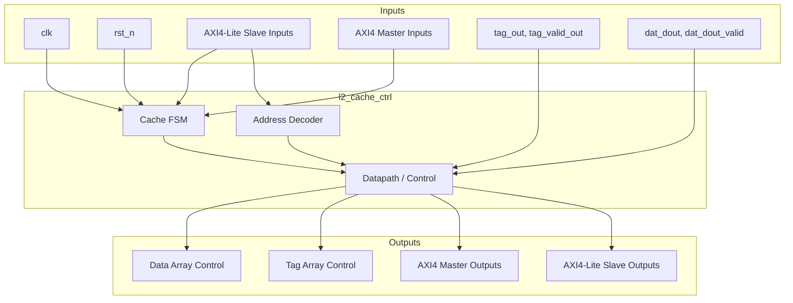
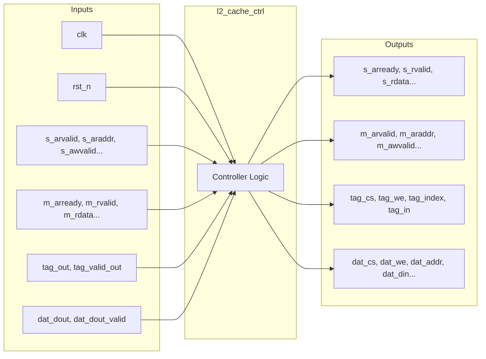

# l2_cache_ctrl

## Description

The L2 Cache Controller implements the control logic for a direct-mapped, write-through L2 cache in the SMVDU-TITAN-X SoC. It operates with a capacity of 2KB (64 sets × 32B lines) and bridges a CPU-side AXI4-Lite slave interface to a memory-side AXI4 master interface targeting a DDR controller. The controller features a finite state machine that sequences through idle, tag lookup, hit serving, miss fetching, line filling, and write-through operations to fulfill cache requests while maintaining coherence via write-through.

## Interface

### Inputs

| Signal | Width | Description |
|--------|-------|-------------|
| clk    | 1     | System clock |
| rst_n  | 1     | Active-low asynchronous reset |
| s_arvalid | 1  | AXI-Lite read address valid from CPU |
| s_araddr | 40  | AXI-Lite read address from CPU |
| s_rready | 1   | AXI-Lite read data ready from CPU |
| s_awvalid | 1  | AXI-Lite write address valid from CPU |
| s_awaddr | 40  | AXI-Lite write address from CPU |
| s_wvalid | 1   | AXI-Lite write data valid from CPU |
| s_wdata | 64   | AXI-Lite write data from CPU |
| s_wstrb | 8    | AXI-Lite write strobe from CPU |
| s_bready | 1   | AXI-Lite write response ready from CPU |
| m_arready | 1  | AXI Master read address ready from memory |
| m_rvalid | 1   | AXI Master read data valid from memory |
| m_rdata | 64   | AXI Master read data from memory |
| m_rresp | 2    | AXI Master read response from memory |
| m_awready | 1  | AXI Master write address ready from memory |
| m_wready | 1   | AXI Master write data ready from memory |
| m_bvalid | 1   | AXI Master write response valid from memory |
| tag_out | 28   | Tag data read from the tag array |
| tag_valid_out | 1 | Valid bit status for the read tag |
| dat_dout | 32  | Data read from the data array |
| dat_dout_valid | 1 | Indicates that the read data from array is valid |

### Outputs

| Signal | Width | Description |
|--------|-------|-------------|
| s_arready | 1  | AXI-Lite read address ready to CPU |
| s_rvalid | 1   | AXI-Lite read data valid to CPU |
| s_rdata | 64   | AXI-Lite read data to CPU |
| s_rresp | 2    | AXI-Lite read response to CPU |
| s_awready | 1  | AXI-Lite write address ready to CPU |
| s_wready | 1   | AXI-Lite write data ready to CPU |
| s_bvalid | 1   | AXI-Lite write response valid to CPU |
| s_bresp | 2    | AXI-Lite write response to CPU |
| m_arvalid | 1  | AXI Master read address valid to memory |
| m_araddr | 40  | AXI Master read address to memory |
| m_rready | 1   | AXI Master read data ready to memory |
| m_awvalid | 1  | AXI Master write address valid to memory |
| m_awaddr | 40  | AXI Master write address to memory |
| m_wvalid | 1   | AXI Master write data valid to memory |
| m_wdata | 64   | AXI Master write data to memory |
| m_wstrb | 8    | AXI Master write strobe to memory |
| m_bready | 1   | AXI Master write response ready to memory |
| tag_cs | 1     | Chip select for the tag array |
| tag_we | 1     | Write enable for the tag array |
| tag_index | 6  | Set index for tag array operations |
| tag_in | 28    | Tag data to write to the tag array |
| dat_cs | 1     | Chip select for the data array |
| dat_we | 1     | Write enable for the data array |
| dat_bank | 1   | Bank selection for the data array |
| dat_wmask | 4  | Byte write mask for the data array |
| dat_addr | 6   | Address selecting line within data array |
| dat_din | 32   | Data word to write to the data array |

## Functionality

The controller FSM sits in `ST_IDLE` until an AXI-Lite read or write request is received. It transitions to `ST_TAG_LU` and issues a read to the tag array using the requested index. In the same cycle, a combinatorial hit/miss decision is evaluated using `tag_out` and `tag_valid_out`. On a read hit, the FSM enters `ST_HIT`, reading the data array and passing it back to the CPU. On a write hit, it transitions directly to `ST_WRTHR` to write-through to DDR while updating the data array. If a tag mismatch occurs (a miss), it issues an AXI read via `ST_MISS_FETCH` and waits for the DDR data. Once the line arrives, it fills the cache and tag arrays in `ST_FILL`, and finally responds to the CPU.

## Hierarchical Block Diagram

## Signal-Level Diagram

