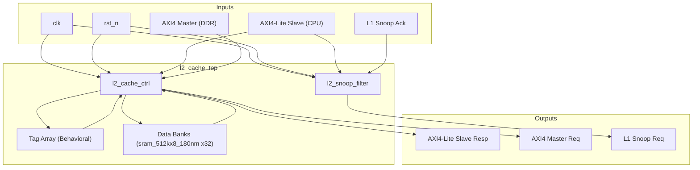
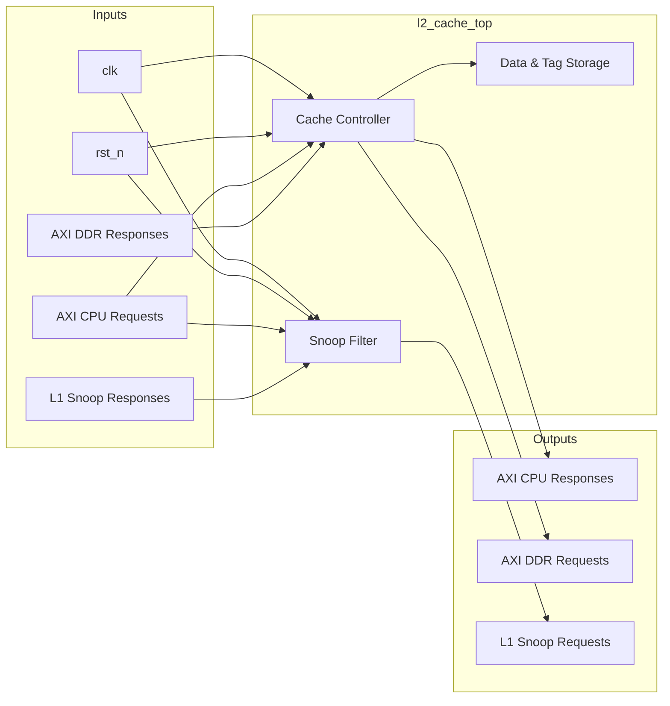

# l2_cache_top

## Description

The L2 Cache Top module is the top-level integration for the SMVDU-TITAN-X SoC L2 cache, scaled to a 2MB, 16-way associative, 4-banked architecture. It integrates the `l2_cache_ctrl` for memory control, an abstract tag array, four data banks constructed from multiple `sram_512kx8_180nm` macros, and an `l2_snoop_filter` to enforce MESI coherence across four application cores. This module serves as the primary bridge between the CPU cluster (via an AXI4-Lite slave interface) and the main DDR memory (via an AXI4 master interface).

## Interface

### Inputs

| Signal | Width | Description |
|--------|-------|-------------|
| clk    | 1     | System clock |
| rst_n  | 1     | Active-low asynchronous reset |
| s_arvalid | 1  | AXI-Lite read address valid from CPU cluster |
| s_araddr | 40  | AXI-Lite read address from CPU cluster |
| s_rready | 1   | AXI-Lite read data ready from CPU cluster |
| s_awvalid | 1  | AXI-Lite write address valid from CPU cluster |
| s_awaddr | 40  | AXI-Lite write address from CPU cluster |
| s_wvalid | 1   | AXI-Lite write data valid from CPU cluster |
| s_wdata | 64   | AXI-Lite write data from CPU cluster |
| s_wstrb | 8    | AXI-Lite write strobe from CPU cluster |
| s_bready | 1   | AXI-Lite write response ready from CPU cluster |
| m_arready | 1  | AXI Master read address ready from DDR controller |
| m_rvalid | 1   | AXI Master read data valid from DDR controller |
| m_rdata | 64   | AXI Master read data from DDR controller |
| m_rresp | 2    | AXI Master read response from DDR controller |
| m_awready | 1  | AXI Master write address ready from DDR controller |
| m_wready | 1   | AXI Master write data ready from DDR controller |
| m_bvalid | 1   | AXI Master write response valid from DDR controller |
| snoop_ack | 4  | Snoop acknowledgement mask from L1 caches |
| snoop_data_valid | 4 | Snoop dirty data indication from L1 caches |

### Outputs

| Signal | Width | Description |
|--------|-------|-------------|
| s_arready | 1  | AXI-Lite read address ready to CPU cluster |
| s_rvalid | 1   | AXI-Lite read data valid to CPU cluster |
| s_rdata | 64   | AXI-Lite read data to CPU cluster |
| s_rresp | 2    | AXI-Lite read response to CPU cluster |
| s_awready | 1  | AXI-Lite write address ready to CPU cluster |
| s_wready | 1   | AXI-Lite write data ready to CPU cluster |
| s_bvalid | 1   | AXI-Lite write response valid to CPU cluster |
| s_bresp | 2    | AXI-Lite write response to CPU cluster |
| m_arvalid | 1  | AXI Master read address valid to DDR controller |
| m_araddr | 40  | AXI Master read address to DDR controller |
| m_rready | 1   | AXI Master read data ready to DDR controller |
| m_awvalid | 1  | AXI Master write address valid to DDR controller |
| m_awaddr | 40  | AXI Master write address to DDR controller |
| m_wvalid | 1   | AXI Master write data valid to DDR controller |
| m_wdata | 64   | AXI Master write data to DDR controller |
| m_wstrb | 8    | AXI Master write strobe to DDR controller |
| m_bready | 1   | AXI Master write response ready to DDR controller |
| snoop_valid | 4 | Snoop request valid mask targeting L1 caches |
| snoop_addr | 40 | Snooped memory address |
| snoop_type | 2 | Snoop request type (GetS, GetM, Inv) |

## Functionality

This top-level module routes AXI4-Lite memory transactions from the CPU cluster to the internal `l2_cache_ctrl`. The controller handles the state machine for cache hits, misses, and write-through actions. Cache tags are stored in a synthesized internal array logic, while the data payload is routed to a generated bank of thirty-two `sram_512kx8_180nm` instances simulating four 512KB banks. In parallel with regular cache accesses, the requests are snooped by the `l2_snoop_filter` instance. This filter tracks directory entries and pushes snoop commands down to the L1 caches for coherence enforcement, ensuring L2 acts securely as the coherence point of serialization.

## Hierarchical Block Diagram

## Signal-Level Diagram

