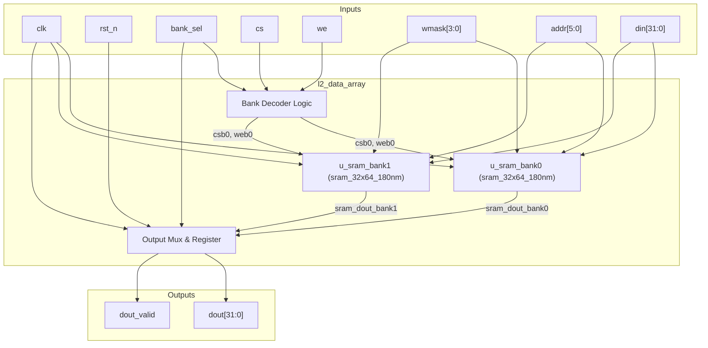
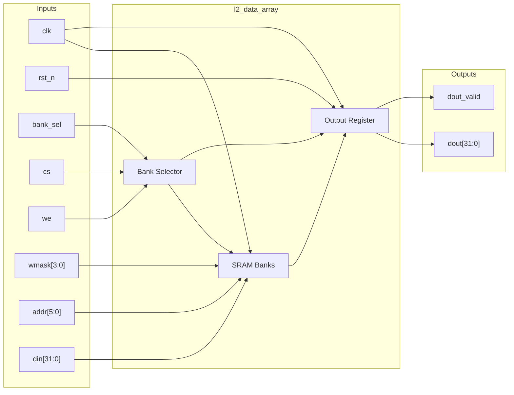

# l2_data_array

## Description

The L2 Data Array provides data storage for the cache using two `sram_32x64_180nm` hard macros organized into a two-bank structure. It includes logic to select between the two banks based on an address bit, multiplexing their outputs for read operations, and distributing write data properly. This module specifically features a critical fix ensuring that all 32 output bits from both SRAM macros are explicitly driven to resolve an LVS floating-net issue reported by the physical design team.

## Interface

### Inputs

| Signal | Width | Description |
|--------|-------|-------------|
| clk    | 1     | System clock |
| rst_n  | 1     | Active-low asynchronous reset |
| bank_sel | 1   | Selects between bank 0 and bank 1 |
| cs     | 1     | Chip select for the array |
| we     | 1     | Write enable for the array |
| wmask  | 4     | Byte-level write mask |
| addr   | 6     | Address selecting one of the 64 entries |
| din    | 32    | 32-bit data to write |

### Outputs

| Signal | Width | Description |
|--------|-------|-------------|
| dout   | 32    | 32-bit data read from the selected bank |
| dout_valid | 1 | Indicates that the read data is valid (asserted one cycle after a read) |

## Functionality

The data array operates with a 1-cycle latency. On an active operation (where `cs` is high), the module decodes the `bank_sel` signal to assert the active-low chip select for the targeted SRAM macro (`u_sram_bank0` or `u_sram_bank1`). During a write, `we` is active, and data is pushed into the chosen bank with byte-level masking. During a read operation, both SRAM macros execute, but the output multiplexer registers the output of the selected bank onto `dout` on the following clock cycle, concurrently asserting `dout_valid`.

## Hierarchical Block Diagram

## Signal-Level Diagram

