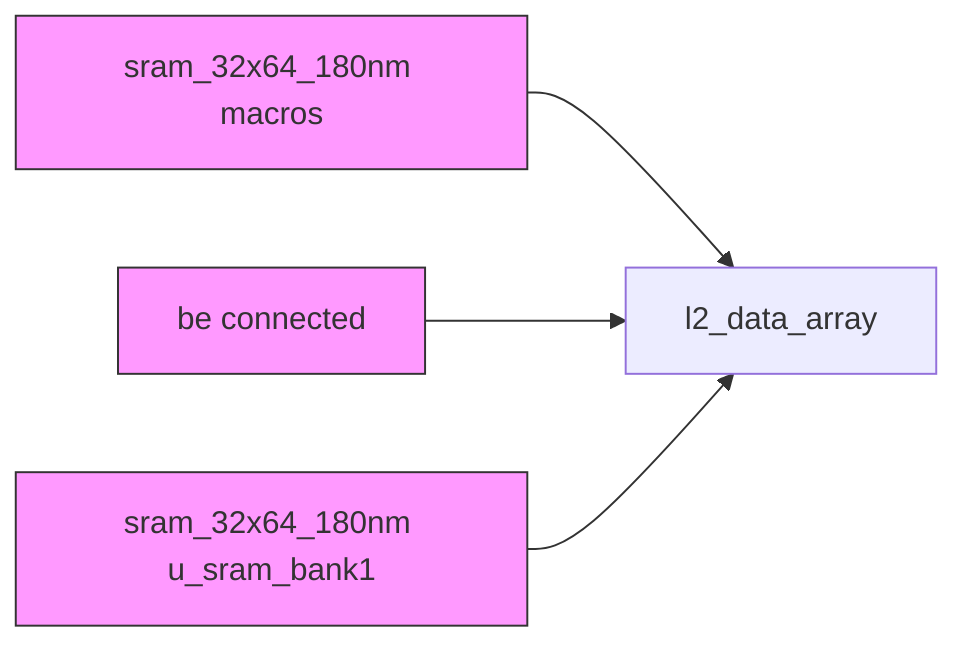
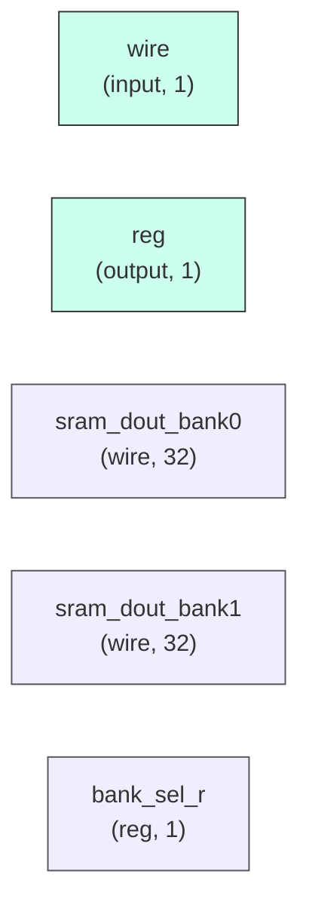

# l2_data_array

## Description

The **l2_data_array** module SPDX-License-Identifier: Apache-2.0
 SMVDU-TITAN-X SoC — L2 Data Array
 Wraps TWO sram_32x64_180nm macros (2 banks).
 CRITICAL FIX: dout0[31:0] from both SRAM macros is properly read and driven
 to dout — this resolves the LVS floating-net issue reported by the PD team.
`timescale 1ns/1ps

## Interface

### Inputs

| Name | Width | Description |
|------|-------|-------------|
| wire | 1 | – |
| wire | 1 | – |
| wire | 1 | – |
| wire | 1 | – |
| wire | 1 | – |
| wire | 1 | – |
| wire | 1 | – |
| wire | 1 | – |

### Outputs

| Name | Width | Description |
|------|-------|-------------|
| reg | 1 | – |
| reg | 1 | – |

## Functionality

*l2_data_array provides the hardware implementation for its designated function within the SoC.*

## Hierarchical Block Diagram (Mermaid)

## Full Signal‑Level Diagram (Mermaid)

