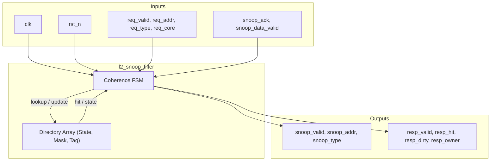
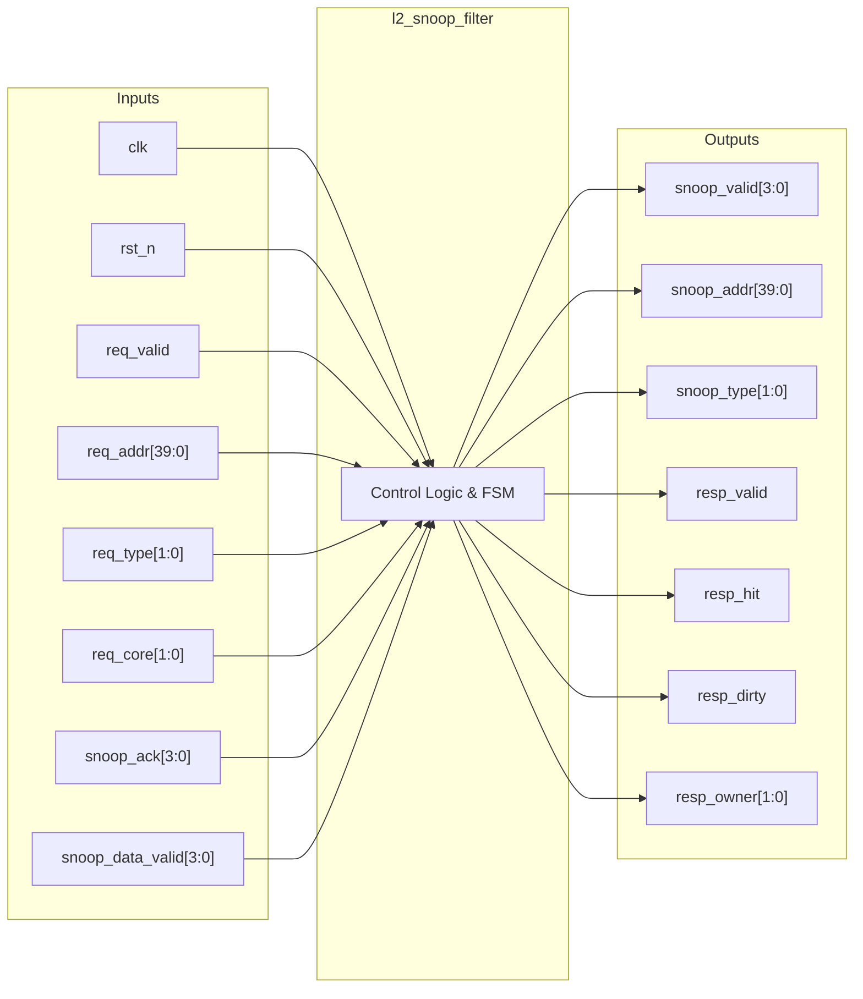

# l2_snoop_filter

## Description

The L2 Snoop Filter implements a directory-based MESI coherence protocol for 4 application cores in the SMVDU-TITAN-X SoC. It tracks the L1 D-Cache coherence state and sharer core mask for each cached line to enforce strict inclusion. The module intercepts crossbar requests, performs directory lookups, and orchestrates snoop requests to specific L1 caches to maintain coherence. It uses an internal FSM to transition between lookup, snoop request, snoop acknowledgment, and directory update phases.

## Interface

### Inputs

| Signal | Width | Description |
|--------|-------|-------------|
| clk    | 1     | System clock |
| rst_n  | 1     | Active-low asynchronous reset |
| req_valid | 1  | Request valid signal from Crossbar / L2 Controller |
| req_addr | 40  | Target address of the coherence request |
| req_type | 2   | Type of request (00=ReadShared, 01=ReadUnique, 10=CleanInvalidate, 11=MakeInvalid) |
| req_core | 2   | ID of the requesting core (0-3) |
| snoop_ack | NUM_CORES | Acknowledgment mask from snooped L1 caches |
| snoop_data_valid | NUM_CORES | Indicates which snooped cores returned dirty data |

### Outputs

| Signal | Width | Description |
|--------|-------|-------------|
| snoop_valid | NUM_CORES | Snoop request valid mask targeting specific cores |
| snoop_addr | 40 | Address sent to L1 caches for snooping |
| snoop_type | 2 | Snoop operation type (00=GetS, 01=GetM, 10=Inv) |
| resp_valid | 1 | Snoop filter response valid to L2 Controller |
| resp_hit | 1 | Indicates if the requested line hit in the directory |
| resp_dirty | 1 | Indicates if the requested line was dirty in another core |
| resp_owner | 2 | Core ID holding the modified line |

## Functionality

The L2 Snoop Filter manages a 64-set × 32-way state array that tracks the MESI state and an owner/sharer mask for cached lines. On receiving a request, the FSM transitions from `IDLE` to `LOOKUP`, examining the directory tags for a hit. If a miss occurs, it flags the need for a memory fetch and allocates a new directory entry. On a hit, if the line is modified or exclusive in another core, it issues snoop requests (via `SNOOP_REQ` state) and waits for acknowledgments. After reconciling coherence, the FSM proceeds to `UPDATE` to modify the directory state and sharer mask based on the request type before returning to `IDLE`.

## Hierarchical Block Diagram

## Signal-Level Diagram

