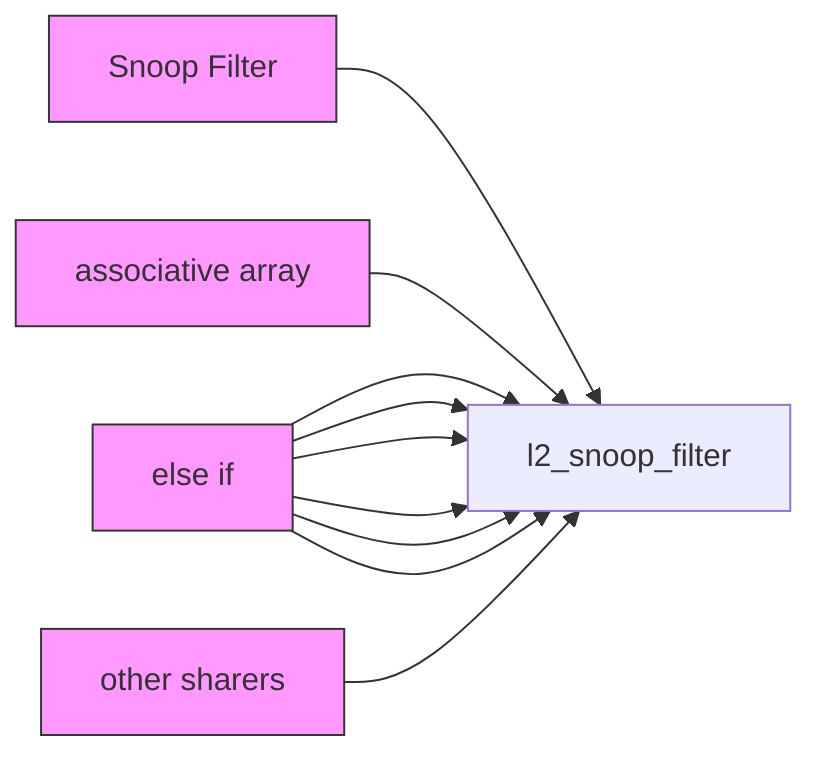
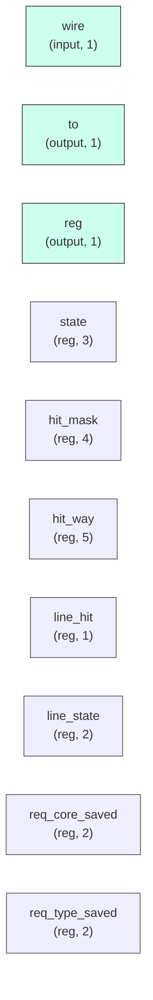

# l2_snoop_filter

## Description

The **l2_snoop_filter** module SPDX-License-Identifier: Apache-2.0
 SMVDU-TITAN-X SoC — L2 Snoop Filter (MESI Directory)
 Iteration 3: Tracks L1 D-Cache coherence state for 4 application cores.
 Coherence Protocol: MESI
`timescale 1ns/1ps
`include "params.vh"

## Interface

### Inputs

| Name | Width | Description |
|------|-------|-------------|
| wire | 1 | – |
| wire | 1 | – |
| wire | 1 | – |
| wire | 1 | – |
| wire | 1 | – |
| wire | 1 | – |
| wire | 1 | – |
| wire | 1 | – |

### Outputs

| Name | Width | Description |
|------|-------|-------------|
| to | 1 | – |
| reg | 1 | – |
| reg | 1 | – |
| reg | 1 | – |
| reg | 1 | – |
| reg | 1 | – |
| reg | 1 | – |
| reg | 1 | – |

## Functionality

*l2_snoop_filter provides the hardware implementation for its designated function within the SoC.*

## Hierarchical Block Diagram (Mermaid)

## Full Signal‑Level Diagram (Mermaid)

