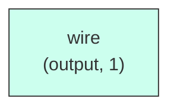

# l2_tag_array

## Description

The **l2_tag_array** module SPDX-License-Identifier: Apache-2.0
 SMVDU-TITAN-X SoC — L2 Tag Array
 Register-based tag storage: 64 sets, 28-bit tags + valid
`timescale 1ns/1ps

## Interface

### Inputs

| Name | Width | Description |
|------|-------|-------------|
| wire | 1 | – |
| wire | 1 | – |
| wire | 1 | – |
| wire | 1 | – |
| wire | 1 | – |
| wire | 1 | – |

### Outputs

| Name | Width | Description |
|------|-------|-------------|
| wire | 1 | – |
| wire | 1 | – |

## Functionality

*l2_tag_array provides the hardware implementation for its designated function within the SoC.*

## Hierarchical Block Diagram (Mermaid)

```mermaid
graph LR
    classDef sub fill:#f9f,stroke:#333,stroke-width:1px;
```

## Full Signal‑Level Diagram (Mermaid)


