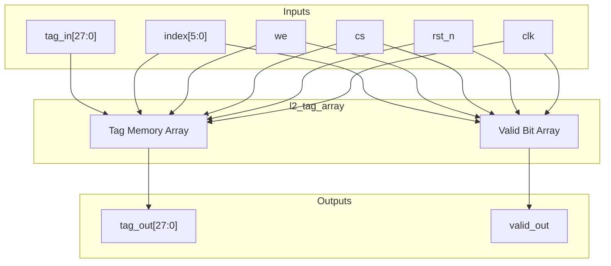
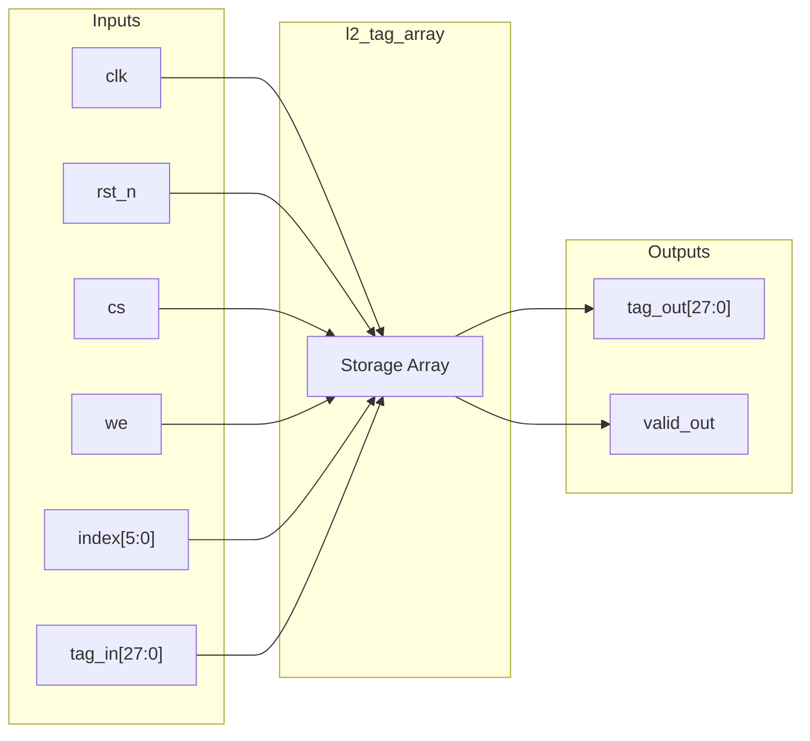

# l2_tag_array

## Description

The L2 Tag Array is a register-based tag storage module used in the SMVDU-TITAN-X SoC L2 cache. It provides storage for 64 sets of cache tags, where each entry consists of a 28-bit tag and a 1-bit valid flag. The array features a synchronous read and write interface controlled by chip select and write enable signals. It serves as a fast lookup table to determine cache hits or misses for incoming addresses.

## Interface

### Inputs

| Signal | Width | Description |
|--------|-------|-------------|
| clk    | 1     | System clock |
| rst_n  | 1     | Active-low asynchronous reset |
| cs     | 1     | Chip select (active-high) |
| we     | 1     | Write enable (active-high) |
| index  | 6     | Cache set index (address) for the target entry |
| tag_in | TAG_W | Tag data to be written |

### Outputs

| Signal | Width | Description |
|--------|-------|-------------|
| tag_out   | TAG_W | Read tag data corresponding to the requested index |
| valid_out | 1     | Valid bit status for the requested index |

## Functionality

The tag array instantiates a register file (`tag_mem` and `valid_mem`) that stores tag entries and their valid states. Upon a negative edge of `rst_n`, all entries are asynchronously cleared to zero. During normal operation, when both `cs` and `we` are high on the rising clock edge, the provided `tag_in` is written into the location specified by `index`, and its valid bit is set to 1. The module performs continuous asynchronous reads (assign statements) outputting the tag and valid status for the currently selected `index`.

## Hierarchical Block Diagram

## Signal-Level Diagram

