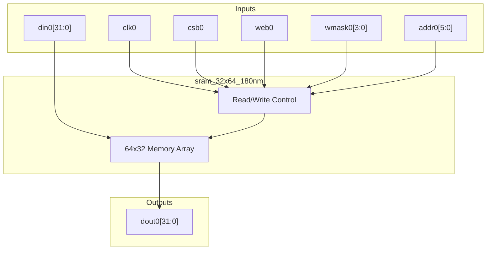
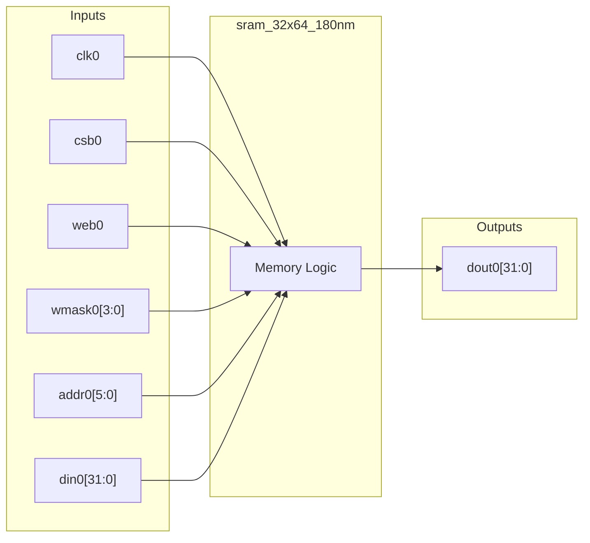

# sram_32x64_180nm

## Description

This module provides a behavioral simulation model for an SCL 180nm SRAM hard macro, featuring a 64-word by 32-bit storage array. It implements a synchronous read/write interface with active-low chip select and write enable signals. The memory supports byte-level write masking, allowing individual bytes within a 32-bit word to be updated independently. It features write-first behavior, meaning read operations during a write cycle will return the newly written data.

## Interface

### Inputs

| Signal | Width | Description |
|--------|-------|-------------|
| clk0   | 1     | System clock |
| csb0   | 1     | Active-low chip select |
| web0   | 1     | Active-low write enable |
| wmask0 | 4     | Active-high byte write mask (1=write byte) |
| addr0  | 6     | 6-bit address selecting one of 64 words |
| din0   | 32    | 32-bit data input for writes |

### Outputs

| Signal | Width | Description |
|--------|-------|-------------|
| dout0  | 32    | 32-bit data output for reads |

## Functionality

The module maintains an internal 64-entry by 32-bit array, initially cleared to zero for simulation purposes. On the rising edge of `clk0`, the memory evaluates the `csb0` chip select. If selected, a write occurs if `web0` is low, conditionally updating up to 4 bytes at `addr0` depending on the `wmask0` bits. Regardless of whether a write occurs, the data at `addr0` is registered into `dout0`. If the module is not selected, `dout0` holds its previous value to prevent floating outputs, mimicking typical SRAM macro retention.

## Hierarchical Block Diagram

## Signal-Level Diagram

