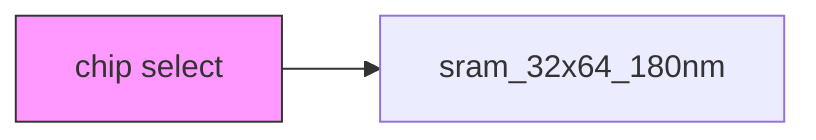
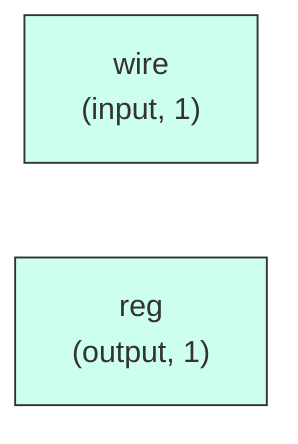

# sram_32x64_180nm

## Description

The **sram_32x64_180nm** module SPDX-License-Identifier: Apache-2.0
 SMVDU-TITAN-X SoC — SRAM Hard Macro Simulation Stub
 Module: sram_32x64_180nm
 Description: Behavioral simulation model for SCL 180nm SRAM macro.
              In physical implementation, replace with foundry-provided hard macro.
              All ports must be connected — floating dout0 causes LVS failure.

 Ports:
   clk0   : clock
   csb0   : chip select (active-LOW)
   web0   : write enable (active-LOW)
   wmask0 : byte write mask [3:0] (active-HIGH: 1=write this byte)
   addr0  : address [5:0] (64 rows)
   din0   : data input [31:0]
   dout0  : data output [31:0] ← MUST BE CONNECTED (LVS requirement)
`timescale 1ns/1ps

## Interface

### Inputs

| Name | Width | Description |
|------|-------|-------------|
| wire | 1 | – |
| wire | 1 | – |
| wire | 1 | – |
| wire | 1 | – |
| wire | 1 | – |
| wire | 1 | – |

### Outputs

| Name | Width | Description |
|------|-------|-------------|
| reg | 1 | – |

## Functionality

*sram_32x64_180nm provides the hardware implementation for its designated function within the SoC.*

## Hierarchical Block Diagram (Mermaid)

## Full Signal‑Level Diagram (Mermaid)

