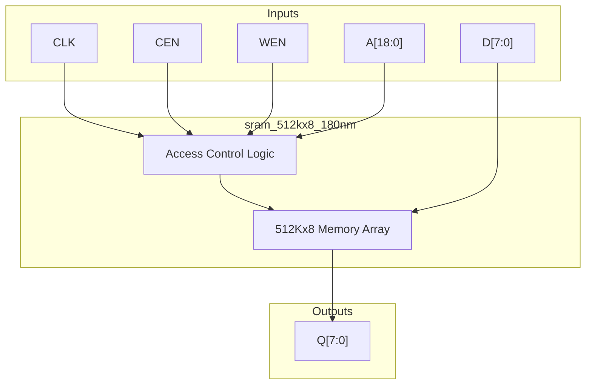
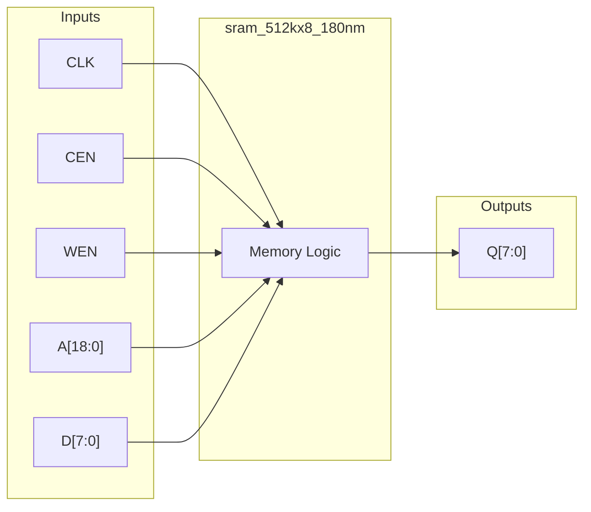

# sram_512kx8_180nm

## Description

This module is a behavioral simulation model for a 512KB SRAM macro targeted for the SCL 180nm CMOS process. It represents a large memory block configured as 524,288 words by 8 bits (4Mb total). The module uses a standard synchronous interface with active-low chip enable and write enable signals. During physical synthesis, this behavioral model is intended to be replaced by a compiled hard macro generated from a foundry memory compiler.

## Interface

### Inputs

| Signal | Width | Description |
|--------|-------|-------------|
| CLK    | 1     | System clock |
| CEN    | 1     | Active-low chip enable |
| WEN    | 1     | Active-low write enable |
| A      | 19    | 19-bit address bus for accessing 512K locations |
| D      | 8     | 8-bit data input for write operations |

### Outputs

| Signal | Width | Description |
|--------|-------|-------------|
| Q      | 8     | 8-bit data output from read operations |

## Functionality

The core of the module is a 512K by 8-bit register array (`mem`). On the rising edge of `CLK`, the memory examines the `CEN` signal. If `CEN` is low, the module becomes active. If `WEN` is also low, a write operation occurs, storing the 8-bit data `D` into the location specified by address `A`; it concurrently assigns `D` to output `Q`, demonstrating write-first (transparent) behavior. If `WEN` is high, a read operation occurs, and the data at address `A` is passed to the output register `Q`.

## Hierarchical Block Diagram

## Signal-Level Diagram

