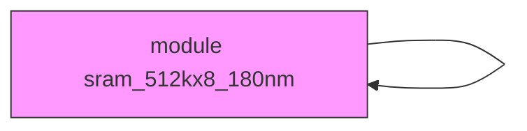
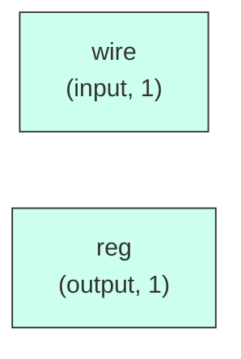

# sram_512kx8_180nm

## Description

The **sram_512kx8_180nm** module SPDX-License-Identifier: Apache-2.0
 SMVDU-TITAN-X SoC — 512KB SRAM Behavioral Macro
 Target: SCL 180nm CMOS
 Configuration: 524288 words × 8 bits = 4Mb (512KB)
 Note: This is a behavioral simulation model. In physical synthesis,
 this will be replaced by a compiled hard macro from the foundry memory compiler.
`timescale 1ns/1ps

## Interface

### Inputs

| Name | Width | Description |
|------|-------|-------------|
| wire | 1 | – |
| wire | 1 | – |
| wire | 1 | – |
| wire | 1 | – |
| wire | 1 | – |

### Outputs

| Name | Width | Description |
|------|-------|-------------|
| reg | 1 | – |

## Functionality

*sram_512kx8_180nm provides the hardware implementation for its designated function within the SoC.*

## Hierarchical Block Diagram (Mermaid)

## Full Signal‑Level Diagram (Mermaid)

