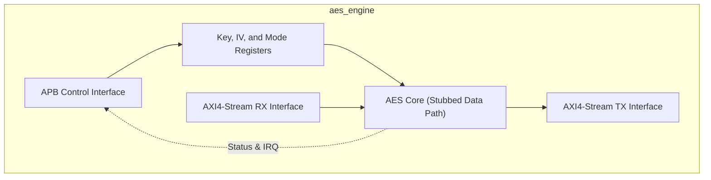
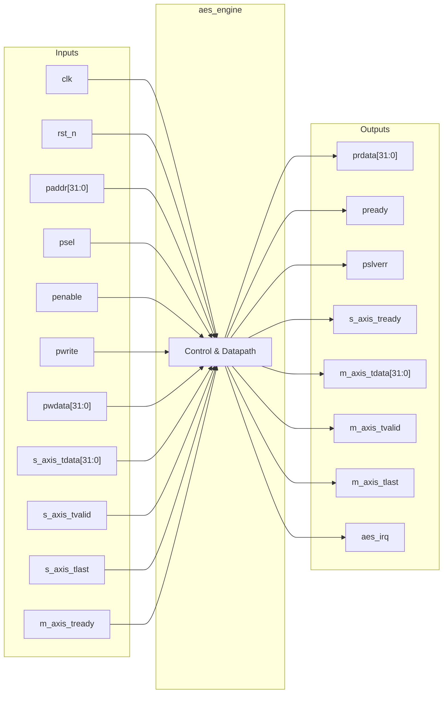

# aes_engine

## Description

The `aes_engine` is a high-performance Advanced Encryption Standard (AES) hardware accelerator designed for the SMVDU-TITAN-X SoC. It is built to support 256-bit cryptographic keys and handle multiple modes of operation, specifically ECB, CBC, CTR, and GCM. The architecture cleanly separates the control plane and data plane: configuration parameters, keys, and Initialization Vectors (IVs) are programmed via a standard APB slave interface, while high-speed plaintext and ciphertext data are streamed in and out using AXI4-Stream interfaces, making it ideal for DMA-driven data transfers. While the current iteration utilizes a behavioral pass-through stub for the core 14-round AES transformations, the interface structure, control registers, and interrupt mechanics are fully defined.

## Interface

### Inputs

| Signal | Width | Description |
|--------|-------|-------------|
| clk    | 1     | System clock |
| rst_n  | 1     | Active-low asynchronous reset |
| paddr  | 32    | APB address bus for configuration registers |
| psel   | 1     | APB select signal |
| penable| 1     | APB enable signal |
| pwrite | 1     | APB write enable signal |
| pwdata | 32    | APB write data bus |
| s_axis_tdata | 32 | AXI4-Stream input data (plaintext or ciphertext) |
| s_axis_tvalid| 1  | AXI4-Stream input valid signal |
| s_axis_tlast | 1  | AXI4-Stream input last signal, indicates end of packet |
| m_axis_tready| 1  | AXI4-Stream output ready signal |

### Outputs

| Signal | Width | Description |
|--------|-------|-------------|
| prdata | 32    | APB read data bus |
| pready | 1     | APB ready signal, hardwired to 1 |
| pslverr| 1     | APB slave error signal, hardwired to 0 |
| s_axis_tready| 1  | AXI4-Stream input ready signal |
| m_axis_tdata | 32 | AXI4-Stream output data (ciphertext or plaintext) |
| m_axis_tvalid| 1  | AXI4-Stream output valid signal |
| m_axis_tlast | 1  | AXI4-Stream output last signal |
| aes_irq| 1     | Interrupt request, asserted when an AES packet finishes processing |

## Functionality

The `aes_engine` requires the host CPU to first configure the operation mode (encrypt/decrypt, block mode) and write the 256-bit key and 128-bit IV into the memory-mapped APB registers. For GCM mode, additional authenticated data (AAD) length is also configured. Once set up, the data plane takes over. Data words arrive via the `s_axis` interface. The internal processing engine accepts valid data blocks, applies the AES cryptographic transformations (currently modeled as a dummy XOR with the key for simulation), and forwards the result to the `m_axis` interface. The module maintains a busy/done status in the `stat_reg`. When an incoming stream asserts `s_axis_tlast`, the engine sets the Done flag and raises the `aes_irq` interrupt, which is cleared when the host reads the status register.

## Hierarchical Block Diagram

## Signal-Level Diagram

