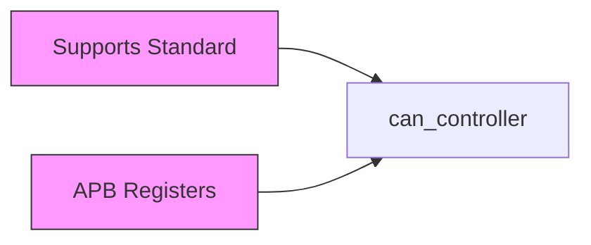

# can_controller

## Description

The **can_controller** module SPDX-License-Identifier: Apache-2.0
 SMVDU-TITAN-X SoC — CAN 2.0B Controller
 Iteration 3: Supports Standard (11-bit) and Extended (29-bit) IDs.
`timescale 1ns/1ps

## Interface

### Inputs

| Name | Width | Description |
|------|-------|-------------|
| wire | 1 | – |
| wire | 1 | – |
| wire | 1 | – |
| wire | 1 | – |
| wire | 1 | – |
| wire | 1 | – |
| wire | 1 | – |
| wire | 1 | – |

### Outputs

| Name | Width | Description |
|------|-------|-------------|
| wire | 1 | – |
| wire | 1 | – |
| wire | 1 | – |
| wire | 1 | – |
| wire | 1 | – |

## Functionality

*can_controller provides the hardware implementation for its designated function within the SoC.*

## Hierarchical Block Diagram (Mermaid)

## Full Signal‑Level Diagram (Mermaid)

```mermaid
graph LR
    classDef sig fill:#eef,stroke:#555,stroke-width:1px;
    classDef port fill:#cfe,stroke:#333,stroke-width:1px;
    wire["wire\n(input, 1)"]:::port
    wire["wire\n(input, 1)"]:::port
    wire["wire\n(input, 1)"]:::port
    wire["wire\n(input, 1)"]:::port
    wire["wire\n(input, 1)"]:::port
    wire["wire\n(input, 1)"]:::port
    wire["wire\n(input, 1)"]:::port
    wire["wire\n(output, 1)"]:::port
    wire["wire\n(output, 1)"]:::port
    wire["wire\n(output, 1)"]:::port
    wire["wire\n(output, 1)"]:::port
    wire["wire\n(output, 1)"]:::port
    wire["wire\n(input, 1)"]:::port
    mode_reg["mode_reg\n(reg, 32)"]:::sig
    cmd_reg["cmd_reg\n(reg, 32)"]:::sig
    stat_reg["stat_reg\n(reg, 32)"]:::sig
    irq_reg["irq_reg\n(reg, 32)"]:::sig
    irq_en_reg["irq_en_reg\n(reg, 32)"]:::sig
    btr_reg["btr_reg\n(reg, 32)"]:::sig
    tx_id["tx_id\n(reg, 32)"]:::sig
    tx_dlc["tx_dlc\n(reg, 32)"]:::sig
    rx_id["rx_id\n(reg, 32)"]:::sig
    rx_dlc["rx_dlc\n(reg, 32)"]:::sig
    prdata_reg["prdata_reg\n(reg, 32)"]:::sig
```

