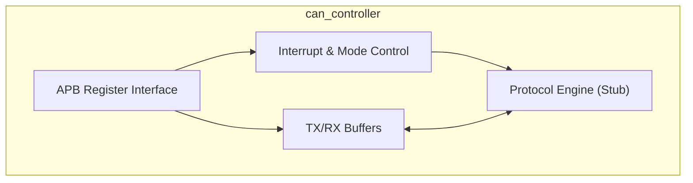
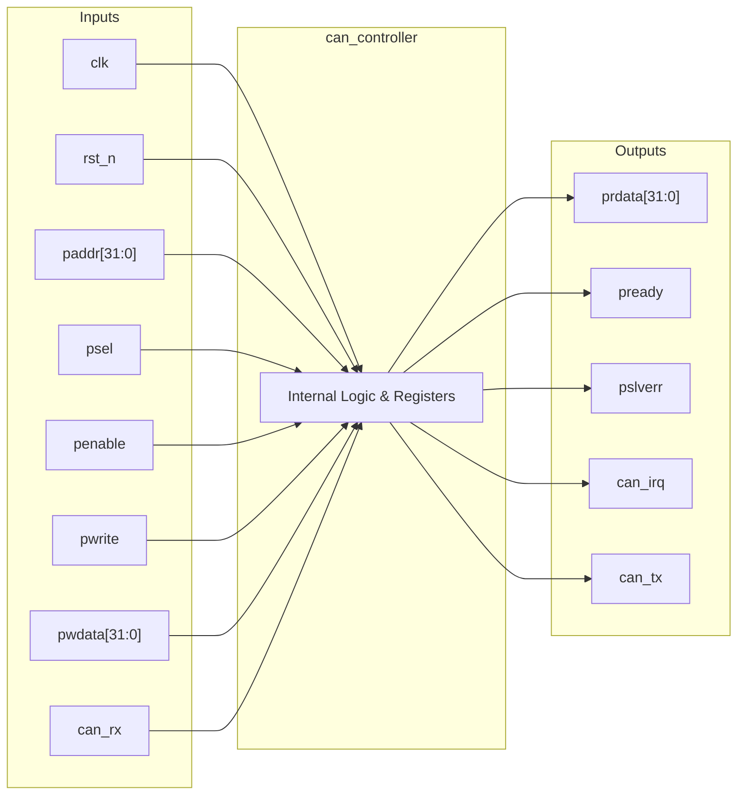

# can_controller

## Description

The `can_controller` is an APB-slave peripheral designed to provide CAN 2.0B communication capabilities for the SMVDU-TITAN-X SoC. It is architected to handle both Standard (11-bit) and Extended (29-bit) message identifiers. The current module establishes the structural and memory-mapped foundation of the controller, featuring a suite of registers for mode configuration, interrupt management, command execution, and bus timing (BTR). It includes simplified transmit and receive buffers for storing message IDs, Data Length Codes (DLC), and up to 8 bytes of payload. Although the full protocol engine logic (bit stuffing, CRC, arbitration) is stubbed in this iteration, the module interfaces with physical layer signals and provides a compliant register map for software interaction.

## Interface

### Inputs

| Signal | Width | Description |
|--------|-------|-------------|
| clk    | 1     | System clock |
| rst_n  | 1     | Active-low asynchronous reset |
| paddr  | 32    | APB address bus |
| psel   | 1     | APB select signal |
| penable| 1     | APB enable signal |
| pwrite | 1     | APB write enable signal |
| pwdata | 32    | APB write data bus |
| can_rx | 1     | CAN physical layer receive pin |

### Outputs

| Signal | Width | Description |
|--------|-------|-------------|
| prdata | 32    | APB read data bus |
| pready | 1     | APB ready signal, hardwired to 1 |
| pslverr| 1     | APB slave error signal, hardwired to 0 |
| can_irq| 1     | CAN interrupt request line |
| can_tx | 1     | CAN physical layer transmit pin |

## Functionality

The controller acts as an APB-slave device, mapping its internal configuration and data buffer registers to specific address offsets. The host configures the module by writing to the mode, interrupt enable, and bus timing (`btr_reg`) registers. To transmit a frame, software writes the ID, DLC, and payload data to the `tx_*` registers and triggers a transmission via the `cmd_reg`. Similarly, received frames populate the `rx_*` registers. The `can_irq` is dynamically generated based on a bitwise AND of the `irq_reg` and the `irq_en_reg`. In the present implementation, the physical CAN TX line (`can_tx`) is held in the idle recessive state (`1'b1`), and the `can_rx` input is absorbed to prevent unused warnings, serving as a structural placeholder for the upcoming protocol engine logic.

## Hierarchical Block Diagram

## Signal-Level Diagram

