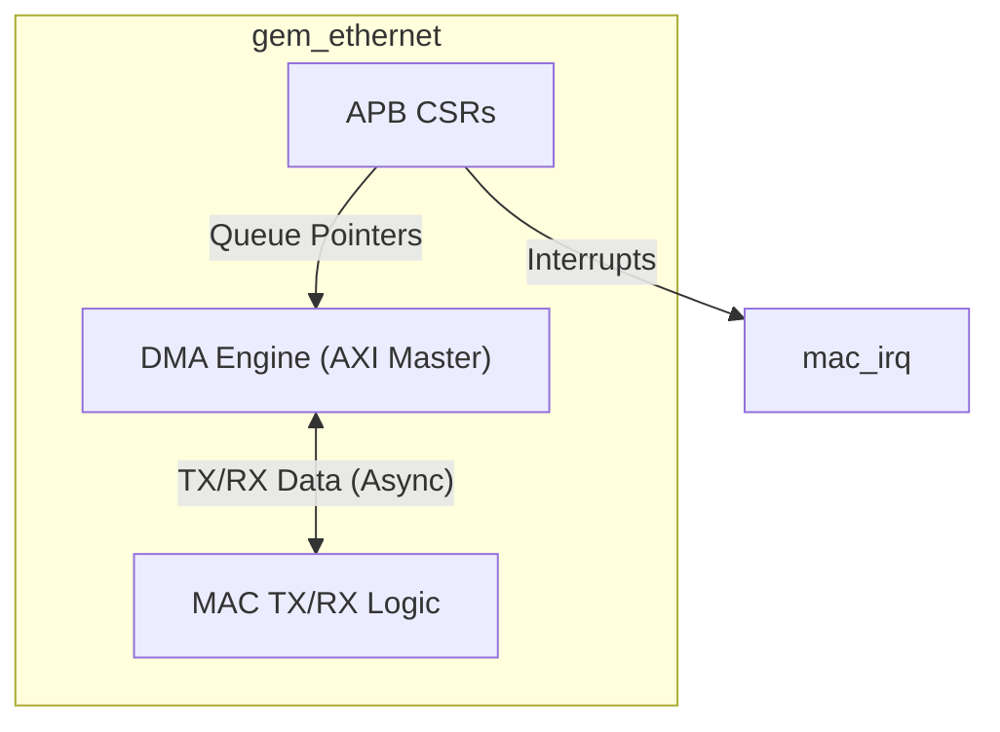
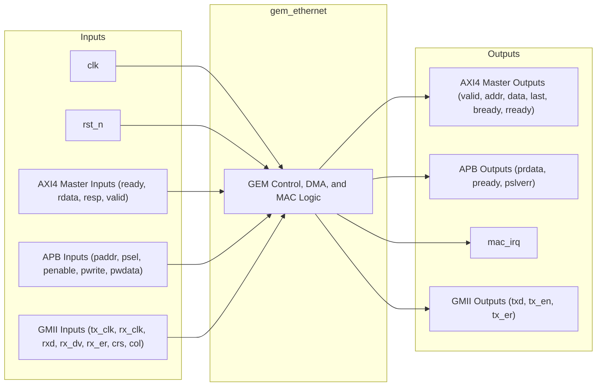

# Gigabit Ethernet MAC (GEM)

## Description

The `gem_ethernet` module implements a Gigabit Ethernet Media Access Controller (MAC) designed for the SMVDU-TITAN-X SoC. It features a Scatter-Gather Direct Memory Access (DMA) engine connected via an AXI4 master interface, allowing high-performance, autonomous network packet transfers to and from system memory. Configuration and status monitoring are facilitated through a 32-bit APB slave interface. On the physical side, it exposes a Gigabit Media Independent Interface (GMII) intended to connect either to an internal SGMII PCS or directly to an external PHY.

## Interface

### Inputs

| Signal | Width | Description |
|--------|-------|-------------|
| clk | 1 | System clock for AXI and APB interfaces |
| rst_n | 1 | Active-low asynchronous reset |
| m_awready | 1 | AXI4 Master write address ready |
| m_wready | 1 | AXI4 Master write data ready |
| m_bvalid | 1 | AXI4 Master write response valid |
| m_bresp | 2 | AXI4 Master write response |
| m_bid | IDW | AXI4 Master write response ID |
| m_arready | 1 | AXI4 Master read address ready |
| m_rvalid | 1 | AXI4 Master read data valid |
| m_rdata | DW | AXI4 Master read data |
| m_rresp | 2 | AXI4 Master read response |
| m_rlast | 1 | AXI4 Master read last indicator |
| m_rid | IDW | AXI4 Master read response ID |
| paddr | 32 | APB slave address bus |
| psel | 1 | APB slave select |
| penable | 1 | APB slave enable |
| pwrite | 1 | APB slave write enable |
| pwdata | 32 | APB slave write data |
| tx_clk | 1 | GMII transmit clock |
| rx_clk | 1 | GMII receive clock |
| gmii_rxd | 8 | GMII receive data |
| gmii_rx_dv | 1 | GMII receive data valid |
| gmii_rx_er | 1 | GMII receive error |
| gmii_crs | 1 | GMII carrier sense |
| gmii_col | 1 | GMII collision detect |

### Outputs

| Signal | Width | Description |
|--------|-------|-------------|
| m_awvalid | 1 | AXI4 Master write address valid |
| m_awaddr | AW | AXI4 Master write address |
| m_awid | IDW | AXI4 Master write address ID |
| m_awlen | 8 | AXI4 Master write burst length |
| m_awsize | 3 | AXI4 Master write burst size |
| m_wvalid | 1 | AXI4 Master write data valid |
| m_wdata | DW | AXI4 Master write data |
| m_wstrb | DW/8 | AXI4 Master write byte strobes |
| m_wlast | 1 | AXI4 Master write last indicator |
| m_bready | 1 | AXI4 Master write response ready |
| m_arvalid | 1 | AXI4 Master read address valid |
| m_araddr | AW | AXI4 Master read address |
| m_arid | IDW | AXI4 Master read address ID |
| m_arlen | 8 | AXI4 Master read burst length |
| m_arsize | 3 | AXI4 Master read burst size |
| m_rready | 1 | AXI4 Master read data ready |
| prdata | 32 | APB slave read data |
| pready | 1 | APB slave ready |
| pslverr | 1 | APB slave error |
| mac_irq | 1 | MAC interrupt request |
| gmii_txd | 8 | GMII transmit data |
| gmii_tx_en | 1 | GMII transmit enable |
| gmii_tx_er | 1 | GMII transmit error |

## Functionality

The `gem_ethernet` module integrates control, DMA, and MAC functionality. The APB interface decodes accesses to a set of Control and Status Registers (CSRs), including network control, configuration, interrupt management, and DMA queue pointers (`tx_q_ptr` and `rx_q_ptr`). The AXI4 master interface is designed to autonomously fetch buffer descriptors and payload data for transmission, as well as write received payload data to system memory. Synchronization between the AXI clock domain and the GMII transmit/receive clock domains is intended to be handled via asynchronous FIFOs. The interrupt logic asserts `mac_irq` whenever an unmasked interrupt condition occurs.

## Hierarchical Block Diagram

## Signal-Level Diagram

