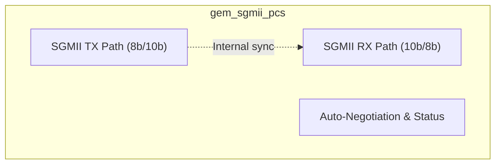
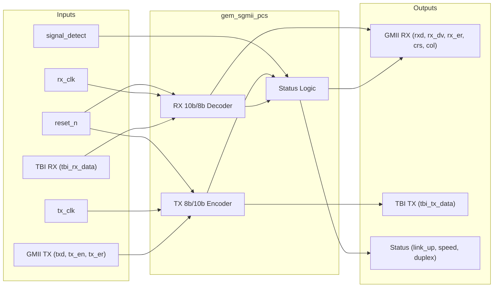

# Gigabit Ethernet SGMII PCS

## Description

The `gem_sgmii_pcs` module implements the Physical Coding Sublayer (PCS) for Serial Gigabit Media Independent Interface (SGMII). It bridges the Gigabit Media Independent Interface (GMII) from the MAC to a Ten Bit Interface (TBI) meant for a SerDes PHY. The module performs 8b/10b encoding on the transmit path and 10b/8b decoding on the receive path, handling idle character insertion/removal and basic auto-negotiation status reporting.

## Interface

### Inputs

| Signal | Width | Description |
|--------|-------|-------------|
| reset_n | 1 | Active-low asynchronous reset |
| tx_clk | 1 | Transmit clock (125 MHz for 1G) |
| rx_clk | 1 | Receive recovered clock (125 MHz) |
| gmii_txd | 8 | GMII transmit data from MAC |
| gmii_tx_en | 1 | GMII transmit enable from MAC |
| gmii_tx_er | 1 | GMII transmit error from MAC |
| tbi_rx_data | 10 | 10-bit receive data from SerDes PHY |
| signal_detect | 1 | Signal detect from PHY |

### Outputs

| Signal | Width | Description |
|--------|-------|-------------|
| gmii_rxd | 8 | GMII receive data to MAC |
| gmii_rx_dv | 1 | GMII receive data valid to MAC |
| gmii_rx_er | 1 | GMII receive error to MAC |
| gmii_crs | 1 | GMII carrier sense to MAC |
| gmii_col | 1 | GMII collision detect to MAC |
| tbi_tx_data | 10 | 10-bit transmit data to SerDes PHY |
| link_up | 1 | Auto-negotiation link up status |
| speed | 2 | Auto-negotiation speed status (10=1G) |
| duplex | 1 | Auto-negotiation duplex status (1=Full) |

## Functionality

The module processes ethernet data across two main data paths. In the transmit direction, it registers the incoming 8-bit GMII data and encodes it into a 10-bit TBI format. When transmission is idle, it outputs the K28.5 idle sequence (`10'b0011111010`). If an error is signaled during transmission, it propagates a standard error code. In the receive direction, it takes the 10-bit TBI stream from the SerDes, decodes it back to 8-bit GMII data, and asserts `gmii_rx_dv` for valid data characters while filtering out K28.5 idle symbols. The module also hardcodes auto-negotiation status to 1G full-duplex and provides carrier sense and collision detection for half-duplex configurations.

## Hierarchical Block Diagram

## Signal-Level Diagram

