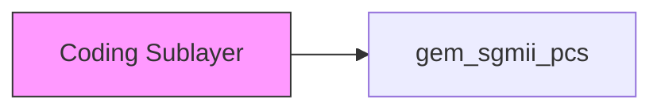
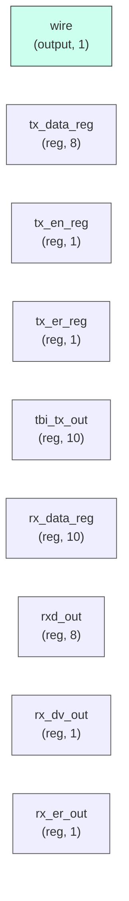

# gem_sgmii_pcs

## Description

The **gem_sgmii_pcs** module SPDX-License-Identifier: Apache-2.0
 SMVDU-TITAN-X SoC — Gigabit Ethernet SGMII PCS Sublayer
 Iteration 3: SGMII Physical Coding Sublayer (8b/10b encode/decode, auto-negotiation)
`timescale 1ns/1ps

## Interface

### Inputs

| Name | Width | Description |
|------|-------|-------------|
| wire | 1 | – |
| wire | 1 | – |
| wire | 1 | – |
| wire | 1 | – |
| wire | 1 | – |
| wire | 1 | – |
| wire | 1 | – |
| wire | 1 | – |

### Outputs

| Name | Width | Description |
|------|-------|-------------|
| wire | 1 | – |
| wire | 1 | – |
| wire | 1 | – |
| wire | 1 | – |
| wire | 1 | – |
| wire | 1 | – |
| wire | 1 | – |
| wire | 1 | – |
| wire | 1 | – |

## Functionality

*gem_sgmii_pcs provides the hardware implementation for its designated function within the SoC.*

## Hierarchical Block Diagram (Mermaid)

## Full Signal‑Level Diagram (Mermaid)

