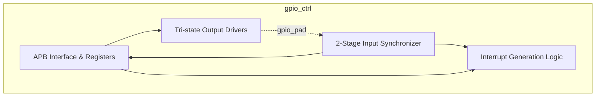
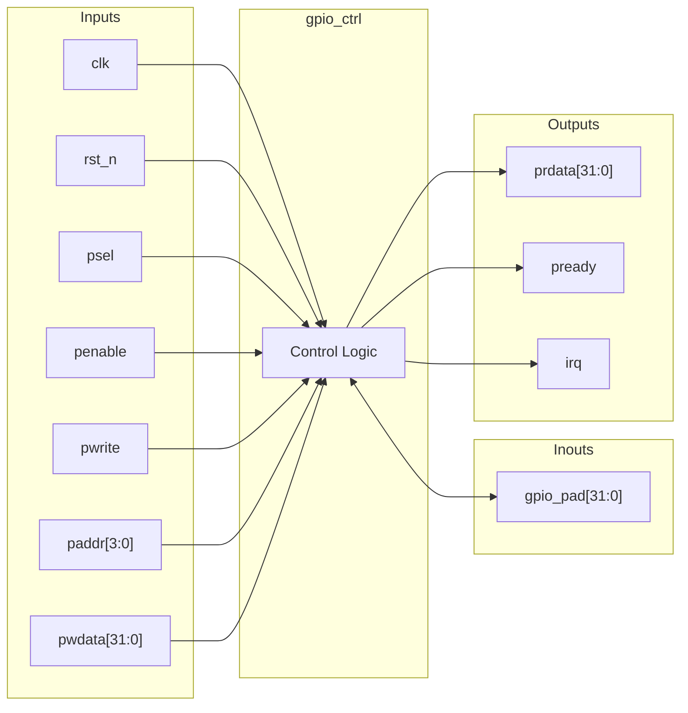

# gpio_ctrl

## Description

The `gpio_ctrl` module is an APB-slave peripheral designed to manage up to 32 bidirectional General-Purpose Input/Output (GPIO) pins for the SMVDU-TITAN-X SoC. It provides flexible control over pin direction, output state, and interrupt generation. Each GPIO pad can be independently configured as an input or output via a direction register, utilizing internal tri-state drivers. To prevent metastability, the design incorporates a two-stage flip-flop synchronizer on all incoming pad signals before they are read or processed. Additionally, the controller features a customizable interrupt generation mechanism capable of triggering on configurable polarities, allowing the SoC to quickly respond to external events.

## Interface

### Inputs

| Signal | Width | Description |
|--------|-------|-------------|
| clk    | 1     | System clock |
| rst_n  | 1     | Active-low asynchronous reset |
| psel   | 1     | APB select signal |
| penable| 1     | APB enable signal |
| pwrite | 1     | APB write enable signal |
| paddr  | 4     | APB address bus |
| pwdata | 32    | APB write data bus |

### Inouts

| Signal | Width | Description |
|--------|-------|-------------|
| gpio_pad | 32  | 32-bit bidirectional GPIO bus utilizing tri-state drivers |

### Outputs

| Signal | Width | Description |
|--------|-------|-------------|
| prdata | 32    | APB read data bus |
| pready | 1     | APB ready signal, hardwired to 1 |
| irq    | 1     | Consolidated interrupt request signal |

## Functionality

The GPIO controller is programmed via an APB register interface. Writing to the `dir_reg` configures the pin direction (1 for output, 0 for input). The `gpio_pad` is driven by the `out_reg` if the corresponding direction bit is 1; otherwise, it is put into a high-impedance state (`1'bz`). The physical pin state is sampled on every clock cycle and passed through a two-stage synchronizer (`gpio_sync1`, `gpio_sync2`) to produce `in_sync`, eliminating potential metastability. The CPU can read the synchronized input data at any time.

Interrupt generation is handled per-pin through `int_en` (interrupt enable) and `int_pol` (interrupt polarity: 1 for active-high, 0 for active-low) registers. The raw interrupt condition is evaluated combinationally, masked by `int_en`, and gated by the `int_stat` register. Any valid unserviced trigger will assert the global `irq` output. Software clears pending interrupts by writing a 1 to the respective bits in the `int_stat` register (Write-1-to-Clear).

## Hierarchical Block Diagram

## Signal-Level Diagram

