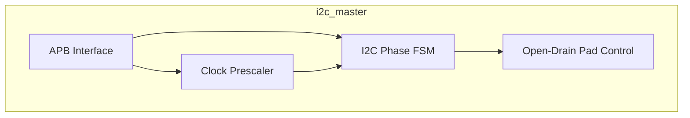
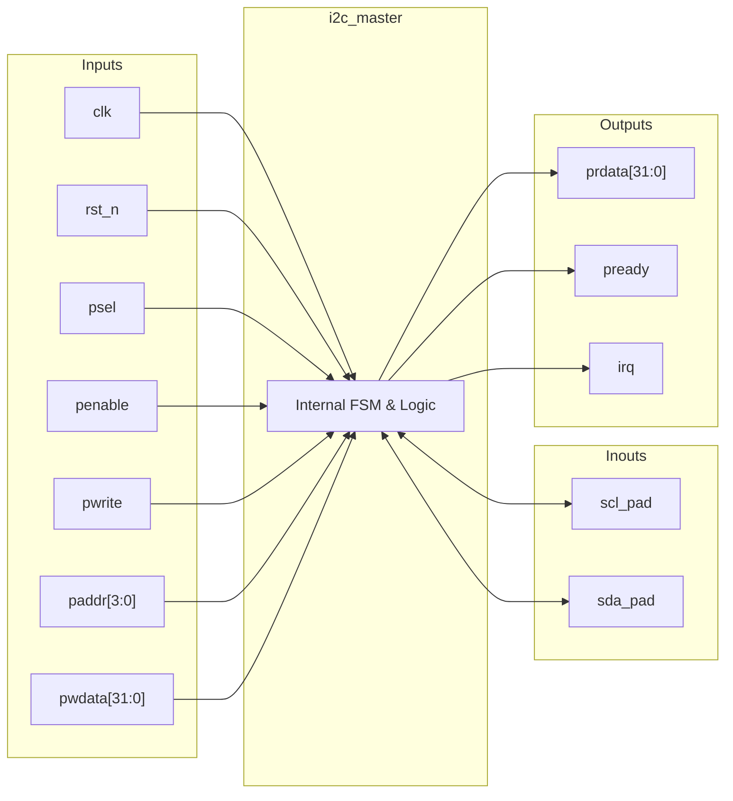

# i2c_master

## Description

The `i2c_master` module is an APB-slave peripheral designed for the SMVDU-TITAN-X SoC, functioning as a byte-level I2C master controller. It abstracts I2C bus transactions into register commands, allowing the host to trigger START, STOP, READ, and WRITE operations. Key architectural features include a configurable prescaler to set the I2C clock frequency (SCL) and a dedicated byte-oriented finite state machine (FSM). The module manages the complex timing and phase shifting required by the I2C protocol, handles open-drain output control for SCL and SDA internally, and flags an interrupt upon completion of ongoing operations.

## Interface

### Inputs

| Signal | Width | Description |
|--------|-------|-------------|
| clk    | 1     | System clock |
| rst_n  | 1     | Active-low asynchronous reset |
| psel   | 1     | APB select signal, indicates the slave is selected |
| penable| 1     | APB enable signal, indicates the second cycle of an APB transfer |
| pwrite | 1     | APB write enable signal |
| paddr  | 4     | APB address bus for register selection |
| pwdata | 32    | APB write data bus |

### Inouts

| Signal | Width | Description |
|--------|-------|-------------|
| scl_pad| 1     | I2C serial clock line (open-drain, externally pulled up) |
| sda_pad| 1     | I2C serial data line (open-drain, externally pulled up) |

### Outputs

| Signal | Width | Description |
|--------|-------|-------------|
| prdata | 32    | APB read data bus |
| pready | 1     | APB ready signal, hardwired to 1 (zero wait states) |
| irq    | 1     | Interrupt request signal, asserted when the controller is not busy |

## Functionality

The controller interfaces with the system CPU via the APB bus. Through memory-mapped registers, the host writes data, sets the clock prescaler, and issues specific I2C commands (e.g., START, STOP, WRITE). When an action is initiated, a phase-driven FSM steps through the I2C protocol. A prescaler divides the system clock into four discrete phase ticks per I2C clock cycle. The FSM uses these phases to precisely control the timing of SDA and SCL transitions to generate valid START and STOP conditions, shift out byte data bit-by-bit (MSB first), and sample acknowledgment bits (ACK) from the slave. The `scl_pad` and `sda_pad` lines are treated as open-drain signals by driving them low when active or setting them to high-impedance (`1'bz`) to let an external pull-up resistor pull the line high.

## Hierarchical Block Diagram

## Signal-Level Diagram

