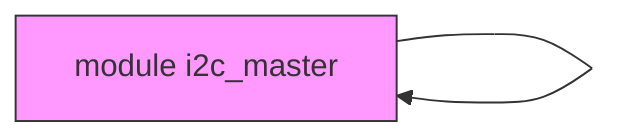

# i2c_master

## Description

The **i2c_master** module SPDX-License-Identifier: Apache-2.0
 SMVDU-TITAN-X SoC — I2C Master Controller
`timescale 1ns/1ps

## Interface

### Inputs

| Name | Width | Description |
|------|-------|-------------|
| wire | 1 | – |
| wire | 1 | – |
| wire | 1 | – |
| wire | 1 | – |
| wire | 1 | – |
| wire | 1 | – |
| wire | 1 | – |

### Outputs

| Name | Width | Description |
|------|-------|-------------|
| reg | 1 | – |
| wire | 1 | – |
| wire | 1 | – |

## Functionality

*i2c_master provides the hardware implementation for its designated function within the SoC.*

## Hierarchical Block Diagram (Mermaid)

## Full Signal‑Level Diagram (Mermaid)

```mermaid
graph LR
    classDef sig fill:#eef,stroke:#555,stroke-width:1px;
    classDef port fill:#cfe,stroke:#333,stroke-width:1px;
    wire["wire\n(input, 1)"]:::port
    wire["wire\n(input, 1)"]:::port
    wire["wire\n(input, 1)"]:::port
    wire["wire\n(input, 1)"]:::port
    wire["wire\n(input, 1)"]:::port
    wire["wire\n(input, 1)"]:::port
    wire["wire\n(input, 1)"]:::port
    reg["reg\n(output, 1)"]:::port
    wire["wire\n(output, 1)"]:::port
    wire["wire\n(inout, 1)"]:::port
    wire["wire\n(inout, 1)"]:::port
    wire["wire\n(output, 1)"]:::port
    prescale["prescale\n(reg, 16)"]:::sig
    tx_data["tx_data\n(reg, 8)"]:::sig
    rx_data["rx_data\n(reg, 8)"]:::sig
    cmd_start["cmd_start\n(reg, 1)"]:::sig
    cmd_stop["cmd_stop\n(reg, 1)"]:::sig
    cmd_read["cmd_read\n(reg, 1)"]:::sig
    cmd_write["cmd_write\n(reg, 1)"]:::sig
    cmd_ack["cmd_ack\n(reg, 1)"]:::sig
    busy["busy\n(reg, 1)"]:::sig
    ack_out["ack_out\n(reg, 1)"]:::sig
    scl_o["scl_o\n(reg, 1)"]:::sig
    sda_o["sda_o\n(reg, 1)"]:::sig
    presc_cnt["presc_cnt\n(reg, 16)"]:::sig
    phase["phase\n(reg, 2)"]:::sig
    istate["istate\n(reg, 3)"]:::sig
    bit_idx["bit_idx\n(reg, 3)"]:::sig
    shift["shift\n(reg, 8)"]:::sig
```

