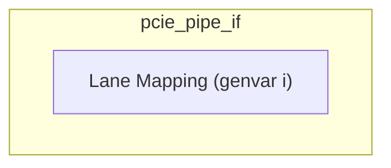
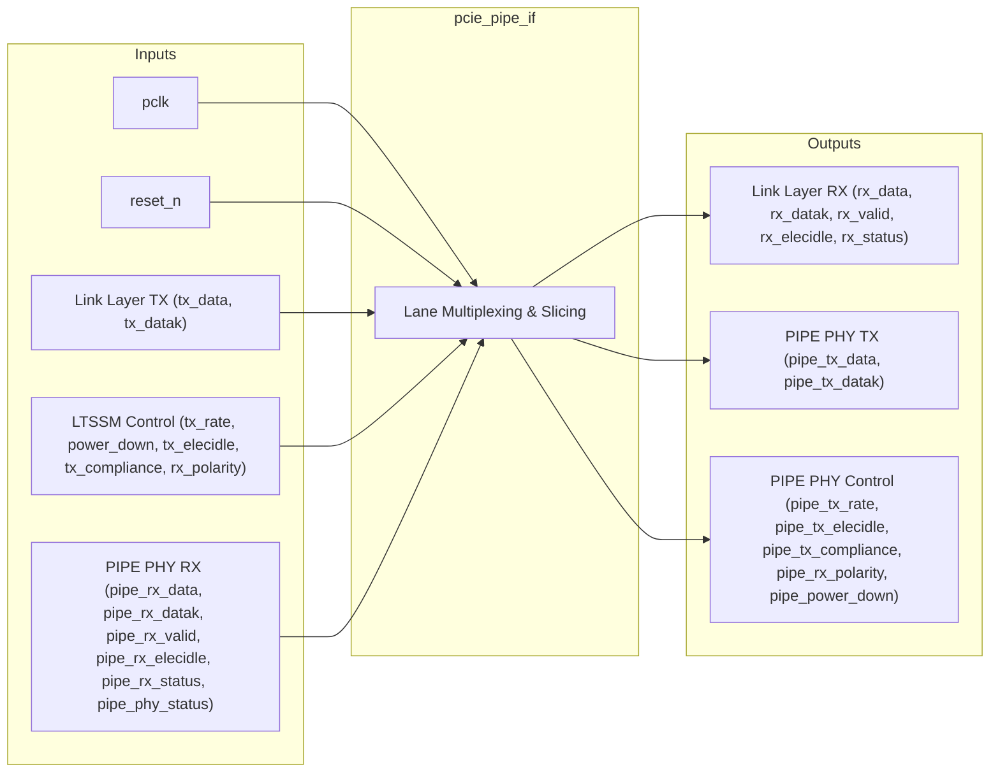

# PCIe PIPE PHY Interface

## Description

The `pcie_pipe_if` module acts as a mapping and passthrough layer between the PCIe Link Layer and a hard PHY (e.g., SerDes) utilizing the standard PIPE (PHY Interface for the PCI Express) 3.0 specification. Configured for PCIe Gen2 (5 GT/s) with 4 lanes, this module organizes multi-lane Tx/Rx data, control symbols, Link Training and Status State Machine (LTSSM) commands, and power management signals, routing them from the MAC to the individual PHY lanes. 

## Interface

### Inputs

| Signal | Width | Description |
|--------|-------|-------------|
| pclk | 1 | PIPE clock, typically 250MHz for Gen2 16-bit |
| reset_n | 1 | Active-low reset |
| tx_data | LANES*16 | Transmit data from Link Layer |
| tx_datak | LANES*2 | Transmit data/control indicator (K-character) |
| tx_rate | 2 | Transmission rate control (00=2.5 GT/s, 01=5.0 GT/s) |
| power_down | 2 (array) | Power down state for each lane (P0, P0s, P1, P2) |
| tx_elecidle | LANES | Transmit electrical idle command |
| tx_compliance | LANES | Transmit compliance mode indicator |
| rx_polarity | LANES | Receive polarity inversion control |
| pipe_rx_data | LANES*16 | Receive data from hard PHY |
| pipe_rx_datak | LANES*2 | Receive data/control indicator from hard PHY |
| pipe_rx_valid | LANES | Receive data valid from hard PHY |
| pipe_rx_elecidle | LANES | Receive electrical idle status from hard PHY |
| pipe_rx_status | LANES*3 | Receive status indicators from hard PHY |
| pipe_phy_status | LANES | PHY status signaling |

### Outputs

| Signal | Width | Description |
|--------|-------|-------------|
| rx_data | LANES*16 | Receive data to Link Layer |
| rx_datak | LANES*2 | Receive data/control indicator to Link Layer |
| rx_valid | LANES | Receive data valid to Link Layer |
| rx_elecidle | LANES | Receive electrical idle to Link Layer |
| rx_status | LANES*3 | Receive status to Link Layer |
| pipe_tx_data | LANES*16 | Transmit data to hard PHY |
| pipe_tx_datak | LANES*2 | Transmit data/control indicator to hard PHY |
| pipe_tx_rate | 2 | Transmission rate to hard PHY |
| pipe_tx_elecidle | LANES | Transmit electrical idle to hard PHY |
| pipe_tx_compliance | LANES | Transmit compliance mode to hard PHY |
| pipe_rx_polarity | LANES | Receive polarity inversion to hard PHY |
| pipe_power_down | LANES*2 | Power down state to hard PHY |

## Functionality

The `pcie_pipe_if` module primarily consists of a `generate` block that iteratates through the configured number of PCIe lanes (defaulting to 4). For each lane, it directly slices and assigns transmit data (`tx_data`, `tx_datak`), LTSSM state commands (`tx_elecidle`, `tx_compliance`, `rx_polarity`, `power_down`), and transmission rate (`tx_rate`) from the wide buses of the Link Layer into the individual, per-lane PIPE PHY signals. Conversely, it maps the lane-specific receive data (`pipe_rx_data`, `pipe_rx_datak`) and status signals (`pipe_rx_valid`, `pipe_rx_elecidle`, `pipe_rx_status`) from the hard PHY back into the aggregated wide buses sent to the Link Layer.

## Hierarchical Block Diagram

## Signal-Level Diagram

