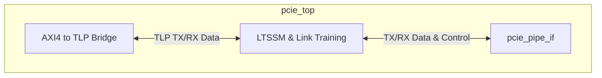
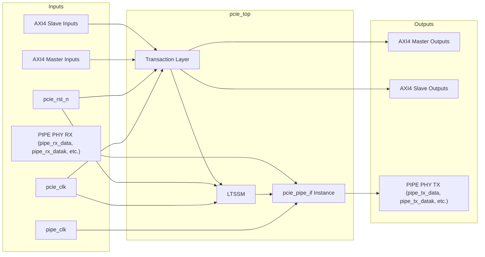

# PCIe Gen2 x4 Endpoint/Root Port Top

## Description

The `pcie_top` module serves as the top-level wrapper for the PCIe subsystem within the SMVDU-TITAN-X SoC. Designed for PCIe Gen2 (5 GT/s) operations over 4 lanes, this module incorporates the Transaction Layer interfacing with system memory via AXI4, the Data Link Layer, and the LTSSM (Link Training and Status State Machine). It instantiates the `pcie_pipe_if` sub-module to connect the internal logic to an external physical layer via the standard PIPE 3.0 interface.

## Interface

### Inputs

| Signal | Width | Description |
|--------|-------|-------------|
| pcie_clk | 1 | PCIe core clock |
| pcie_rst_n | 1 | Active-low PCIe core reset |
| pipe_clk | 1 | 250MHz PIPE clock |
| m_awready | 1 | AXI4 Master write address ready |
| m_wready | 1 | AXI4 Master write data ready |
| m_bvalid | 1 | AXI4 Master write response valid |
| m_bresp | 2 | AXI4 Master write response |
| m_bid | IDW | AXI4 Master write response ID |
| m_arready | 1 | AXI4 Master read address ready |
| m_rvalid | 1 | AXI4 Master read data valid |
| m_rdata | DW | AXI4 Master read data |
| m_rresp | 2 | AXI4 Master read response |
| m_rlast | 1 | AXI4 Master read last indicator |
| m_rid | IDW | AXI4 Master read response ID |
| s_awvalid | 1 | AXI4 Slave write address valid |
| s_awaddr | AW | AXI4 Slave write address |
| s_awid | IDW | AXI4 Slave write address ID |
| s_awlen | 8 | AXI4 Slave write burst length |
| s_awsize | 3 | AXI4 Slave write burst size |
| s_wvalid | 1 | AXI4 Slave write data valid |
| s_wdata | DW | AXI4 Slave write data |
| s_wstrb | DW/8 | AXI4 Slave write byte strobes |
| s_wlast | 1 | AXI4 Slave write last indicator |
| s_bready | 1 | AXI4 Slave write response ready |
| s_arvalid | 1 | AXI4 Slave read address valid |
| s_araddr | AW | AXI4 Slave read address |
| s_arid | IDW | AXI4 Slave read address ID |
| s_arlen | 8 | AXI4 Slave read burst length |
| s_arsize | 3 | AXI4 Slave read burst size |
| s_rready | 1 | AXI4 Slave read data ready |
| pipe_rx_data | LANES*16 | Receive data from hard PHY via PIPE |
| pipe_rx_datak | LANES*2 | Receive data/control indicator from hard PHY via PIPE |
| pipe_rx_valid | LANES | Receive data valid from hard PHY via PIPE |
| pipe_rx_elecidle | LANES | Receive electrical idle status from hard PHY via PIPE |
| pipe_rx_status | LANES*3 | Receive status indicators from hard PHY via PIPE |
| pipe_phy_status | LANES | PHY status signaling via PIPE |

### Outputs

| Signal | Width | Description |
|--------|-------|-------------|
| m_awvalid | 1 | AXI4 Master write address valid |
| m_awaddr | AW | AXI4 Master write address |
| m_awid | IDW | AXI4 Master write address ID |
| m_awlen | 8 | AXI4 Master write burst length |
| m_awsize | 3 | AXI4 Master write burst size |
| m_wvalid | 1 | AXI4 Master write data valid |
| m_wdata | DW | AXI4 Master write data |
| m_wstrb | DW/8 | AXI4 Master write byte strobes |
| m_wlast | 1 | AXI4 Master write last indicator |
| m_bready | 1 | AXI4 Master write response ready |
| m_arvalid | 1 | AXI4 Master read address valid |
| m_araddr | AW | AXI4 Master read address |
| m_arid | IDW | AXI4 Master read address ID |
| m_arlen | 8 | AXI4 Master read burst length |
| m_arsize | 3 | AXI4 Master read burst size |
| m_rready | 1 | AXI4 Master read data ready |
| s_awready | 1 | AXI4 Slave write address ready |
| s_wready | 1 | AXI4 Slave write data ready |
| s_bvalid | 1 | AXI4 Slave write response valid |
| s_bresp | 2 | AXI4 Slave write response |
| s_bid | IDW | AXI4 Slave write response ID |
| s_arready | 1 | AXI4 Slave read address ready |
| s_rvalid | 1 | AXI4 Slave read data valid |
| s_rdata | DW | AXI4 Slave read data |
| s_rresp | 2 | AXI4 Slave read response |
| s_rlast | 1 | AXI4 Slave read last indicator |
| s_rid | IDW | AXI4 Slave read response ID |
| pipe_tx_data | LANES*16 | Transmit data to hard PHY via PIPE |
| pipe_tx_datak | LANES*2 | Transmit data/control indicator to hard PHY via PIPE |
| pipe_tx_rate | 2 | Transmission rate to hard PHY via PIPE |
| pipe_tx_elecidle | LANES | Transmit electrical idle to hard PHY via PIPE |
| pipe_tx_compliance | LANES | Transmit compliance mode to hard PHY via PIPE |
| pipe_rx_polarity | LANES | Receive polarity inversion to hard PHY via PIPE |
| pipe_power_down | LANES*2 | Power down state to hard PHY via PIPE |

## Functionality

The `pcie_top` module handles the high-level PCIe protocol functionality. It includes two full AXI4 interfaces (one Master for DMA operations initiating transactions onto the system bus, and one Slave for receiving configuration or memory-mapped accesses from the host system). The core maps these AXI transactions to PCIe Transaction Layer Packets (TLPs). Additionally, the module manages the LTSSM, maintaining link training states such as power states (`power_down`), transmission rate (`tx_rate`), and electrical idle signals. The logical signals for the physical link are routed through an instantiated `pcie_pipe_if` submodule which interfaces directly with an external physical SerDes.

## Hierarchical Block Diagram

## Signal-Level Diagram

