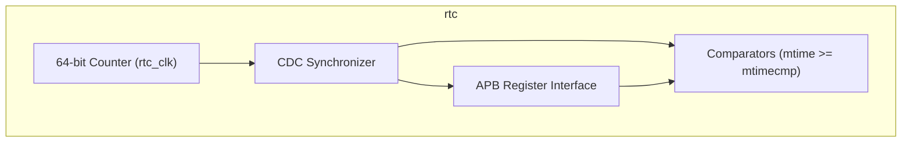
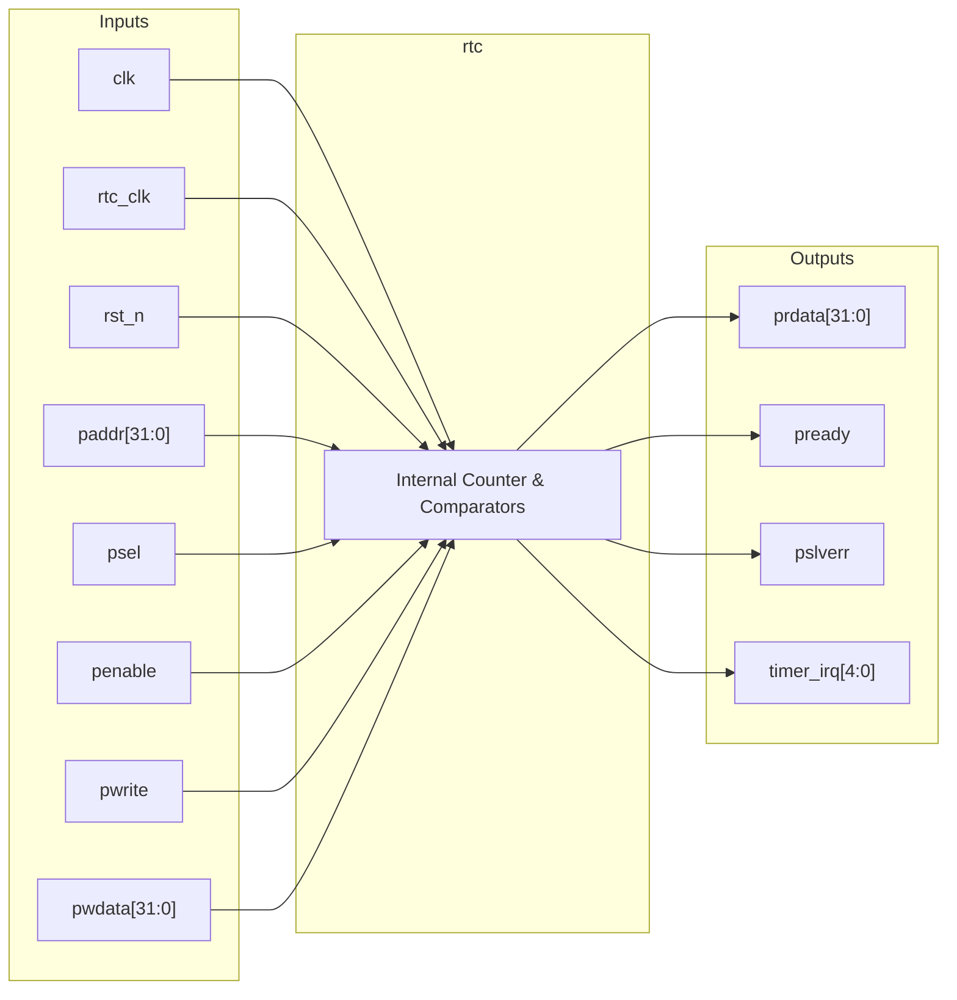

# rtc

## Description

The `rtc` module is a Real-Time Counter designed for the SMVDU-TITAN-X SoC. It serves as the primary timebase for the RISC-V core local timer interrupts, implementing a 64-bit free-running counter (analogous to the RISC-V `mtime` register). The architecture supports up to 5 distinct harts (4 application cores and 1 monitor core) by providing dedicated 64-bit memory-mapped comparators (`mtimecmp`) for each. A key design feature is the use of a 2-stage flip-flop synchronizer to safely transfer the 64-bit counter value from the slow, always-on RTC clock domain to the faster system clock domain. When the synchronized counter value meets or exceeds a core's comparator value, the corresponding timer interrupt is asserted.

## Interface

### Inputs

| Signal | Width | Description |
|--------|-------|-------------|
| clk    | 1     | System clock used for APB interface and comparator logic |
| rtc_clk| 1     | Always-on slow clock (e.g., 32.768 kHz) for the 64-bit counter |
| rst_n  | 1     | Active-low asynchronous reset |
| paddr  | 32    | APB address bus for accessing mtime and mtimecmp registers |
| psel   | 1     | APB select signal |
| penable| 1     | APB enable signal |
| pwrite | 1     | APB write enable signal |
| pwdata | 32    | APB write data bus |

### Outputs

| Signal | Width | Description |
|--------|-------|-------------|
| prdata | 32    | APB read data bus |
| pready | 1     | APB ready signal, hardwired to 1 (zero wait states) |
| pslverr| 1     | APB slave error signal, hardwired to 0 |
| timer_irq | 5  | Timer interrupt lines (MTIP) for 5 harts (4 App + 1 Monitor) |

## Functionality

The `rtc` peripheral increments a 64-bit internal counter (`mtime`) on every positive edge of the `rtc_clk`. To prevent metastability when accessed by the rest of the SoC, this 64-bit value is synchronized into the `clk` domain using a 2-stage flip-flop chain (`mtime_meta`, `mtime_sync`). The module acts as an APB slave, allowing the host to read the current synchronized time and to configure the 64-bit `mtimecmp` registers for each of the five connected cores. The APB address mapping follows a standard CLINT-like structure, splitting 64-bit reads and writes into 32-bit halves. Continuous combinational logic checks if `mtime_sync` is greater than or equal to `mtimecmp[i]`; if so, it drives `timer_irq[i]` high, triggering a timer interrupt in the respective core.

## Hierarchical Block Diagram

## Signal-Level Diagram

