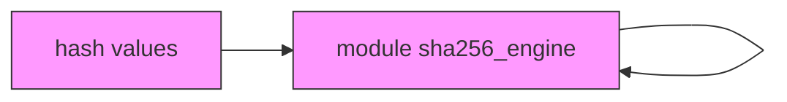

# sha256_engine

## Description

The **sha256_engine** module SPDX-License-Identifier: Apache-2.0
 SMVDU-TITAN-X SoC — SHA-256 Hash Engine
 FIPS 180-4 compliant. 64-round iterative architecture.
`timescale 1ns/1ps

## Interface

### Inputs

| Name | Width | Description |
|------|-------|-------------|
| wire | 1 | – |
| wire | 1 | – |
| wire | 1 | – |
| wire | 1 | – |
| wire | 1 | – |
| wire | 1 | – |
| wire | 1 | – |

### Outputs

| Name | Width | Description |
|------|-------|-------------|
| reg | 1 | – |
| wire | 1 | – |
| wire | 1 | – |

## Functionality

*sha256_engine provides the hardware implementation for its designated function within the SoC.*

## Hierarchical Block Diagram (Mermaid)

## Full Signal‑Level Diagram (Mermaid)

```mermaid
graph LR
    classDef sig fill:#eef,stroke:#555,stroke-width:1px;
    classDef port fill:#cfe,stroke:#333,stroke-width:1px;
    wire["wire\n(input, 1)"]:::port
    wire["wire\n(input, 1)"]:::port
    wire["wire\n(input, 1)"]:::port
    wire["wire\n(input, 1)"]:::port
    wire["wire\n(input, 1)"]:::port
    wire["wire\n(input, 1)"]:::port
    wire["wire\n(input, 1)"]:::port
    reg["reg\n(output, 1)"]:::port
    wire["wire\n(output, 1)"]:::port
    wire["wire\n(output, 1)"]:::port
    a["a\n(reg, 32)"]:::sig
    b["b\n(reg, 32)"]:::sig
    c["c\n(reg, 32)"]:::sig
    d["d\n(reg, 32)"]:::sig
    e["e\n(reg, 32)"]:::sig
    f["f\n(reg, 32)"]:::sig
    g["g\n(reg, 32)"]:::sig
    h["h\n(reg, 32)"]:::sig
    round["round\n(reg, 6)"]:::sig
    active["active\n(reg, 1)"]:::sig
    done["done\n(reg, 1)"]:::sig
    start["start\n(reg, 1)"]:::sig
    T1["T1\n(wire, 32)"]:::sig
    T2["T2\n(wire, 32)"]:::sig
    S1["S1\n(wire, 32)"]:::sig
    S0["S0\n(wire, 32)"]:::sig
    ch_val["ch_val\n(wire, 32)"]:::sig
    maj_val["maj_val\n(wire, 32)"]:::sig
    sig0["sig0\n(wire, 32)"]:::sig
    sig1["sig1\n(wire, 32)"]:::sig
    w_sched["w_sched\n(wire, 32)"]:::sig
```

