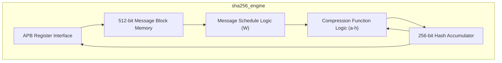
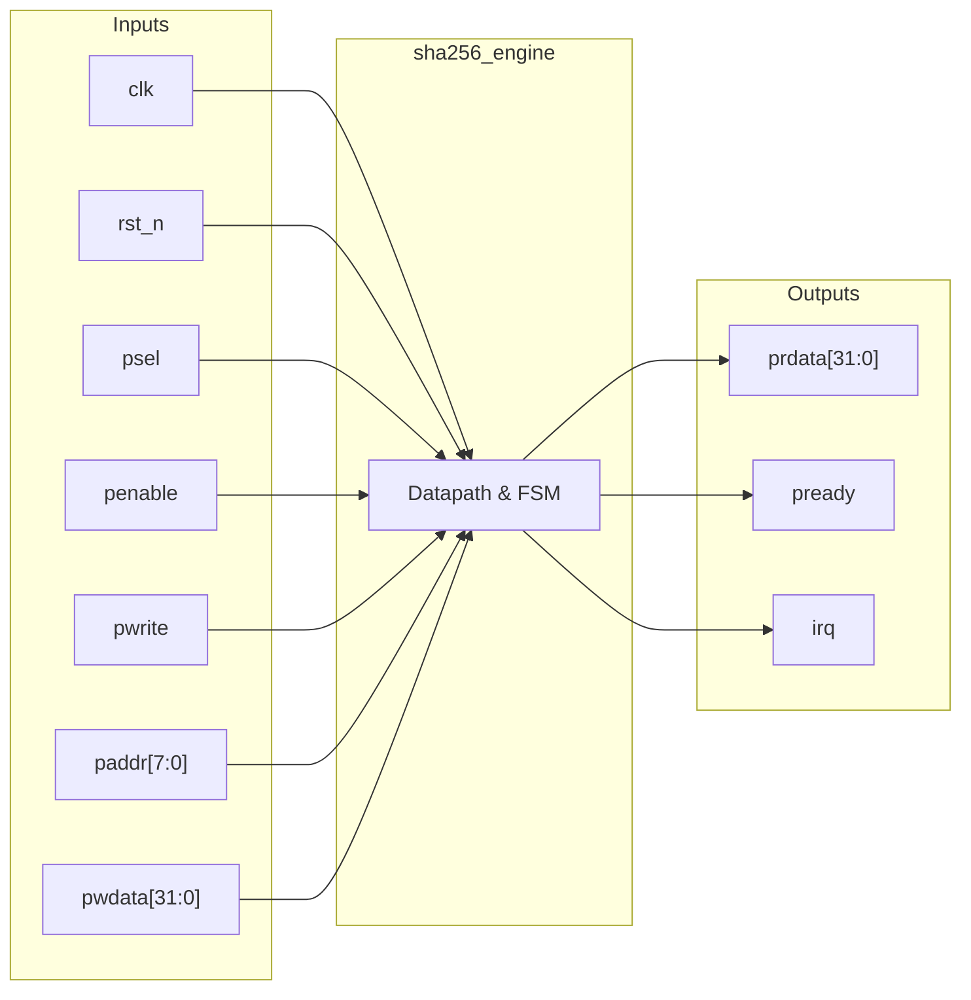

# sha256_engine

## Description

The `sha256_engine` is a FIPS 180-4 compliant cryptographic hash accelerator for the SMVDU-TITAN-X SoC. It implements the standard 64-round iterative SHA-256 algorithm entirely in hardware, taking 512-bit message blocks as input to produce a 256-bit message digest. The module is interfaced via an APB bus, allowing the CPU to load the input message block by writing sixteen 32-bit words, trigger the hashing process, and read back the final eight-word hash value. A sliding-window message schedule block and highly optimized round logic allow the engine to complete one compression round per clock cycle, offering significant performance gains over software-based hashing. An interrupt is generated when a block finishes processing.

## Interface

### Inputs

| Signal | Width | Description |
|--------|-------|-------------|
| clk    | 1     | System clock |
| rst_n  | 1     | Active-low asynchronous reset |
| psel   | 1     | APB select signal |
| penable| 1     | APB enable signal |
| pwrite | 1     | APB write enable signal |
| paddr  | 8     | APB address bus (8-bit for block and hash access) |
| pwdata | 32    | APB write data bus |

### Outputs

| Signal | Width | Description |
|--------|-------|-------------|
| prdata | 32    | APB read data bus |
| pready | 1     | APB ready signal, hardwired to 1 |
| irq    | 1     | Interrupt request, asserted for one cycle when hashing completes |

## Functionality

The peripheral operates by having the host CPU write a 512-bit chunk of the padded message into the internal `msg_block` memory via the APB interface (offsets 0x00 to 0x3C). After loading the data, a write to the start register (offset 0x60) triggers the FSM. Upon starting, the engine initializes its internal state variables (a–h) from the current hash registers (H0–H7) and loads the 16-word message schedule `W` array. For 64 consecutive clock cycles, the compression function logic computes the SHA-256 round equations (using `T1`, `T2`, `Ch`, `Maj`, and bitwise rotations) and advances the message schedule. On round 63, the computed state variables are accumulated into the hash registers, the `active` flag is cleared, and `done` (mapped to `irq`) is pulsed. The CPU can then read the 256-bit digest from offsets 0x40 to 0x5C.

## Hierarchical Block Diagram

## Signal-Level Diagram

