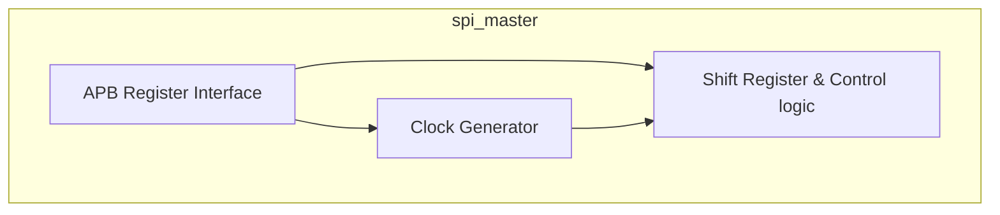
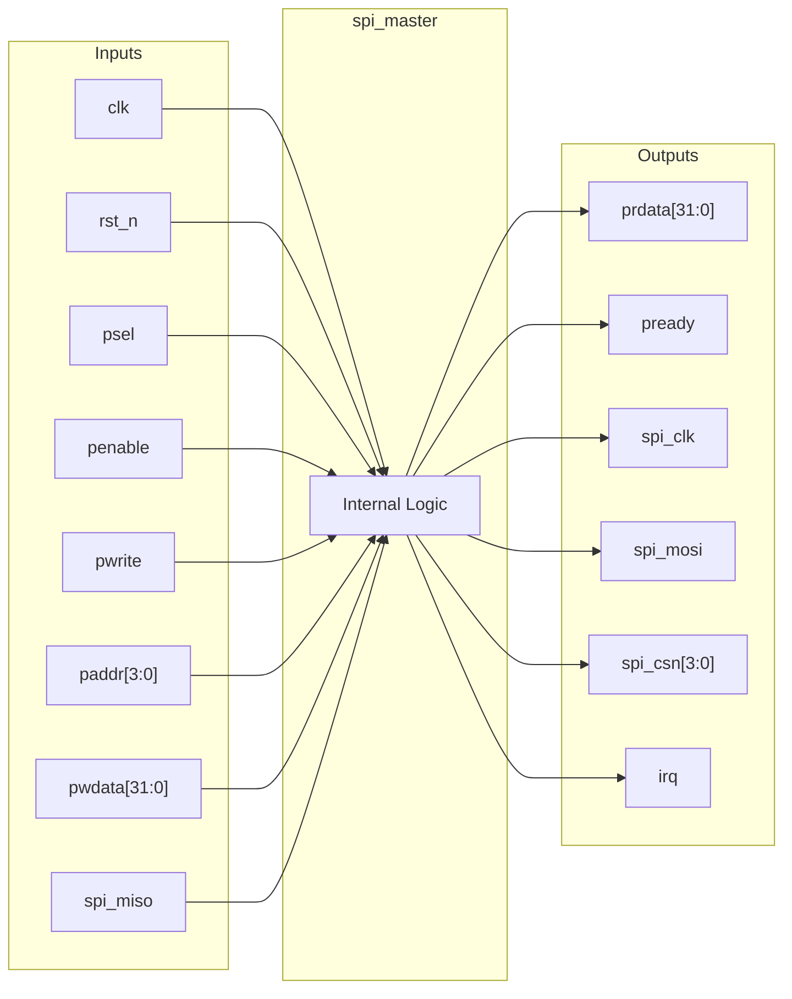

# spi_master

## Description

The `spi_master` module is an APB-slave peripheral designed for the SMVDU-TITAN-X SoC, functioning as a standard SPI master controller. It supports full-duplex communication and provides up to four active-low chip selects to interface with multiple SPI slave devices. The architecture features a configurable clock divider for setting the SPI baud rate, and programmable clock polarity (CPOL) and phase (CPHA) to accommodate various SPI modes. The controller interfaces with the host CPU via an APB bus for register configuration and data transfers, and asserts an interrupt pulse upon the completion of a byte transmission.

## Interface

### Inputs

| Signal | Width | Description |
|--------|-------|-------------|
| clk    | 1     | System clock |
| rst_n  | 1     | Active-low asynchronous reset |
| psel   | 1     | APB select signal, indicates the slave is selected |
| penable| 1     | APB enable signal, indicates the second cycle of an APB transfer |
| pwrite | 1     | APB write enable signal |
| paddr  | 4     | APB address bus for register selection |
| pwdata | 32    | APB write data bus |
| spi_miso | 1   | SPI Master In Slave Out (MISO) data line |

### Outputs

| Signal | Width | Description |
|--------|-------|-------------|
| prdata | 32    | APB read data bus |
| pready | 1     | APB ready signal, hardwired to 1 (zero wait states) |
| spi_clk| 1     | SPI serial clock output |
| spi_mosi | 1   | SPI Master Out Slave In (MOSI) data line |
| spi_csn| 4     | Active-low SPI chip select lines for up to 4 slaves |
| irq    | 1     | Interrupt request signal, pulses high when a transfer completes |

## Functionality

The controller acts as an APB slave, allowing the host to write transmission data and configuration parameters such as the clock divider, CPOL, CPHA, and the active chip select. When a write to the data register occurs, the `start` signal is asserted, initiating a SPI transfer. A clock generation block creates the SPI clock based on the `clk_div` register. The core logic consists of a shift register and a state machine that handles the serialization of the output data onto `spi_mosi` and the deserialization of the input data from `spi_miso`. Depending on the SCLK edge (governed by internal phase tracking), data is shifted out and sampled in. When the 8-bit transfer finishes, the chip select is deasserted, the received byte is stored in the receive data register, the `busy` flag is cleared, and an `irq` pulse is generated.

## Hierarchical Block Diagram

## Signal-Level Diagram

