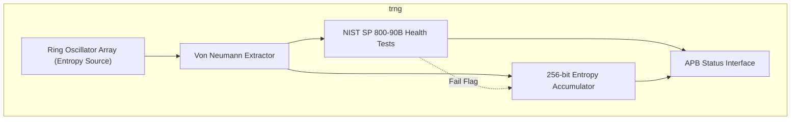
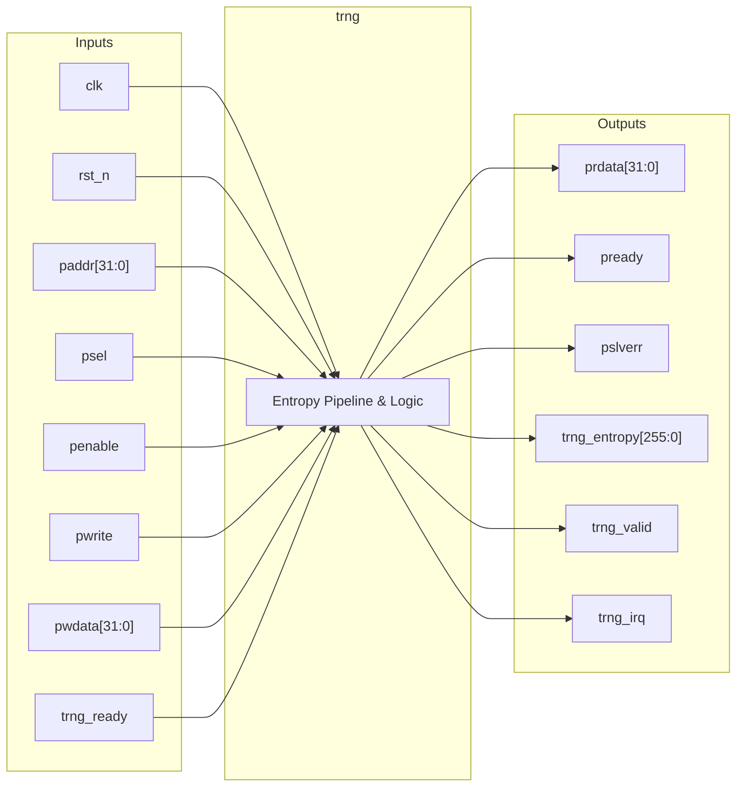

# trng

## Description

The True Random Number Generator (`trng`) is a critical security peripheral for the SMVDU-TITAN-X SoC, designed to produce cryptographically secure random bits. It leverages an array of free-running Ring Oscillators (ROs) as its physical entropy source (modeled behaviorally in this RTL). To counteract hardware bias and environmental correlation, the raw oscillator output is post-processed through a digital Von Neumann extractor. The module implements continuous health testing, specifically a Repetition Count Test compliant with NIST SP 800-90B, to monitor the quality of the entropy stream and alert the system of failures. The extracted entropy is packed into a 256-bit register and delivered to downstream consumer blocks (such as a DRBG) via a dedicated hardware handshake interface.

## Interface

### Inputs

| Signal | Width | Description |
|--------|-------|-------------|
| clk    | 1     | System clock |
| rst_n  | 1     | Active-low asynchronous reset |
| paddr  | 32    | APB address bus |
| psel   | 1     | APB select signal |
| penable| 1     | APB enable signal |
| pwrite | 1     | APB write enable signal |
| pwdata | 32    | APB write data bus |
| trng_ready | 1 | Ready signal from a downstream entropy consumer (e.g., DRBG) |

### Outputs

| Signal | Width | Description |
|--------|-------|-------------|
| prdata | 32    | APB read data bus |
| pready | 1     | APB ready signal, hardwired to 1 |
| pslverr| 1     | APB slave error signal, hardwired to 0 |
| trng_entropy | 256 | Accumulated 256-bit true random number |
| trng_valid | 1 | Indicates that a full 256-bit entropy value is available |
| trng_irq | 1   | Interrupt request, asserted if the entropy health test fails |

## Functionality

The TRNG's core entropy source consists of 16 simulated Ring Oscillators that toggle independently based on random delays (represented here using randomized shift registers). The XORed bitstream from these oscillators forms a raw entropy sequence. A Von Neumann extractor processes this raw stream by examining bits in pairs: `01` yields a `0`, `10` yields a `1`, and pairs of `00` or `11` are discarded to eliminate bias. The debiased bitstream feeds into a continuous Repetition Count health test; if a single bit value is repeated 256 times sequentially, `health_fail` is asserted and triggers an interrupt (`trng_irq`), halting entropy collection. Valid bits are shifted into a 256-bit accumulator. Once 256 valid bits are collected, `trng_valid` is raised. The downstream logic can consume the data by asserting `trng_ready`, resetting the accumulator for the next batch. Software can monitor the TRNG status through the APB interface.

## Hierarchical Block Diagram

## Signal-Level Diagram

