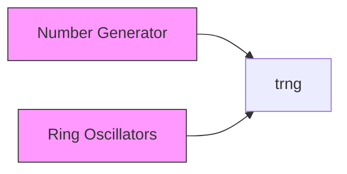

# trng

## Description

The **trng** module SPDX-License-Identifier: Apache-2.0
 SMVDU-TITAN-X SoC — True Random Number Generator (TRNG)
 Iteration 3: Based on Free-running Ring Oscillators (FIRO/GARO) with NIST SP 800-90B health tests.
`timescale 1ns/1ps

## Interface

### Inputs

| Name | Width | Description |
|------|-------|-------------|
| wire | 1 | – |
| wire | 1 | – |
| wire | 1 | – |
| wire | 1 | – |
| wire | 1 | – |
| wire | 1 | – |
| wire | 1 | – |
| wire | 1 | – |

### Outputs

| Name | Width | Description |
|------|-------|-------------|
| wire | 1 | – |
| wire | 1 | – |
| wire | 1 | – |
| wire | 1 | – |
| wire | 1 | – |
| wire | 1 | – |

## Functionality

*trng provides the hardware implementation for its designated function within the SoC.*

## Hierarchical Block Diagram (Mermaid)

## Full Signal‑Level Diagram (Mermaid)

```mermaid
graph LR
    classDef sig fill:#eef,stroke:#555,stroke-width:1px;
    classDef port fill:#cfe,stroke:#333,stroke-width:1px;
    wire["wire\n(input, 1)"]:::port
    wire["wire\n(input, 1)"]:::port
    wire["wire\n(input, 1)"]:::port
    wire["wire\n(input, 1)"]:::port
    wire["wire\n(input, 1)"]:::port
    wire["wire\n(input, 1)"]:::port
    wire["wire\n(input, 1)"]:::port
    wire["wire\n(output, 1)"]:::port
    wire["wire\n(output, 1)"]:::port
    wire["wire\n(output, 1)"]:::port
    wire["wire\n(output, 1)"]:::port
    wire["wire\n(output, 1)"]:::port
    wire["wire\n(input, 1)"]:::port
    wire["wire\n(output, 1)"]:::port
    ro_out["ro_out\n(reg, 16)"]:::sig
    vn_state["vn_state\n(reg, 1)"]:::sig
    vn_prev_bit["vn_prev_bit\n(reg, 1)"]:::sig
    vn_out_bit["vn_out_bit\n(reg, 1)"]:::sig
    vn_out_valid["vn_out_valid\n(reg, 1)"]:::sig
    rep_count["rep_count\n(reg, 8)"]:::sig
    rep_prev["rep_prev\n(reg, 1)"]:::sig
    health_fail["health_fail\n(reg, 1)"]:::sig
    entropy_reg["entropy_reg\n(reg, 256)"]:::sig
    entropy_cnt["entropy_cnt\n(reg, 9)"]:::sig
    entropy_valid["entropy_valid\n(reg, 1)"]:::sig
    ctrl_reg["ctrl_reg\n(reg, 32)"]:::sig
```

