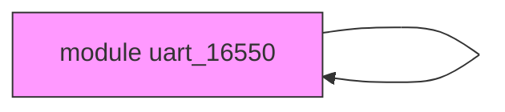

# uart_16550

## Description

The **uart_16550** module SPDX-License-Identifier: Apache-2.0
 SMVDU-TITAN-X SoC — MMUART (Multi-Mode UART based on 16550)
 Iteration 3: Added support for LIN, IrDA, and 9-bit data modes.
`timescale 1ns/1ps

## Interface

### Inputs

| Name | Width | Description |
|------|-------|-------------|
| wire | 1 | – |
| wire | 1 | – |
| wire | 1 | – |
| wire | 1 | – |
| wire | 1 | – |
| wire | 1 | – |
| wire | 1 | – |
| wire | 1 | – |
| wire | 1 | – |
| wire | 1 | – |

### Outputs

| Name | Width | Description |
|------|-------|-------------|
| wire | 1 | – |
| wire | 1 | – |
| wire | 1 | – |
| wire | 1 | – |
| wire | 1 | – |
| wire | 1 | – |
| wire | 1 | – |

## Functionality

*uart_16550 provides the hardware implementation for its designated function within the SoC.*

## Hierarchical Block Diagram (Mermaid)

## Full Signal‑Level Diagram (Mermaid)

```mermaid
graph LR
    classDef sig fill:#eef,stroke:#555,stroke-width:1px;
    classDef port fill:#cfe,stroke:#333,stroke-width:1px;
    wire["wire\n(input, 1)"]:::port
    wire["wire\n(input, 1)"]:::port
    wire["wire\n(input, 1)"]:::port
    wire["wire\n(input, 1)"]:::port
    wire["wire\n(input, 1)"]:::port
    wire["wire\n(input, 1)"]:::port
    wire["wire\n(input, 1)"]:::port
    wire["wire\n(output, 1)"]:::port
    wire["wire\n(output, 1)"]:::port
    wire["wire\n(output, 1)"]:::port
    wire["wire\n(output, 1)"]:::port
    wire["wire\n(input, 1)"]:::port
    wire["wire\n(output, 1)"]:::port
    wire["wire\n(output, 1)"]:::port
    wire["wire\n(input, 1)"]:::port
    wire["wire\n(output, 1)"]:::port
    wire["wire\n(input, 1)"]:::port
    thr_rbr["thr_rbr\n(reg, 8)"]:::sig
    ier["ier\n(reg, 8)"]:::sig
    iir_fcr["iir_fcr\n(reg, 8)"]:::sig
    lcr["lcr\n(reg, 8)"]:::sig
    mcr["mcr\n(reg, 8)"]:::sig
    lsr["lsr\n(reg, 8)"]:::sig
    msr["msr\n(reg, 8)"]:::sig
    scr["scr\n(reg, 8)"]:::sig
    dll["dll\n(reg, 8)"]:::sig
    dlm["dlm\n(reg, 8)"]:::sig
    mode_cr["mode_cr\n(reg, 8)"]:::sig
    nbit_cr["nbit_cr\n(reg, 8)"]:::sig
    prdata_reg["prdata_reg\n(reg, 32)"]:::sig
```

