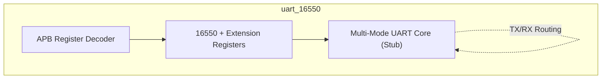
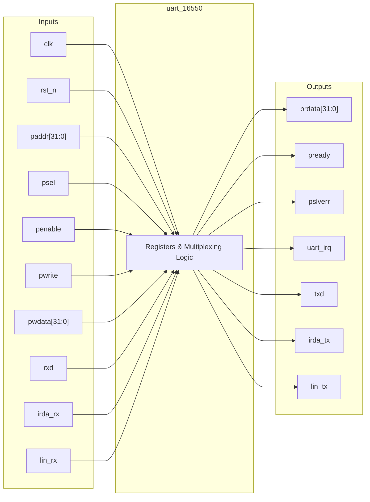

# uart_16550

## Description

The `uart_16550` module is a Multi-Mode UART designed for the SMVDU-TITAN-X SoC, building upon the industry-standard 16550 architecture. In addition to conventional asynchronous serial communication, this iteration introduces support for advanced protocols including IrDA (Infrared Data Association), LIN (Local Interconnect Network) bus, and 9-bit data frames. The core provides a standard APB slave interface that implements traditional 16550 memory-mapped registers alongside custom extension registers (`mode_cr`, `nbit_cr`) for configuring the advanced modes. While the complex physical layer processing logic is currently stubbed, the module establishes the structural and memory framework necessary for multiplexing standard TX/RX paths to specialized protocol endpoints.

## Interface

### Inputs

| Signal | Width | Description |
|--------|-------|-------------|
| clk    | 1     | System clock |
| rst_n  | 1     | Active-low asynchronous reset |
| paddr  | 32    | APB address bus |
| psel   | 1     | APB select signal |
| penable| 1     | APB enable signal |
| pwrite | 1     | APB write enable signal |
| pwdata | 32    | APB write data bus |
| rxd    | 1     | Standard UART receive line |
| irda_rx| 1     | IrDA receive line |
| lin_rx | 1     | LIN bus receive line |

### Outputs

| Signal | Width | Description |
|--------|-------|-------------|
| prdata | 32    | APB read data bus |
| pready | 1     | APB ready signal, hardwired to 1 |
| pslverr| 1     | APB slave error signal, hardwired to 0 |
| uart_irq | 1   | UART interrupt request line |
| txd    | 1     | Standard UART transmit line |
| irda_tx| 1     | IrDA transmit line |
| lin_tx | 1     | LIN bus transmit line |

## Functionality

The `uart_16550` core functions as an APB-slave device, decoding register accesses based on the APB address bus. The module implements the conventional 16550 register map, utilizing the Divisor Latch Access Bit (`dlab` from the LCR) to multiplex accesses to the transmit/receive buffers and the baud rate divisor latches (`dll`, `dlm`). It expands upon the standard by introducing `mode_cr` to switch between UART, IrDA, and LIN modes, and `nbit_cr` to toggle 9-bit operation. The actual physical data transmission and reception (baud generation, framing, and serialization) are placeholders in this version, represented by static idle assignments (e.g., driving `txd` high and `irda_tx` low). Software drivers interact with this module identically to a legacy 16550 UART, with the addition of the extended protocol toggles.

## Hierarchical Block Diagram

## Signal-Level Diagram

