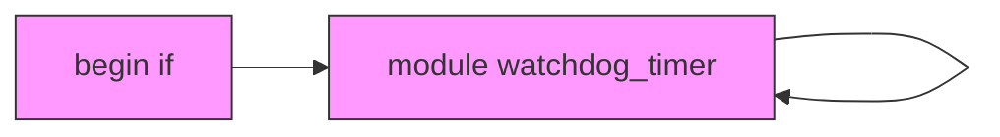
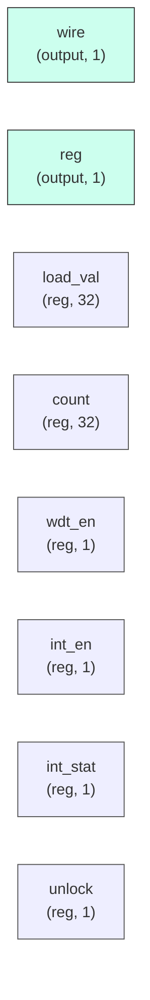

# watchdog_timer

## Description

The **watchdog_timer** module SPDX-License-Identifier: Apache-2.0
 SMVDU-TITAN-X SoC — Watchdog Timer
`timescale 1ns/1ps

## Interface

### Inputs

| Name | Width | Description |
|------|-------|-------------|
| wire | 1 | – |
| wire | 1 | – |
| wire | 1 | – |
| wire | 1 | – |
| wire | 1 | – |
| wire | 1 | – |
| wire | 1 | – |

### Outputs

| Name | Width | Description |
|------|-------|-------------|
| reg | 1 | – |
| wire | 1 | – |
| reg | 1 | – |
| wire | 1 | – |

## Functionality

*watchdog_timer provides the hardware implementation for its designated function within the SoC.*

## Hierarchical Block Diagram (Mermaid)

## Full Signal‑Level Diagram (Mermaid)

