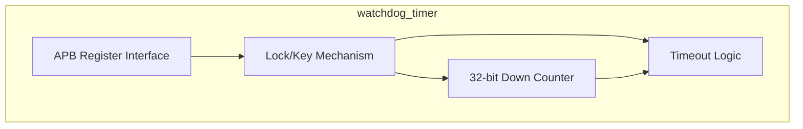
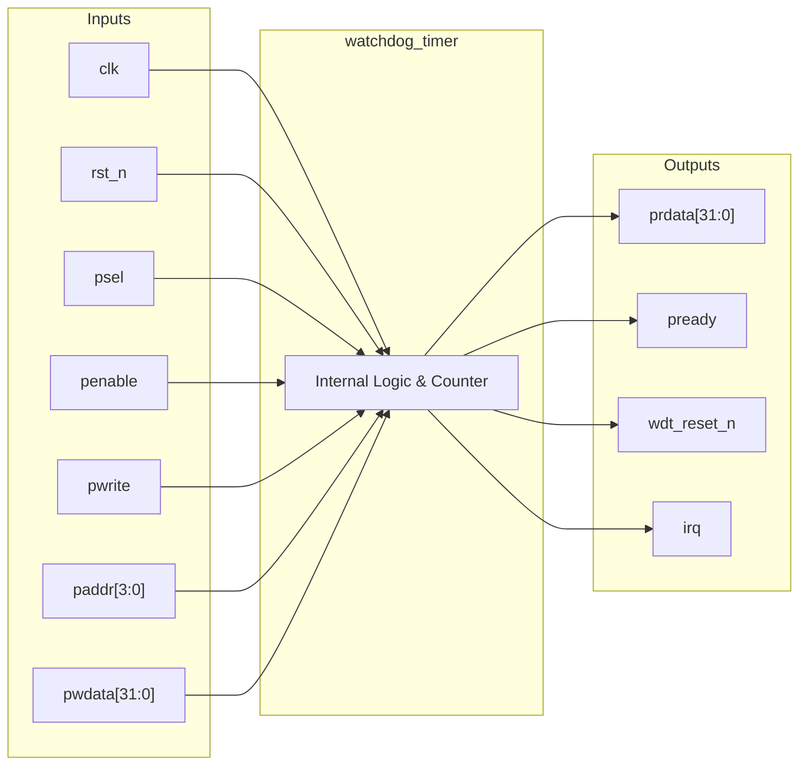

# watchdog_timer

## Description

The `watchdog_timer` is an APB-slave peripheral designed to monitor system health and recover from hangs in the SMVDU-TITAN-X SoC. It features a 32-bit down counter driven by a programmable reload value. The module implements a robust two-stage timeout mechanism: a first expiry generates an interrupt to give the system a chance to recover, while a second consecutive expiry unconditionally asserts a system reset. To prevent accidental modification of critical settings by errant code, the peripheral incorporates a lock-and-key mechanism requiring a specific 32-bit password (`0x1ACCE551`) to be written before its control registers can be altered.

## Interface

### Inputs

| Signal | Width | Description |
|--------|-------|-------------|
| clk    | 1     | System clock |
| rst_n  | 1     | Active-low asynchronous reset |
| psel   | 1     | APB select signal |
| penable| 1     | APB enable signal |
| pwrite | 1     | APB write enable signal |
| paddr  | 4     | APB address bus |
| pwdata | 32    | APB write data bus |

### Outputs

| Signal | Width | Description |
|--------|-------|-------------|
| prdata | 32    | APB read data bus |
| pready | 1     | APB ready signal, hardwired to 1 |
| wdt_reset_n | 1| Watchdog reset output; asserts low on a secondary timeout to reset the system |
| irq    | 1     | Interrupt request output; asserts high on the primary timeout |

## Functionality

The core of the watchdog is a 32-bit counter that decrements on every clock cycle when enabled (`wdt_en`). Software configures the timeout period by writing to the `load_val` register. When the counter reaches zero, the module checks `int_stat`. If `int_stat` is 0, the watchdog asserts an interrupt flag (raising `irq` if `int_en` is set), sets `int_stat` to 1, and reloads the counter. If the counter reaches zero again and `int_stat` is already 1, indicating the interrupt was not serviced, the watchdog asserts `wdt_reset_n` low. Software must routinely "kick" the watchdog by writing `0x000000E5` to the service register to reload the counter and clear `int_stat`. All write accesses to the configuration and load registers are blocked unless the unlock register is first written with the magic value `0x1ACCE551`.

## Hierarchical Block Diagram

## Signal-Level Diagram

